# HEIDI Technical Architecture Document

This document defines the technical architecture for the HEIDI platform, covering system design, component interactions, deployment strategies, and cross-cutting concerns.

**Version:** 2.0
**Last Updated:** 2025-06-10
**Status:** Draft

> **Note:** This document consolidates requirements from [Backend](./backend.requirement.md), [Web](./web.requirement.md), and [Mobile](./mobile.requirement.md) requirement documents.

---

## Table of Contents

1. [System Context](#1-system-context)
2. [Container Diagram](#2-container-diagram)
3. [Component Diagrams](#3-component-diagrams)
4. [Sequence Diagrams](#4-sequence-diagrams)
5. [Data Flow Diagrams](#5-data-flow-diagrams)
6. [Integration Patterns](#6-integration-patterns)
7. [Deployment Architecture](#7-deployment-architecture)
8. [Security Architecture](#8-security-architecture)
9. [Cross-Cutting Concerns](#9-cross-cutting-concerns)
10. [Platform Requirements Summary](#10-platform-requirements-summary)
11. [Mobile App Architecture](#11-mobile-app-architecture)
12. [Web Platform Architecture](#12-web-platform-architecture)
13. [Feature Modules Catalog](#13-feature-modules-catalog)
14. [Infrastructure & Hosting Plan](#14-infrastructure--hosting-plan)
15. [Acceptance Criteria & Deliverables](#15-acceptance-criteria--deliverables)

---

# 1. System Context

The System Context diagram provides a high-level view of the HEIDI platform, showing all actors, systems, and external dependencies.

## Actors

- **Super Admin**: Platform-level operator managing cities, global templates, and platform-wide settings
- **Super City Admin**: City-level operator managing local CMS data, city admins, and city configurations
- **City Admin**: Operational manager handling listings approvals, content publishing, and local dashboards
- **Editor / Contributor**: Authenticated citizen submitting content for approval
- **Anonymous Citizen**: Public visitor browsing listings, using chatbot, viewing news/events

## Systems

- **Web CMS**: React SPA for administrative operations
- **Citizen Web App**: Next.js application for public access
- **Mobile App**: iOS/Android native applications
- **HEIDI Backend**: Microservices architecture behind API Gateway

## External Systems

- **Object Storage**: S3-compatible storage for media files
- **Map Provider**: External mapping service (Google Maps, OpenStreetMap, etc.)

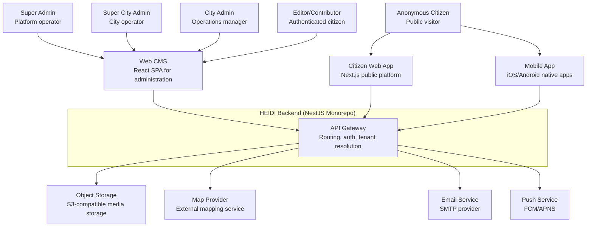
```mermaid
graph TB
    %% Actors
    SuperAdmin[Super Admin<br/>Platform operator]
    SuperCityAdmin[Super City Admin<br/>City operator]
    CityAdmin[City Admin<br/>Operations manager]
    Editor[Editor/Contributor<br/>Authenticated citizen]
    Citizen[Anonymous Citizen<br/>Public visitor]

    %% Systems
    WebCMS[Web CMS<br/>React SPA for administration]
    WebApp[Citizen Web App<br/>Next.js public platform]
    MobileApp[Mobile App<br/>iOS/Android native apps]

    %% Backend
    subgraph "HEIDI Backend (NestJS Monorepo)"
        APIGateway[API Gateway<br/>Routing, auth, tenant resolution]
    end

    %% External Systems
    ObjectStorage[Object Storage<br/>S3-compatible media storage]
    MapProvider[Map Provider<br/>External mapping service]
    EmailService[Email Service<br/>SMTP provider]
    PushService[Push Service<br/>FCM/APNS]

    %% Relationships
    SuperAdmin --> WebCMS
    SuperCityAdmin --> WebCMS
    CityAdmin --> WebCMS
    Editor --> WebCMS
    Citizen --> WebApp
    Citizen --> MobileApp

    WebCMS --> APIGateway
    WebApp --> APIGateway
    MobileApp --> APIGateway

    APIGateway --> ObjectStorage
    APIGateway --> MapProvider
    APIGateway --> EmailService
    APIGateway --> PushService
```

## System Boundaries

### Web CMS Boundary
- Accessible only to authenticated users with appropriate roles
- Handles all administrative functions
- Communicates exclusively through API Gateway
- No direct database access

### Citizen Web App Boundary
- Publicly accessible for browsing
- Requires authentication for personal features (favorites, contributions)
- Uses SSR for SEO-critical pages
- Uses CSR for interactive features

### Backend Boundary
- All services communicate through API Gateway
- No direct external access to internal services
- All requests require tenant context
- RBAC enforced at gateway and service levels

---

# 2. Container Diagram

The Container diagram shows all microservices, their responsibilities, and supporting infrastructure.

## Microservices Overview (NestJS Monorepo)

| Service | Responsibility | Technology Stack |
|---------|---------------|------------------|
| **API Gateway** | Request routing, rate limiting, tenant resolution, authentication middleware | NestJS + Express |
| **Auth Service** | JWT issuance, token validation, session management, password management | NestJS + TypeScript |
| **Users Service** | User profiles, roles, permissions, user lifecycle management | NestJS + TypeScript |
| **Core Service** | Listings CRUD, Categories, POIs, search functionality | NestJS + TypeScript |
| **City Management Service** | City configurations, tenant settings, city activation/deactivation | NestJS + TypeScript |
| **Template Service** | App templates (A/B variants), template metadata, versioning | NestJS + TypeScript |
| **Feature Service** | Module registry, feature flags, dependencies, version compatibility | NestJS + TypeScript |
| **AppConfig Service** | Per-tenant app configurations, theme settings, branding | NestJS + TypeScript |
| **ProjectGen Service** | App Factory build orchestration, build queue management, artifact handling | NestJS + TypeScript |
| **Notification Service** | Push notifications, email notifications, scheduling, delivery tracking | NestJS + TypeScript |
| **Chatbot Service** | RAG-based Q&A, embeddings generation, content ingestion, citation formatting | NestJS + TypeScript |
| **Analytics Service** | Usage metrics collection, dashboard aggregation, reporting | NestJS + TypeScript |
| **Audit Service** | Action logging, compliance trails, audit log querying | NestJS + TypeScript |

## Supporting Infrastructure

- **PostgreSQL**: Primary relational database for all services (tenant-isolated schemas)
- **Redis**: Caching layer, session storage, rate limiting counters
- **RabbitMQ**: Message queue for asynchronous operations and event publishing
- **S3-Compatible Storage**: Media files, build artifacts, document storage
- **Vector Database**: For chatbot embeddings storage (e.g., Pinecone, Weaviate, or pgvector)

## Container Diagram

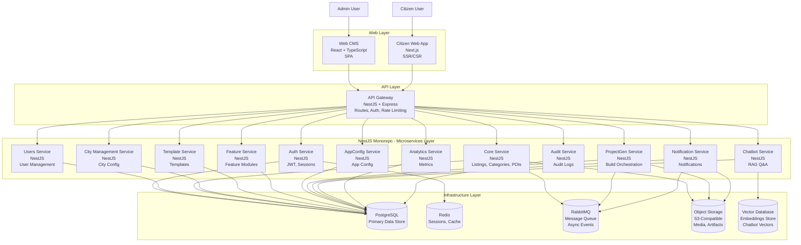
```mermaid
graph TB
    %% Users
    AdminUser[Admin User]
    CitizenUser[Citizen User]

    %% Web Layer
    subgraph "Web Layer"
        WebCMS[Web CMS<br/>React + TypeScript<br/>SPA]
        WebApp[Citizen Web App<br/>Next.js<br/>SSR/CSR]
    end

    %% API Layer
    subgraph "API Layer"
        APIGateway[API Gateway<br/>NestJS + Express<br/>Routes, Auth, Rate Limiting]
    end

    %% NestJS Monorepo Microservices
    subgraph "NestJS Monorepo - Microservices Layer"
        AuthService[Auth Service<br/>NestJS<br/>JWT, Sessions]
        UsersService[Users Service<br/>NestJS<br/>User Management]
        CoreService[Core Service<br/>NestJS<br/>Listings, Categories, POIs]
        CityService[City Management Service<br/>NestJS<br/>City Config]
        TemplateService[Template Service<br/>NestJS<br/>Templates]
        FeatureService[Feature Service<br/>NestJS<br/>Feature Modules]
        AppConfigService[AppConfig Service<br/>NestJS<br/>App Config]
        ProjectGenService[ProjectGen Service<br/>NestJS<br/>Build Orchestration]
        NotificationService[Notification Service<br/>NestJS<br/>Notifications]
        ChatbotService[Chatbot Service<br/>NestJS<br/>RAG Q&A]
        AnalyticsService[Analytics Service<br/>NestJS<br/>Metrics]
        AuditService[Audit Service<br/>NestJS<br/>Audit Logs]
    end

    %% Infrastructure Layer
    subgraph "Infrastructure Layer"
        Postgres[(PostgreSQL<br/>Primary Data Store)]
        Redis[(Redis<br/>Sessions, Cache)]
        RabbitMQ[(RabbitMQ<br/>Message Queue<br/>Async Events)]
        S3[(Object Storage<br/>S3-Compatible<br/>Media, Artifacts)]
        VectorDB[(Vector Database<br/>Embeddings Store<br/>Chatbot Vectors)]
    end

    %% User connections
    AdminUser --> WebCMS
    CitizenUser --> WebApp

    %% Web to API
    WebCMS --> APIGateway
    WebApp --> APIGateway

    %% API Gateway to Services
    APIGateway --> AuthService
    APIGateway --> UsersService
    APIGateway --> CoreService
    APIGateway --> CityService
    APIGateway --> TemplateService
    APIGateway --> FeatureService
    APIGateway --> AppConfigService
    APIGateway --> ProjectGenService
    APIGateway --> NotificationService
    APIGateway --> ChatbotService
    APIGateway --> AnalyticsService
    APIGateway --> AuditService

    %% Service to Infrastructure connections
    AuthService --> Postgres
    AuthService --> Redis
    UsersService --> Postgres
    CoreService --> Postgres
    CoreService --> S3
    CoreService --> RabbitMQ
    CityService --> Postgres
    TemplateService --> Postgres
    FeatureService --> Postgres
    AppConfigService --> Postgres
    ProjectGenService --> RabbitMQ
    ProjectGenService --> S3
    ProjectGenService --> Postgres
    NotificationService --> RabbitMQ
    NotificationService --> S3
    NotificationService --> Postgres
    ChatbotService --> VectorDB
    ChatbotService --> Postgres
    AnalyticsService --> Postgres
    AuditService --> Postgres
```

## Service Communication Patterns

### Synchronous Communication
- **REST API**: All service-to-service communication via HTTP/REST
- **API Gateway**: Single entry point routing requests to appropriate services
- **Service Discovery**: Kubernetes service discovery or Consul/Eureka

### Asynchronous Communication
- **RabbitMQ**: Event-driven messaging for:
  - Content approval notifications
  - Build job queuing
  - Analytics event publishing
  - Notification delivery triggers

### Data Access
- **Database per Service**: Each service has dedicated database schema/tables
- **Shared Database Pattern**: PostgreSQL with tenant-isolated schemas
- **Caching**: Redis for frequently accessed data (sessions, user roles, configuration)

## NestJS Monorepo Structure

The backend is organized as a NestJS monorepo with the following structure:

```
heidi-backend/
├── apps/
│   ├── api-gateway/          # Main API Gateway application
│   ├── auth-service/         # Authentication microservice
│   ├── users-service/        # User management microservice
│   ├── core-service/         # Core business logic microservice
│   ├── city-service/         # City management microservice
│   ├── template-service/     # Template management microservice
│   ├── feature-service/      # Feature flags microservice
│   ├── appconfig-service/    # App configuration microservice
│   ├── projectgen-service/   # Build orchestration microservice
│   ├── notification-service/ # Notification microservice
│   ├── chatbot-service/      # RAG chatbot microservice
│   ├── analytics-service/    # Analytics microservice
│   └── audit-service/        # Audit logging microservice
├── libs/
│   ├── common/               # Shared utilities and types
│   ├── database/             # Database configuration and entities
│   ├── auth/                 # Authentication guards and decorators
│   ├── tenant/               # Multi-tenant utilities
│   ├── events/               # Event handling and RabbitMQ
│   └── config/               # Configuration management
├── docker/                   # Docker configurations
├── k8s/                      # Kubernetes manifests
└── scripts/                  # Build and deployment scripts
```

### Shared Libraries

- **@heidi/common**: Shared DTOs, interfaces, utilities, and constants
- **@heidi/database**: TypeORM entities, migrations, and database configuration
- **@heidi/auth**: JWT guards, RBAC decorators, and authentication utilities
- **@heidi/tenant**: Multi-tenant middleware, decorators, and utilities
- **@heidi/events**: RabbitMQ event handling, publishers, and consumers
- **@heidi/config**: Configuration management and validation schemas

---

# 3. Component Diagrams

This section details the internal component structure of critical services.

## 3.1 Auth Service Components

The Auth Service handles authentication, authorization, and session management.

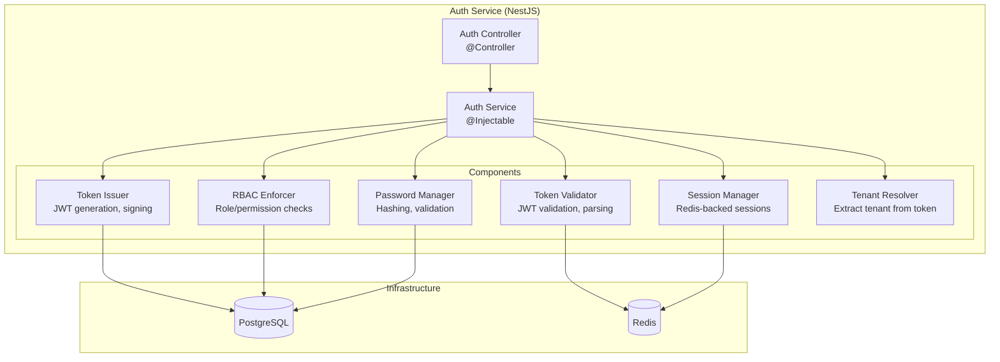
```mermaid
graph TB
    subgraph "Auth Service (NestJS)"
        AuthController[Auth Controller<br/>@Controller]
        AuthService[Auth Service<br/>@Injectable]

        subgraph "Components"
            TokenIssuer[Token Issuer<br/>JWT generation, signing]
            TokenValidator[Token Validator<br/>JWT validation, parsing]
            SessionManager[Session Manager<br/>Redis-backed sessions]
            RBACEnforcer[RBAC Enforcer<br/>Role/permission checks]
            PasswordManager[Password Manager<br/>Hashing, validation]
            TenantResolver[Tenant Resolver<br/>Extract tenant from token]
        end
    end

    subgraph "Infrastructure"
        Postgres[(PostgreSQL)]
        Redis[(Redis)]
    end

    %% Controller to Service
    AuthController --> AuthService

    %% Service to Components
    AuthService --> TokenIssuer
    AuthService --> TokenValidator
    AuthService --> SessionManager
    AuthService --> RBACEnforcer
    AuthService --> PasswordManager
    AuthService --> TenantResolver

    %% Components to Infrastructure
    TokenIssuer --> Postgres
    TokenValidator --> Redis
    SessionManager --> Redis
    RBACEnforcer --> Postgres
    PasswordManager --> Postgres
```

**Component Responsibilities:**

- **Token Issuer**: Generates JWT tokens with claims (user ID, tenant ID, roles, permissions)
- **Token Validator**: Validates incoming JWT tokens, checks expiration, verifies signature
- **Session Manager**: Manages user sessions in Redis, handles session refresh, logout
- **RBAC Enforcer**: Evaluates role-based access control rules for API endpoints
- **Password Manager**: Handles password hashing (bcrypt/argon2), validation, reset flows
- **Tenant Resolver**: Extracts tenant context from JWT claims or request headers

## 3.2 Core Service Components

The Core Service manages listings, categories, POIs, and search functionality.

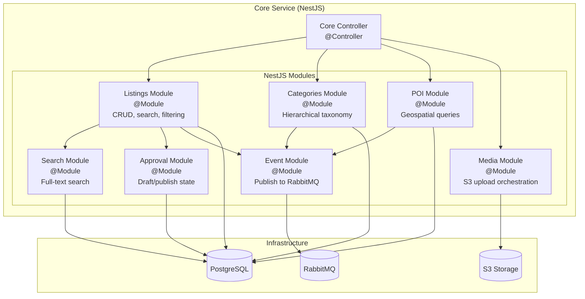
```mermaid
graph TB
    subgraph "Core Service (NestJS)"
        CoreController[Core Controller<br/>@Controller]

        subgraph "NestJS Modules"
            ListingsModule[Listings Module<br/>@Module<br/>CRUD, search, filtering]
            CategoriesModule[Categories Module<br/>@Module<br/>Hierarchical taxonomy]
            POIModule[POI Module<br/>@Module<br/>Geospatial queries]
            MediaModule[Media Module<br/>@Module<br/>S3 upload orchestration]
            SearchModule[Search Module<br/>@Module<br/>Full-text search]
            ApprovalModule[Approval Module<br/>@Module<br/>Draft/publish state]
            EventModule[Event Module<br/>@Module<br/>Publish to RabbitMQ]
        end
    end

    subgraph "Infrastructure"
        Postgres[(PostgreSQL)]
        S3[(S3 Storage)]
        RabbitMQ[(RabbitMQ)]
    end

    %% Controller to Modules
    CoreController --> ListingsModule
    CoreController --> CategoriesModule
    CoreController --> POIModule
    CoreController --> MediaModule

    %% Module interactions
    ListingsModule --> SearchModule
    ListingsModule --> ApprovalModule
    ListingsModule --> EventModule
    CategoriesModule --> EventModule
    POIModule --> EventModule

    %% Modules to Infrastructure
    ListingsModule --> Postgres
    CategoriesModule --> Postgres
    POIModule --> Postgres
    MediaModule --> S3
    SearchModule --> Postgres
    ApprovalModule --> Postgres
    EventModule --> RabbitMQ
```

**Component Responsibilities:**

- **Listings Module**: Manages listing entities (CRUD operations), status workflow (draft → pending → published)
- **Categories Module**: Handles hierarchical category structures, category assignments to listings
- **POI Module**: Manages Points of Interest with geospatial data, supports location-based queries
- **Media Handler**: Orchestrates file uploads to S3, generates thumbnails, manages media metadata
- **Search Engine**: Provides full-text search across listings, categories, with filtering and sorting
- **Approval Workflow**: Manages approval states, tracks approver, timestamps, rejection reasons
- **Event Publisher**: Publishes events to RabbitMQ for downstream processing (notifications, analytics)

## 3.3 Chatbot Service Components

The Chatbot Service provides RAG-based question answering with tenant-specific knowledge bases.

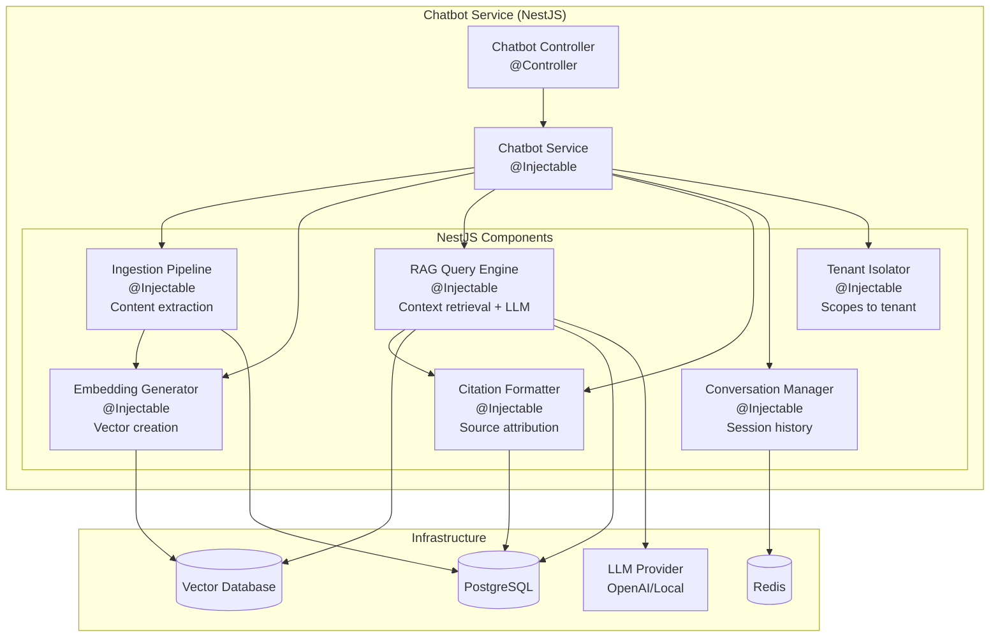
```mermaid
graph TB
    subgraph "Chatbot Service (NestJS)"
        ChatbotController[Chatbot Controller<br/>@Controller]
        ChatbotService[Chatbot Service<br/>@Injectable]

        subgraph "NestJS Components"
            IngestionPipeline[Ingestion Pipeline<br/>@Injectable<br/>Content extraction]
            EmbeddingGenerator[Embedding Generator<br/>@Injectable<br/>Vector creation]
            RAGQueryEngine[RAG Query Engine<br/>@Injectable<br/>Context retrieval + LLM]
            CitationFormatter[Citation Formatter<br/>@Injectable<br/>Source attribution]
            ConversationManager[Conversation Manager<br/>@Injectable<br/>Session history]
            TenantIsolator[Tenant Isolator<br/>@Injectable<br/>Scopes to tenant]
        end
    end

    subgraph "Infrastructure"
        Postgres[(PostgreSQL)]
        VectorDB[(Vector Database)]
        Redis[(Redis)]
        LLM[LLM Provider<br/>OpenAI/Local]
    end

    %% Controller to Service
    ChatbotController --> ChatbotService

    %% Service to Components
    ChatbotService --> IngestionPipeline
    ChatbotService --> EmbeddingGenerator
    ChatbotService --> RAGQueryEngine
    ChatbotService --> CitationFormatter
    ChatbotService --> ConversationManager
    ChatbotService --> TenantIsolator

    %% Component interactions
    IngestionPipeline --> EmbeddingGenerator
    RAGQueryEngine --> CitationFormatter

    %% Components to Infrastructure
    IngestionPipeline --> Postgres
    EmbeddingGenerator --> VectorDB
    RAGQueryEngine --> VectorDB
    RAGQueryEngine --> Postgres
    RAGQueryEngine --> LLM
    CitationFormatter --> Postgres
    ConversationManager --> Redis
```

**Component Responsibilities:**

- **Ingestion Pipeline**: Extracts content from listings, news, events, FAQs; chunks text appropriately
- **Embedding Generator**: Converts text chunks to vector embeddings using language models (OpenAI, local LLM)
- **RAG Query Engine**: Retrieves relevant context from vector DB, formats prompts, calls LLM API, generates responses
- **Citation Formatter**: Formats source citations, links back to original content, provides attribution
- **Conversation Manager**: Maintains conversation history per user session, enables follow-up questions
- **Tenant Isolator**: Ensures all queries and embeddings are scoped to specific tenant

## 3.4 ProjectGen Service Components

The ProjectGen Service orchestrates mobile app builds through the App Factory.

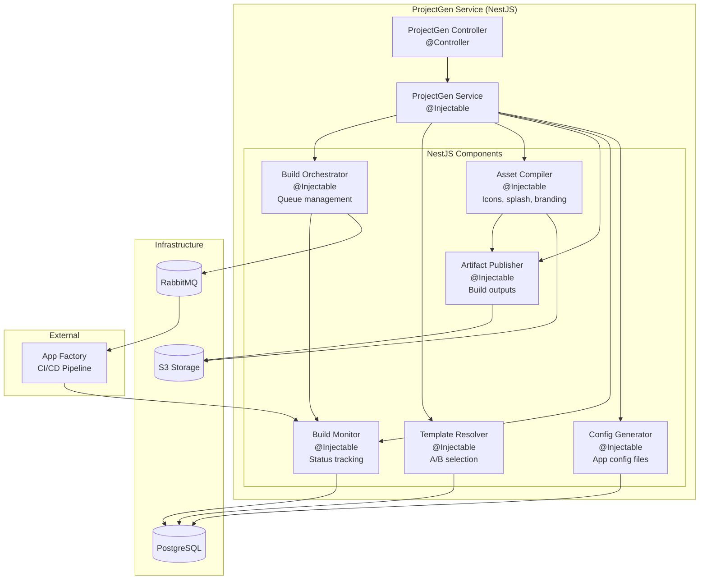
```mermaid
graph TB
    subgraph "ProjectGen Service (NestJS)"
        ProjectGenController[ProjectGen Controller<br/>@Controller]
        ProjectGenService[ProjectGen Service<br/>@Injectable]

        subgraph "NestJS Components"
            BuildOrchestrator[Build Orchestrator<br/>@Injectable<br/>Queue management]
            TemplateResolver[Template Resolver<br/>@Injectable<br/>A/B selection]
            AssetCompiler[Asset Compiler<br/>@Injectable<br/>Icons, splash, branding]
            ArtifactPublisher[Artifact Publisher<br/>@Injectable<br/>Build outputs]
            BuildMonitor[Build Monitor<br/>@Injectable<br/>Status tracking]
            ConfigGenerator[Config Generator<br/>@Injectable<br/>App config files]
        end
    end

    subgraph "Infrastructure"
        Postgres[(PostgreSQL)]
        S3[(S3 Storage)]
        RabbitMQ[(RabbitMQ)]
    end

    subgraph "External"
        AppFactory[App Factory<br/>CI/CD Pipeline]
    end

    %% Controller to Service
    ProjectGenController --> ProjectGenService

    %% Service to Components
    ProjectGenService --> BuildOrchestrator
    ProjectGenService --> TemplateResolver
    ProjectGenService --> AssetCompiler
    ProjectGenService --> ArtifactPublisher
    ProjectGenService --> BuildMonitor
    ProjectGenService --> ConfigGenerator

    %% Component interactions
    BuildOrchestrator --> BuildMonitor
    AssetCompiler --> ArtifactPublisher

    %% Components to Infrastructure
    BuildOrchestrator --> RabbitMQ
    TemplateResolver --> Postgres
    AssetCompiler --> S3
    ArtifactPublisher --> S3
    BuildMonitor --> Postgres
    ConfigGenerator --> Postgres

    %% External connections
    RabbitMQ --> AppFactory
    AppFactory --> BuildMonitor
```

**Component Responsibilities:**

- **Build Orchestrator**: Manages build queue, handles build requests, coordinates with App Factory
- **Template Resolver**: Resolves template selection (A/B), loads template metadata, validates compatibility
- **Asset Compiler**: Processes app icons, splash screens, branding assets, generates platform-specific formats
- **Artifact Publisher**: Stores build artifacts (APK, IPA) in S3, provides download URLs, manages versions
- **Build Monitor**: Tracks build status, polls App Factory, updates build history, notifies on completion
- **Config Generator**: Generates app configuration files (Info.plist, AndroidManifest.xml, app.json)

---

# 4. Sequence Diagrams

This section documents key interaction flows between system components.

## 4.1 Authentication Flow

Complete authentication flow from login to token issuance.

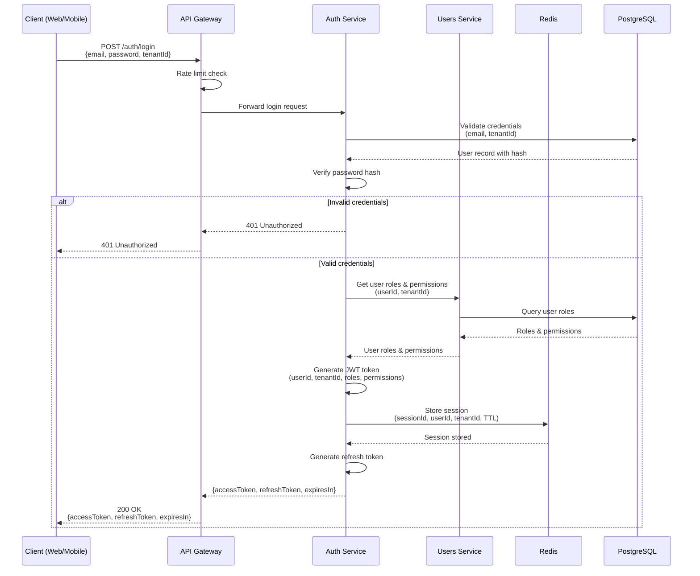
```mermaid
sequenceDiagram
    participant Client as Client (Web/Mobile)
    participant Gateway as API Gateway
    participant Auth as Auth Service
    participant Users as Users Service
    participant Redis
    participant Postgres as PostgreSQL

    Client->>Gateway: POST /auth/login<br/>{email, password, tenantId}
    Gateway->>Gateway: Rate limit check
    Gateway->>Auth: Forward login request

    Auth->>Postgres: Validate credentials<br/>(email, tenantId)
    Postgres-->>Auth: User record with hash

    Auth->>Auth: Verify password hash

    alt Invalid credentials
        Auth-->>Gateway: 401 Unauthorized
        Gateway-->>Client: 401 Unauthorized
    else Valid credentials
        Auth->>Users: Get user roles & permissions<br/>(userId, tenantId)
        Users->>Postgres: Query user roles
        Postgres-->>Users: Roles & permissions
        Users-->>Auth: User roles & permissions

        Auth->>Auth: Generate JWT token<br/>(userId, tenantId, roles, permissions)
        Auth->>Redis: Store session<br/>(sessionId, userId, tenantId, TTL)
        Redis-->>Auth: Session stored

        Auth->>Auth: Generate refresh token
        Auth-->>Gateway: {accessToken, refreshToken, expiresIn}
        Gateway-->>Client: 200 OK<br/>{accessToken, refreshToken, expiresIn}
    end
```

**Key Points:**

- API Gateway performs rate limiting before forwarding
- Password verification happens in Auth Service (never transmit plain passwords)
- JWT contains all necessary claims (userId, tenantId, roles, permissions)
- Session stored in Redis for revocation and session management
- Refresh token allows token renewal without re-authentication

## 4.2 Listing Creation with Approval Flow

Complete flow from contributor submission to publication.

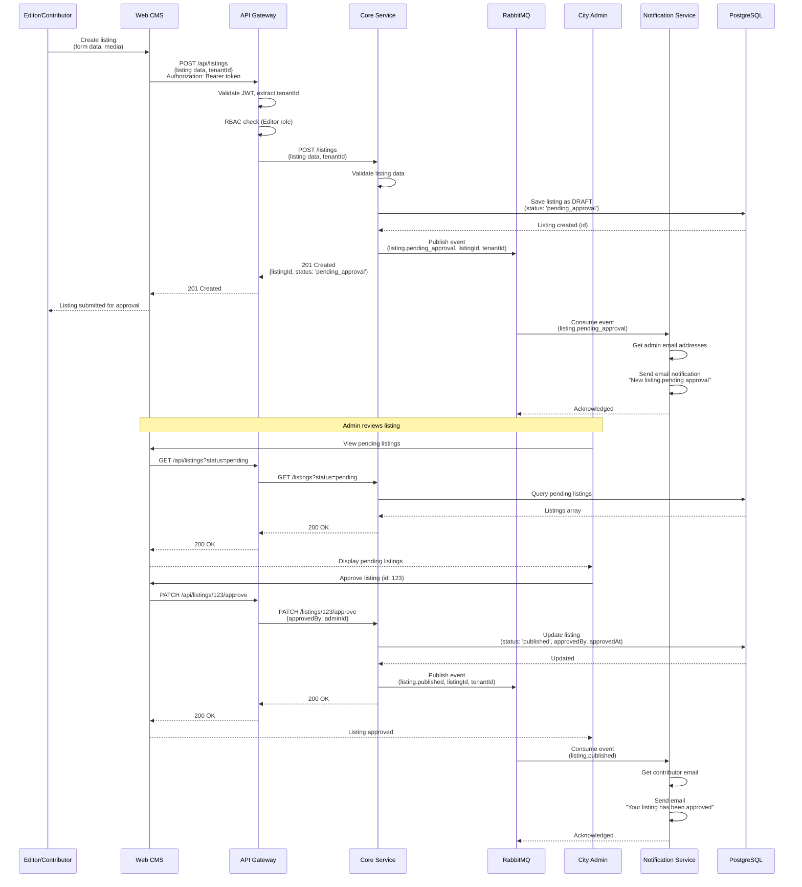
```mermaid
sequenceDiagram
    participant Editor as Editor/Contributor
    participant CMS as Web CMS
    participant Gateway as API Gateway
    participant Core as Core Service
    participant RabbitMQ
    participant Admin as City Admin
    participant Notification as Notification Service
    participant Postgres as PostgreSQL

    Editor->>CMS: Create listing<br/>(form data, media)
    CMS->>Gateway: POST /api/listings<br/>{listing data, tenantId}<br/>Authorization: Bearer token
    Gateway->>Gateway: Validate JWT, extract tenantId
    Gateway->>Gateway: RBAC check (Editor role)
    Gateway->>Core: POST /listings<br/>{listing data, tenantId}

    Core->>Core: Validate listing data
    Core->>Postgres: Save listing as DRAFT<br/>(status: 'pending_approval')
    Postgres-->>Core: Listing created (id)

    Core->>RabbitMQ: Publish event<br/>(listing.pending_approval, listingId, tenantId)

    Core-->>Gateway: 201 Created<br/>{listingId, status: 'pending_approval'}
    Gateway-->>CMS: 201 Created
    CMS-->>Editor: Listing submitted for approval

    RabbitMQ->>Notification: Consume event<br/>(listing.pending_approval)
    Notification->>Notification: Get admin email addresses
    Notification->>Notification: Send email notification<br/>"New listing pending approval"
    Notification-->>RabbitMQ: Acknowledged

    Note over Admin,CMS: Admin reviews listing

    Admin->>CMS: View pending listings
    CMS->>Gateway: GET /api/listings?status=pending
    Gateway->>Core: GET /listings?status=pending
    Core->>Postgres: Query pending listings
    Postgres-->>Core: Listings array
    Core-->>Gateway: 200 OK
    Gateway-->>CMS: 200 OK
    CMS-->>Admin: Display pending listings

    Admin->>CMS: Approve listing (id: 123)
    CMS->>Gateway: PATCH /api/listings/123/approve
    Gateway->>Core: PATCH /listings/123/approve<br/>{approvedBy: adminId}

    Core->>Postgres: Update listing<br/>(status: 'published', approvedBy, approvedAt)
    Postgres-->>Core: Updated

    Core->>RabbitMQ: Publish event<br/>(listing.published, listingId, tenantId)

    Core-->>Gateway: 200 OK
    Gateway-->>CMS: 200 OK
    CMS-->>Admin: Listing approved

    RabbitMQ->>Notification: Consume event<br/>(listing.published)
    Notification->>Notification: Get contributor email
    Notification->>Notification: Send email<br/>"Your listing has been approved"
    Notification-->>RabbitMQ: Acknowledged
```

**Key Points:**

- Initial listing saved with status `pending_approval`
- Event-driven notification: City Admin notified via RabbitMQ
- Approval updates listing status to `published`
- Contributor notified of approval via async notification
- All actions logged to Audit Service

## 4.3 App Build Trigger Flow

Complete flow from build request to artifact availability.

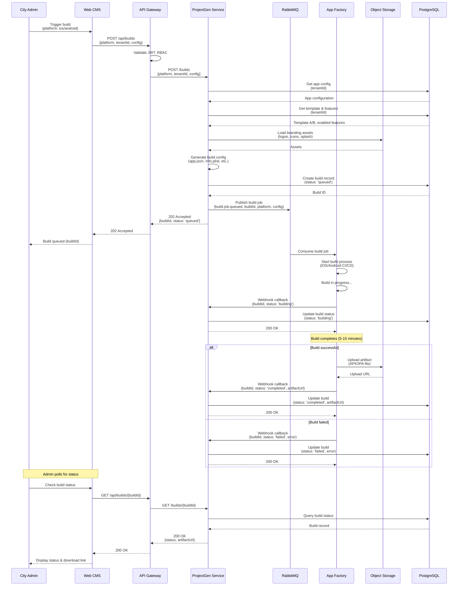
```mermaid
sequenceDiagram
    participant Admin as City Admin
    participant CMS as Web CMS
    participant Gateway as API Gateway
    participant ProjectGen as ProjectGen Service
    participant RabbitMQ
    participant AppFactory as App Factory
    participant S3 as Object Storage
    participant Postgres as PostgreSQL

    Admin->>CMS: Trigger build<br/>(platform: ios/android)
    CMS->>Gateway: POST /api/builds<br/>{platform, tenantId, config}
    Gateway->>Gateway: Validate JWT, RBAC
    Gateway->>ProjectGen: POST /builds<br/>{platform, tenantId, config}

    ProjectGen->>Postgres: Get app config<br/>(tenantId)
    Postgres-->>ProjectGen: App configuration

    ProjectGen->>Postgres: Get template & features<br/>(tenantId)
    Postgres-->>ProjectGen: Template A/B, enabled features

    ProjectGen->>S3: Load branding assets<br/>(logos, icons, splash)
    S3-->>ProjectGen: Assets

    ProjectGen->>ProjectGen: Generate build config<br/>(app.json, Info.plist, etc.)

    ProjectGen->>Postgres: Create build record<br/>(status: 'queued')
    Postgres-->>ProjectGen: Build ID

    ProjectGen->>RabbitMQ: Publish build job<br/>(build.job.queued, buildId, platform, config)

    ProjectGen-->>Gateway: 202 Accepted<br/>{buildId, status: 'queued'}
    Gateway-->>CMS: 202 Accepted
    CMS-->>Admin: Build queued (buildId)

    RabbitMQ->>AppFactory: Consume build job
    AppFactory->>AppFactory: Start build process<br/>(iOS/Android CI/CD)

    AppFactory->>AppFactory: Build in progress...
    AppFactory->>ProjectGen: Webhook callback<br/>(buildId, status: 'building')

    ProjectGen->>Postgres: Update build status<br/>(status: 'building')
    ProjectGen-->>AppFactory: 200 OK

    Note over AppFactory: Build completes (5-15 minutes)

    alt Build successful
        AppFactory->>S3: Upload artifact<br/>(APK/IPA file)
        S3-->>AppFactory: Upload URL
        AppFactory->>ProjectGen: Webhook callback<br/>(buildId, status: 'completed', artifactUrl)
        ProjectGen->>Postgres: Update build<br/>(status: 'completed', artifactUrl)
        ProjectGen-->>AppFactory: 200 OK
    else Build failed
        AppFactory->>ProjectGen: Webhook callback<br/>(buildId, status: 'failed', error)
        ProjectGen->>Postgres: Update build<br/>(status: 'failed', error)
        ProjectGen-->>AppFactory: 200 OK
    end

    Note over Admin,CMS: Admin polls for status

    Admin->>CMS: Check build status
    CMS->>Gateway: GET /api/builds/{buildId}
    Gateway->>ProjectGen: GET /builds/{buildId}
    ProjectGen->>Postgres: Query build status
    Postgres-->>ProjectGen: Build record
    ProjectGen-->>Gateway: 200 OK<br/>{status, artifactUrl}
    Gateway-->>CMS: 200 OK
    CMS-->>Admin: Display status & download link
```

**Key Points:**

- Build request creates queued record immediately
- Build job dispatched to App Factory via RabbitMQ
- App Factory updates status via webhook callbacks
- Artifacts stored in S3 with signed URLs for download
- Admin can poll build status or receive notifications
- All build attempts logged for audit

## 4.4 Chatbot Query Flow

Complete RAG-based question answering flow.

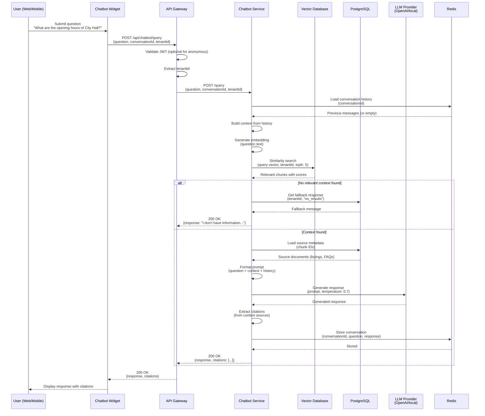
```mermaid
sequenceDiagram
    participant User as User (Web/Mobile)
    participant Widget as Chatbot Widget
    participant Gateway as API Gateway
    participant Chatbot as Chatbot Service
    participant VectorDB as Vector Database
    participant Postgres as PostgreSQL
    participant LLM as LLM Provider<br/>(OpenAI/local)
    participant Redis

    User->>Widget: Submit question<br/>"What are the opening hours of City Hall?"
    Widget->>Gateway: POST /api/chatbot/query<br/>{question, conversationId, tenantId}
    Gateway->>Gateway: Validate JWT (optional for anonymous)
    Gateway->>Gateway: Extract tenantId
    Gateway->>Chatbot: POST /query<br/>{question, conversationId, tenantId}

    Chatbot->>Redis: Load conversation history<br/>(conversationId)
    Redis-->>Chatbot: Previous messages (or empty)

    Chatbot->>Chatbot: Build context from history

    Chatbot->>Chatbot: Generate embedding<br/>(question text)

    Chatbot->>VectorDB: Similarity search<br/>(query vector, tenantId, topK: 5)
    VectorDB-->>Chatbot: Relevant chunks with scores

    alt No relevant context found
        Chatbot->>Postgres: Get fallback response<br/>(tenantId, "no_results")
        Postgres-->>Chatbot: Fallback message
        Chatbot-->>Gateway: 200 OK<br/>{response: "I don't have information..."}
    else Context found
        Chatbot->>Postgres: Load source metadata<br/>(chunk IDs)
        Postgres-->>Chatbot: Source documents (listings, FAQs)

        Chatbot->>Chatbot: Format prompt<br/>(question + context + history)

        Chatbot->>LLM: Generate response<br/>(prompt, temperature: 0.7)
        LLM-->>Chatbot: Generated response

        Chatbot->>Chatbot: Extract citations<br/>(from context sources)

        Chatbot->>Redis: Store conversation<br/>(conversationId, question, response)
        Redis-->>Chatbot: Stored

        Chatbot-->>Gateway: 200 OK<br/>{response, citations: [...]}
    end

    Gateway-->>Widget: 200 OK<br/>{response, citations}
    Widget-->>User: Display response with citations
```

**Key Points:**

- Conversation history maintained in Redis for context
- Vector similarity search scoped to tenant
- LLM generates response with retrieved context
- Citations link back to original source documents
- Fallback responses for no-results scenarios
- Supports anonymous users (optional JWT validation)

## 4.5 Multi-Tenant Request Flow

Complete request flow showing tenant isolation at every layer.

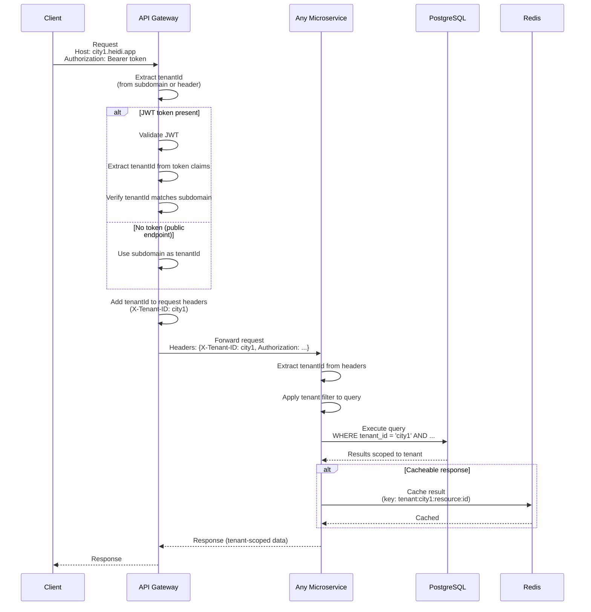
```mermaid
sequenceDiagram
    participant Client as Client
    participant Gateway as API Gateway
    participant Service as Any Microservice
    participant Postgres as PostgreSQL
    participant Redis

    Client->>Gateway: Request<br/>Host: city1.heidi.app<br/>Authorization: Bearer token

    Gateway->>Gateway: Extract tenantId<br/>(from subdomain or header)

    alt JWT token present
        Gateway->>Gateway: Validate JWT
        Gateway->>Gateway: Extract tenantId from token claims
        Gateway->>Gateway: Verify tenantId matches subdomain
    else No token (public endpoint)
        Gateway->>Gateway: Use subdomain as tenantId
    end

    Gateway->>Gateway: Add tenantId to request headers<br/>(X-Tenant-ID: city1)

    Gateway->>Service: Forward request<br/>Headers: {X-Tenant-ID: city1, Authorization: ...}

    Service->>Service: Extract tenantId from headers

    Service->>Service: Apply tenant filter to query

    Service->>Postgres: Execute query<br/>WHERE tenant_id = 'city1' AND ...
    Postgres-->>Service: Results scoped to tenant

    alt Cacheable response
        Service->>Redis: Cache result<br/>(key: tenant:city1:resource:id)
        Redis-->>Service: Cached
    end

    Service-->>Gateway: Response (tenant-scoped data)
    Gateway-->>Client: Response
```

**Key Points:**

- Tenant resolution at API Gateway (subdomain or header)
- Tenant ID propagated via `X-Tenant-ID` header
- All database queries include tenant filter
- Cache keys include tenant ID for isolation
- JWT validation ensures tenant matches request
- Public endpoints can use subdomain-only tenant resolution

---

# 5. Data Flow Diagrams

This section illustrates data flows for key system operations.

## 5.1 Content Publishing Pipeline

Flow of content from creation to public availability.

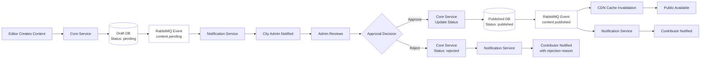
```mermaid
flowchart LR
    A[Editor Creates Content] --> B[Core Service]
    B --> C[(Draft DB<br/>Status: pending)]
    C --> D[RabbitMQ Event<br/>content.pending]
    D --> E[Notification Service]
    E --> F[City Admin Notified]

    F --> G[Admin Reviews]
    G --> H{Approval Decision}

    H -->|Approve| I[Core Service<br/>Update Status]
    H -->|Reject| J[Core Service<br/>Status: rejected]

    I --> K[(Published DB<br/>Status: published)]
    K --> L[RabbitMQ Event<br/>content.published]
    L --> M[CDN Cache Invalidation]
    M --> N[Public Available]

    L --> O[Notification Service]
    O --> P[Contributor Notified]

    J --> Q[Notification Service]
    Q --> R[Contributor Notified<br/>with rejection reason]

    style C fill:#fff
    style K fill:#fff
    style D fill:#fff
    style L fill:#fff
```

**Data Flow Details:**

1. **Creation**: Editor submits content → Core Service validates → Saved to database as `pending`
2. **Notification**: Event published → Notification Service consumes → Email sent to City Admin
3. **Approval**: Admin approves → Status updated → Event published → Contributor notified
4. **Publication**: Published content → Cache invalidated → Available to public
5. **Rejection**: Admin rejects → Status updated → Contributor notified with reason

## 5.2 Notification Delivery Pipeline

Flow of notifications from trigger to delivery.

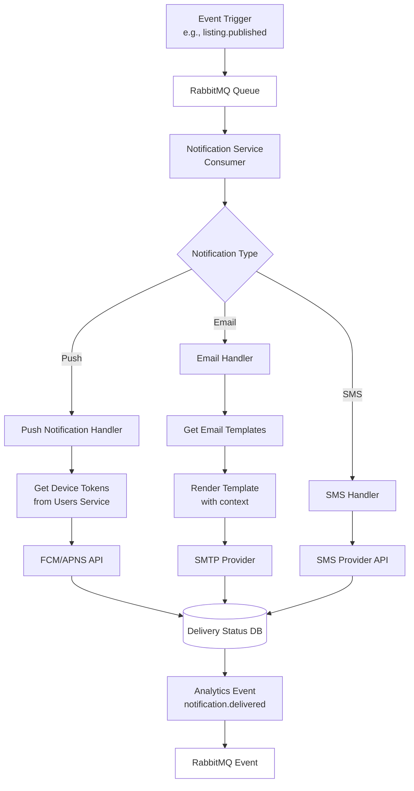
```mermaid
flowchart TB
    A[Event Trigger<br/>e.g., listing.published] --> B[RabbitMQ Queue]
    B --> C[Notification Service<br/>Consumer]

    C --> D{Notification Type}

    D -->|Push| E[Push Notification Handler]
    D -->|Email| F[Email Handler]
    D -->|SMS| G[SMS Handler]

    E --> H[Get Device Tokens<br/>from Users Service]
    H --> I[FCM/APNS API]
    I --> J[(Delivery Status DB)]

    F --> K[Get Email Templates]
    K --> L[Render Template<br/>with context]
    L --> M[SMTP Provider]
    M --> J

    G --> N[SMS Provider API]
    N --> J

    J --> O[Analytics Event<br/>notification.delivered]
    O --> P[RabbitMQ Event]

    style B fill:#fff
    style J fill:#fff
    style P fill:#fff
```

**Data Flow Details:**

1. **Trigger**: Event published to RabbitMQ → Notification Service consumes
2. **Routing**: Service determines notification type → Routes to appropriate handler
3. **Recipient Resolution**: Loads recipient addresses/tokens from Users Service
4. **Template Rendering**: Loads template, injects context variables
5. **Delivery**: Sends via external provider (FCM, SMTP, SMS)
6. **Tracking**: Delivery status stored → Analytics event published

## 5.3 Analytics Collection Pipeline

Flow of analytics events from client to dashboard.

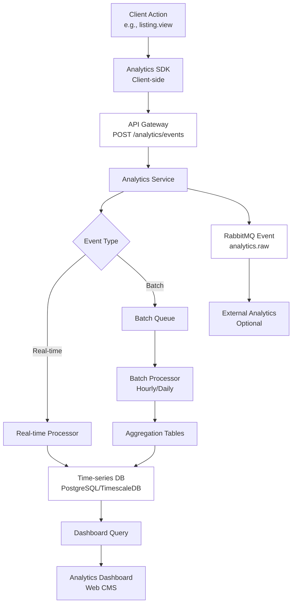
```mermaid
flowchart TB
    A[Client Action<br/>e.g., listing.view] --> B[Analytics SDK<br/>Client-side]
    B --> C[API Gateway<br/>POST /analytics/events]

    C --> D[Analytics Service]
    D --> E{Event Type}

    E -->|Real-time| F[Real-time Processor]
    E -->|Batch| G[Batch Queue]

    F --> H[Time-series DB<br/>PostgreSQL/TimescaleDB]

    G --> I[Batch Processor<br/>Hourly/Daily]
    I --> J[Aggregation Tables]
    J --> H

    H --> K[Dashboard Query]
    K --> L[Analytics Dashboard<br/>Web CMS]

    D --> M[RabbitMQ Event<br/>analytics.raw]
    M --> N[External Analytics<br/>Optional]

    style C fill:#fff
    style H fill:#fff
    style M fill:#fff
```

**Data Flow Details:**

1. **Collection**: Client SDK captures events → Sent to API Gateway
2. **Routing**: Analytics Service receives → Routes by priority (real-time vs batch)
3. **Storage**: Real-time events → Time-series DB | Batch events → Queue → Aggregated
4. **Aggregation**: Batch processor aggregates hourly/daily metrics
5. **Querying**: Dashboard queries aggregated data for visualization
6. **Export**: Raw events optionally published to external analytics systems

---

# 6. Integration Patterns

This section documents the integration patterns used throughout the system.

## 6.1 API Gateway Pattern

**Purpose**: Single entry point for all client requests

**Implementation**:
- All external requests route through API Gateway
- Gateway handles:
  - Tenant resolution (subdomain, header, JWT)
  - JWT validation
  - Rate limiting (per tenant, per user)
  - Request routing to appropriate microservice
  - Response aggregation (if needed)
  - CORS handling
  - Request/response logging

**Benefits**:
- Centralized security enforcement
- Simplified client integration (single endpoint)
- Cross-cutting concerns (logging, monitoring) handled once
- Service abstraction (clients don't know about internal services)

## 6.2 Request/Response Pattern (Synchronous)

**Purpose**: Synchronous service-to-service communication

**Implementation**:
- REST APIs for all inter-service communication
- HTTP/HTTPS with JSON payloads
- Standardized error responses
- Request timeouts and retries
- Circuit breaker pattern for resilience

**Use Cases**:
- User authentication
- Data retrieval (listings, categories)
- Configuration queries
- Immediate responses required

## 6.3 Pub/Sub Pattern (Asynchronous)

**Purpose**: Event-driven communication for decoupled operations

**Implementation**:
- RabbitMQ as message broker
- Topic-based routing (e.g., `listing.*`, `build.*`)
- Multiple consumers can subscribe to same topic
- Guaranteed delivery (acknowledgment required)
- Dead letter queues for failed messages

**Use Cases**:
- Content approval notifications
- Build job queuing
- Analytics event publishing
- Cache invalidation triggers
- Audit log events

**Event Topics**:
- `listing.created`, `listing.approved`, `listing.rejected`
- `build.queued`, `build.completed`, `build.failed`
- `user.created`, `user.updated`
- `content.published`, `content.updated`
- `notification.sent`, `notification.failed`

## 6.4 Event Sourcing Pattern

**Purpose**: Complete audit trail of all state changes

**Implementation**:
- All admin actions published as events
- Audit Service consumes all events
- Events stored in append-only log (PostgreSQL)
- Can reconstruct state at any point in time
- Supports time-travel queries

**Event Schema**:
```json
{
  "eventId": "uuid",
  "eventType": "listing.approved",
  "tenantId": "city1",
  "userId": "admin123",
  "timestamp": "2024-01-15T10:30:00Z",
  "payload": { ... },
  "metadata": {
    "ipAddress": "192.168.1.1",
    "userAgent": "..."
  }
}
```

## 6.5 Circuit Breaker Pattern

**Purpose**: Prevent cascading failures from external dependencies

**Implementation**:
- Circuit breaker monitors external service calls
- States: Closed (normal), Open (failing), Half-Open (testing)
- Opens circuit after failure threshold
- Automatically attempts to close after timeout
- Fallback responses when circuit is open

**Use Cases**:
- External LLM API calls (Chatbot)
- Email/SMS provider calls
- Map provider API calls
- S3 storage operations

## 6.6 Saga Pattern

**Purpose**: Manage distributed transactions across multiple services

**Implementation**:
- Choreography-based saga (services coordinate via events)
- Each service performs local transaction
- Compensating actions for rollback
- Event-driven state machine

**Use Case**: App Build Orchestration
1. ProjectGen creates build record
2. Assets compiled and uploaded
3. Build job queued
4. If any step fails, compensating actions triggered

## 6.7 Database per Service Pattern

**Purpose**: Service independence and data isolation

**Implementation**:
- Each service has dedicated database schema
- Shared PostgreSQL instance with schema isolation
- Service owns its data (no direct cross-service DB access)
- Data consistency via events (eventual consistency)

**Benefits**:
- Service autonomy
- Independent scaling
- Technology choice per service (if needed)
- Clear ownership boundaries

## 6.8 CQRS Pattern (Command Query Responsibility Segregation)

**Purpose**: Separate read and write operations for optimization

**Implementation**:
- Write operations (commands) update primary database
- Read operations (queries) use optimized read models
- Read models updated via events (eventual consistency)
- Enables read scaling independently

**Use Cases**:
- Analytics dashboards (read-heavy)
- Search functionality (read-optimized indexes)
- Reporting (aggregated data)

## 6.9 NestJS-Specific Patterns

### Dependency Injection Pattern
**Purpose**: Manage service dependencies and enable testability

**Implementation**:
- `@Injectable()` decorators for services
- Constructor-based dependency injection
- Module-based organization with `@Module()` decorators
- Provider registration in module metadata

### Guard Pattern
**Purpose**: Handle authentication and authorization

**Implementation**:
- `@UseGuards()` decorator for route protection
- JWT authentication guard for token validation
- RBAC guard for role-based access control
- Tenant isolation guard for multi-tenancy

### Interceptor Pattern
**Purpose**: Handle cross-cutting concerns

**Implementation**:
- Logging interceptor for request/response logging
- Transform interceptor for response formatting
- Timeout interceptor for request timeouts
- Cache interceptor for response caching

### Pipe Pattern
**Purpose**: Data validation and transformation

**Implementation**:
- `ValidationPipe` for DTO validation using class-validator
- `ParseIntPipe` for parameter type conversion
- Custom pipes for tenant validation
- Transform pipes for data sanitization

### Exception Filter Pattern
**Purpose**: Centralized error handling

**Implementation**:
- Global exception filter for unhandled errors
- HTTP exception filter for API errors
- Custom exception filters for business logic errors
- Error response standardization

---

# 7. Deployment Architecture

This section describes the cloud-agnostic Kubernetes deployment architecture.

## 7.1 Infrastructure Overview

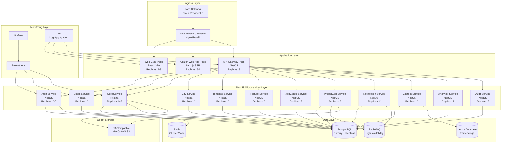
```mermaid
graph TB
    subgraph "Ingress Layer"
        LB[Load Balancer<br/>Cloud Provider LB]
        IngressController[K8s Ingress Controller<br/>Nginx/Traefik]
    end

    subgraph "Application Layer"
        WebCMS[Web CMS Pods<br/>React SPA<br/>Replicas: 2-3]
        WebApp[Citizen Web App Pods<br/>Next.js SSR<br/>Replicas: 3-5]
        Gateway[API Gateway Pods<br/>NestJS<br/>Replicas: 3]
    end

    subgraph "NestJS Microservices Layer"
        Auth[Auth Service<br/>NestJS<br/>Replicas: 2-3]
        Users[Users Service<br/>NestJS<br/>Replicas: 2]
        Core[Core Service<br/>NestJS<br/>Replicas: 3-5]
        City[City Service<br/>NestJS<br/>Replicas: 2]
        Template[Template Service<br/>NestJS<br/>Replicas: 2]
        Feature[Feature Service<br/>NestJS<br/>Replicas: 2]
        AppConfig[AppConfig Service<br/>NestJS<br/>Replicas: 2]
        ProjectGen[ProjectGen Service<br/>NestJS<br/>Replicas: 2]
        Notification[Notification Service<br/>NestJS<br/>Replicas: 2]
        Chatbot[Chatbot Service<br/>NestJS<br/>Replicas: 2]
        Analytics[Analytics Service<br/>NestJS<br/>Replicas: 2]
        Audit[Audit Service<br/>NestJS<br/>Replicas: 2]
    end

    subgraph "Data Layer"
        PG[(PostgreSQL<br/>Primary + Replicas)]
        Redis[(Redis<br/>Cluster Mode)]
        RabbitMQ[(RabbitMQ<br/>High Availability)]
        VectorDB[(Vector Database<br/>Embeddings)]
    end

    subgraph "Object Storage"
        S3[S3-Compatible<br/>MinIO/AWS S3]
    end

    subgraph "Monitoring Layer"
        Prometheus[Prometheus]
        Grafana[Grafana]
        Loki[Loki<br/>Log Aggregation]
    end

    %% Ingress connections
    LB --> IngressController
    IngressController --> WebCMS
    IngressController --> WebApp
    IngressController --> Gateway

    %% Gateway to services
    Gateway --> Auth
    Gateway --> Users
    Gateway --> Core
    Gateway --> City
    Gateway --> Template
    Gateway --> Feature
    Gateway --> AppConfig
    Gateway --> ProjectGen
    Gateway --> Notification
    Gateway --> Chatbot
    Gateway --> Analytics
    Gateway --> Audit

    %% Services to data layer
    Auth --> PG
    Auth --> Redis
    Users --> PG
    Core --> PG
    Core --> RabbitMQ
    Core --> S3
    City --> PG
    Template --> PG
    Feature --> PG
    AppConfig --> PG
    ProjectGen --> PG
    ProjectGen --> RabbitMQ
    ProjectGen --> S3
    Notification --> PG
    Notification --> RabbitMQ
    Chatbot --> PG
    Chatbot --> VectorDB
    Analytics --> PG
    Audit --> PG

    %% Monitoring connections
    Prometheus --> Auth
    Prometheus --> Users
    Prometheus --> Core
    Grafana --> Prometheus
    Loki --> WebCMS
    Loki --> WebApp
    Loki --> Gateway
```

## 7.2 Kubernetes Namespace Structure (NestJS Monorepo)

```
heidi-production/
├── web/
│   ├── web-cms/              (Web CMS deployment)
│   └── web-app/              (Citizen Web App deployment)
├── nestjs-services/
│   ├── api-gateway/          (NestJS API Gateway)
│   ├── auth-service/         (NestJS Auth Service)
│   ├── users-service/        (NestJS Users Service)
│   ├── core-service/         (NestJS Core Service)
│   ├── city-service/         (NestJS City Management Service)
│   ├── template-service/     (NestJS Template Service)
│   ├── feature-service/      (NestJS Feature Service)
│   ├── appconfig-service/    (NestJS AppConfig Service)
│   ├── projectgen-service/   (NestJS ProjectGen Service)
│   ├── notification-service/ (NestJS Notification Service)
│   ├── chatbot-service/      (NestJS Chatbot Service)
│   ├── analytics-service/    (NestJS Analytics Service)
│   └── audit-service/        (NestJS Audit Service)
├── infrastructure/
│   ├── postgresql/           (PostgreSQL StatefulSet)
│   ├── redis/                (Redis StatefulSet)
│   └── rabbitmq/             (RabbitMQ StatefulSet)
└── monitoring/
    ├── prometheus/           (Prometheus)
    └── grafana/              (Grafana)
```

### NestJS Service Deployment Strategy

Each NestJS microservice is deployed as a separate Kubernetes deployment but shares:
- Common base Docker image (NestJS runtime)
- Shared configuration via ConfigMaps
- Common secrets for database and external services
- Shared monitoring and logging configuration

## 7.3 Resource Allocation

### Web Layer
- **Web CMS**: 2-3 replicas, 512Mi memory, 0.5 CPU
- **Citizen Web App**: 3-5 replicas, 1Gi memory, 1 CPU (higher due to SSR)
- **API Gateway**: 3 replicas, 512Mi memory, 0.5 CPU

### Microservices
- **Auth Service**: 2-3 replicas, 256Mi memory, 0.25 CPU
- **Core Service**: 3-5 replicas, 512Mi memory, 0.5 CPU (higher load)
- **Other Services**: 2-3 replicas each, 256-512Mi memory, 0.25-0.5 CPU

### Data Layer
- **PostgreSQL**: Primary + 2 replicas, 4-8Gi memory, 2-4 CPU
- **Redis**: 3-node cluster, 1Gi memory per node, 0.5 CPU per node
- **RabbitMQ**: 3-node cluster, 512Mi memory per node, 0.25 CPU per node

### Scaling Strategy
- **Horizontal Pod Autoscaler (HPA)**: Based on CPU/memory utilization
- **Vertical Pod Autoscaler (VPA)**: Optimize resource requests
- **Database**: Manual scaling or read replicas for read-heavy workloads

## 7.4 Environment Tiers

### Development
- Single-node cluster or local Kubernetes (minikube, k3s)
- Minimal replicas (1 per service)
- Local PostgreSQL, Redis, RabbitMQ
- No high availability
- Debug logging enabled

### Staging
- Multi-node cluster
- 2 replicas per service
- Shared database (tenant-isolated)
- Production-like configuration
- Performance testing environment

### Production
- Multi-node cluster across availability zones
- 3+ replicas for critical services
- High availability for all data stores
- Production-grade monitoring
- Disaster recovery procedures
- Blue-green or canary deployments

## 7.5 Deployment Strategy

### Blue-Green Deployment
- Deploy new version to "green" environment
- Switch traffic from "blue" to "green"
- Keep "blue" as rollback option
- Zero-downtime deployments

### Canary Deployment
- Deploy new version to subset of pods (10%)
- Monitor metrics and errors
- Gradually increase traffic (10% → 50% → 100%)
- Rollback if issues detected

### Rolling Updates
- Default Kubernetes strategy
- Gradually replace pods
- Maintains service availability
- Automatic rollback on health check failures

## 7.6 Health Checks & Readiness

### Liveness Probe
- Determines if container is running
- Restarts container if unhealthy
- HTTP endpoint: `/health/live`
- Interval: 30s, Timeout: 5s, Failure threshold: 3

### Readiness Probe
- Determines if container can accept traffic
- Removes from load balancer if not ready
- HTTP endpoint: `/health/ready`
- Checks: Database connection, dependencies
- Interval: 10s, Timeout: 5s, Failure threshold: 3

### Startup Probe
- Allows slow-starting containers extra time
- Prevents liveness probe from killing during startup
- HTTP endpoint: `/health/startup`
- Initial delay: 0s, Period: 10s, Timeout: 5s

## 7.7 Networking

### Service Mesh (Optional)
- Istio or Linkerd for advanced traffic management
- Mutual TLS between services
- Request tracing and observability
- Circuit breaking and retries

### Ingress Configuration
- TLS termination at ingress
- Path-based routing
- Host-based routing (subdomains)
- Rate limiting per path/host

### Internal Communication
- Services communicate via Kubernetes DNS
- Format: `service-name.namespace.svc.cluster.local`
- Internal load balancing via kube-proxy

## 7.8 Storage

### Persistent Volumes
- PostgreSQL: Persistent Volume Claims (SSD)
- Redis: Persistent Volume Claims (SSD) for persistence
- RabbitMQ: Persistent Volume Claims (SSD) for queues

### Object Storage
- S3-compatible storage (external or MinIO in cluster)
- Media files, build artifacts, backups
- CDN integration for public assets

---

# 8. Security Architecture

This section details security measures across all layers of the system.

## 8.1 JWT Token Structure

### Access Token Claims
```json
{
  "sub": "user123",                    // Subject (user ID)
  "tenantId": "city1",                 // Tenant identifier
  "roles": ["city_admin"],             // User roles
  "permissions": ["listings:write"],   // Granular permissions
  "iat": 1705315200,                   // Issued at
  "exp": 1705322400,                   // Expiration (2 hours)
  "jti": "token-id-123"                // JWT ID (for revocation)
}
```

### Refresh Token
- Separate long-lived token (7-30 days)
- Stored in HTTP-only cookie or secure storage
- Used to obtain new access tokens
- Can be revoked independently

### Token Lifecycle
1. User logs in → Access token (2h) + Refresh token (30d) issued
2. Access token expires → Client uses refresh token to get new access token
3. Refresh token expires → User must re-authenticate
4. User logs out → Both tokens revoked (blacklisted in Redis)

## 8.2 RBAC Permission Matrix

| Role | Listings | Categories | Users | Builds | Templates | Features | Analytics |
|------|----------|------------|-------|--------|-----------|----------|-----------|
| **Super Admin** | Read/Write (all tenants) | Read/Write (all) | Read/Write (all) | Read/Write (all) | Read/Write | Read/Write | Read (all) |
| **Super City Admin** | Read/Write (own tenant) | Read/Write (own tenant) | Read/Write (own tenant) | Read/Write (own tenant) | Read | Read/Write (own tenant) | Read (own tenant) |
| **City Admin** | Read/Write (own tenant) | Read/Write (own tenant) | Read (own tenant) | Read | Read | Read | Read (own tenant) |
| **Editor** | Create (pending) | Read | - | - | - | - | - |

### Permission Granularity
- Resource-level: `listings:read`, `listings:write`, `listings:delete`
- Action-level: `users:create`, `users:update`, `users:delete`
- Scope-level: `own_tenant`, `all_tenants`

## 8.3 Tenant Isolation Strategy

### Database Level
- **Schema Isolation**: Each tenant has dedicated schema or `tenant_id` column
- **Row-Level Security**: PostgreSQL RLS policies enforce tenant filtering
- **Connection Pooling**: Separate connection pools per tenant (optional)

### Application Level
- **Middleware**: All requests include `X-Tenant-ID` header
- **Query Filtering**: All queries automatically include tenant filter
- **Data Access Layer**: Abstraction layer enforces tenant scoping

### Cache Level
- **Key Prefixing**: All cache keys include tenant ID (`tenant:city1:resource:id`)
- **Namespace Isolation**: Redis namespaces per tenant (optional)

### Multi-Tenant Data Access Pattern
```sql
-- Automatic tenant filtering (via middleware/ORM)
SELECT * FROM listings
WHERE tenant_id = :tenantId AND status = 'published';
```

## 8.4 API Gateway Security

### Rate Limiting
- **Per Tenant**: 1000 requests/minute per tenant
- **Per User**: 100 requests/minute per authenticated user
- **Per IP**: 50 requests/minute per IP (anonymous)
- **Burst**: Allow 2x limit for 10 seconds

### Request Validation
- Input sanitization (XSS prevention)
- SQL injection prevention (parameterized queries)
- Request size limits (10MB for uploads, 1MB for JSON)
- Content-Type validation

### CORS Configuration
- Allowed origins: Configured per environment
- Credentials: Required for authenticated requests
- Methods: GET, POST, PATCH, DELETE, OPTIONS
- Headers: Authorization, Content-Type, X-Tenant-ID

### Web Application Firewall (WAF)
- Protection against:
  - SQL injection
  - XSS attacks
  - CSRF attacks
  - DDoS attacks
- Block suspicious patterns
- Rate limit aggressive IPs

## 8.5 Data Encryption

### Encryption at Rest
- **Database**: PostgreSQL encryption at rest (LUKS, TDE, or cloud provider encryption)
- **Object Storage**: S3 server-side encryption (SSE-S3 or SSE-KMS)
- **Secrets**: Kubernetes Secrets encrypted at rest (etcd encryption)

### Encryption in Transit
- **TLS 1.3**: All external communications (HTTPS)
- **mTLS**: Optional mutual TLS between services (service mesh)
- **Database**: TLS connections to PostgreSQL
- **Redis**: TLS for Redis connections (optional)

### Key Management
- **Secrets Store**: Kubernetes Secrets or external secret manager (HashiCorp Vault, AWS Secrets Manager)
- **Key Rotation**: Automated key rotation policies
- **Access Control**: RBAC for secret access

## 8.6 Input Validation & Sanitization

### Content Fields
- **Rich Text**: Sanitize HTML (whitelist tags, remove scripts)
- **Markdown**: Validate markdown syntax, sanitize embedded HTML
- **File Uploads**: Validate file type, size, scan for malware
- **URLs**: Validate URL format, check for malicious domains

### API Input Validation
- **JSON Schema**: Validate all request bodies against schemas
- **Type Validation**: Enforce data types (string, number, boolean)
- **Range Validation**: Enforce min/max values
- **Required Fields**: Validate required fields present

### SQL Injection Prevention
- **Parameterized Queries**: Always use prepared statements
- **ORM Usage**: Use ORM with built-in injection prevention
- **Input Escaping**: Escape special characters if raw queries needed

### XSS Prevention
- **Output Encoding**: Encode all user-generated content
- **CSP Headers**: Content Security Policy restricts script execution
- **HttpOnly Cookies**: Prevent JavaScript access to sensitive cookies

## 8.7 Secure File Uploads

### Validation
- **File Type**: Whitelist allowed MIME types (image/*, application/pdf)
- **File Size**: Limit upload size (10MB for images, 50MB for documents)
- **File Name**: Sanitize filenames, prevent directory traversal
- **Virus Scanning**: Scan uploaded files for malware

### Storage
- **Isolated Buckets**: Separate buckets per tenant
- **Access Control**: Pre-signed URLs for temporary access
- **CDN**: Serve public assets via CDN with access controls

### Processing
- **Image Processing**: Generate thumbnails, strip EXIF data
- **Async Processing**: Process large files asynchronously
- **Error Handling**: Handle processing failures gracefully

## 8.8 GDPR Compliance

### Data Residency
- All data stored in EU data centers
- No data transfer outside EU without explicit consent
- Documented data processing locations

### Consent Management
- **Cookie Consent**: Banner for analytics/tracking cookies
- **Data Processing Consent**: Explicit consent for data processing
- **Marketing Consent**: Opt-in for marketing communications

### User Rights
- **Right to Access**: Users can request their data export
- **Right to Deletion**: Users can request account/data deletion
- **Right to Rectification**: Users can update their data
- **Right to Portability**: Data export in machine-readable format

### Data Retention
- **User Data**: Retained while account active, deleted 30 days after account deletion
- **Audit Logs**: Retained for 7 years (compliance)
- **Analytics**: Anonymized after 2 years

### Privacy by Design
- Data minimization (collect only necessary data)
- Purpose limitation (use data only for stated purposes)
- Pseudonymization where possible
- Regular privacy impact assessments

---

# 9. Cross-Cutting Concerns

This section covers cross-cutting concerns applicable to all services.

## 9.1 Logging Strategy

### Structured Logging
- **Format**: JSON logs for machine parsing
- **Fields**: timestamp, level, service, tenantId, userId, correlationId, message, context

### Log Levels
- **ERROR**: Application errors requiring attention
- **WARN**: Warning conditions (degraded functionality)
- **INFO**: Informational messages (request processing, state changes)
- **DEBUG**: Detailed debugging information (development only)

### Correlation IDs
- **Generation**: API Gateway generates correlation ID per request
- **Propagation**: Correlation ID included in all service calls
- **Tracking**: Trace request across all services

### Log Aggregation
- **Centralized**: All logs collected in Loki or ELK stack
- **Retention**: 30 days for application logs, 7 years for audit logs
- **Search & Query**: LogQL (Loki) or Kibana (ELK) for log analysis
- **Alerting**: Alert on ERROR patterns, rate thresholds

### Log Format Example
```json
{
  "timestamp": "2024-01-15T10:30:00.000Z",
  "level": "INFO",
  "service": "core-service",
  "tenantId": "city1",
  "userId": "user123",
  "correlationId": "req-abc-123",
  "message": "Listing created",
  "context": {
    "listingId": "listing456",
    "status": "pending_approval",
    "operation": "create"
  }
}
```

## 9.2 Distributed Tracing

### Tracing Strategy
- **Standard**: OpenTelemetry for instrumentation
- **Protocol**: OTLP (OpenTelemetry Protocol)
- **Backend**: Jaeger or Tempo for trace storage
- **Sampling**: 100% for errors, 10% for successful requests (configurable)

### Trace Propagation
- **Format**: W3C Trace Context (traceparent header)
- **Generation**: API Gateway generates trace ID
- **Propagation**: Trace ID propagated across all service calls (HTTP headers, RabbitMQ metadata)
- **Span Creation**: Each service creates spans for operations

### Span Attributes
- Service name, operation name, tenant ID, user ID
- HTTP method, status code, request duration
- Database queries, external API calls
- Error details (if applicable)

### Trace Visualization
- **UI**: Jaeger UI or Grafana Tempo
- **Search**: Filter by service, tenant, user, operation, time range
- **Analysis**: Identify slow operations, error patterns, service dependencies

### Trace Example
```
Trace: req-abc-123
├── Span: API Gateway /api/listings (100ms)
│   ├── Span: Core Service POST /listings (80ms)
│   │   ├── Span: Database INSERT (20ms)
│   │   └── Span: RabbitMQ Publish (5ms)
│   └── Span: Auth Service Validate Token (15ms)
```

## 9.3 Health Checks and Readiness Probes

### Health Check Endpoints

#### Liveness Probe
- **Endpoint**: `GET /health/live`
- **Purpose**: Determine if container is running
- **Response**: 200 OK if healthy, 503 if unhealthy
- **Checks**: Application process running, no fatal errors
- **K8s Configuration**: Interval 30s, Timeout 5s, Failure threshold 3

#### Readiness Probe
- **Endpoint**: `GET /health/ready`
- **Purpose**: Determine if container can accept traffic
- **Response**: 200 OK if ready, 503 if not ready
- **Checks**:
  - Database connection available
  - Redis connection available (if used)
  - RabbitMQ connection available (if used)
  - External dependencies accessible
- **K8s Configuration**: Interval 10s, Timeout 5s, Failure threshold 3

#### Startup Probe
- **Endpoint**: `GET /health/startup`
- **Purpose**: Allow slow-starting containers extra time
- **Response**: 200 OK when started
- **K8s Configuration**: Initial delay 0s, Period 10s, Timeout 5s, Failure threshold 30

### Health Check Implementation
```json
{
  "status": "healthy",
  "timestamp": "2024-01-15T10:30:00Z",
  "service": "core-service",
  "version": "1.2.3",
  "checks": {
    "database": "healthy",
    "redis": "healthy",
    "rabbitmq": "healthy"
  },
  "uptime": 86400
}
```

### Dependency Health Checks
- **Database**: Simple query (`SELECT 1`)
- **Redis**: PING command
- **RabbitMQ**: Connection check
- **External APIs**: Lightweight connectivity test

### Failure Behavior
- **Liveness Failure**: Container restarted by Kubernetes
- **Readiness Failure**: Container removed from service endpoints
- **Startup Failure**: Container killed and recreated

## 9.4 Configuration Management

### Configuration Sources
1. **Environment Variables**: Runtime configuration (database URLs, API keys)
2. **ConfigMaps**: Kubernetes ConfigMaps for non-sensitive configuration
3. **Secrets**: Kubernetes Secrets for sensitive data (passwords, tokens)
4. **External Config Service**: Optional centralized configuration service

### Configuration Hierarchy
```
Environment-specific values (override)
  ↓
Service defaults (base configuration)
  ↓
Platform defaults (fallback)
```

### Configuration Categories

#### Application Configuration
- Database connection strings
- Redis connection settings
- RabbitMQ broker URLs
- Service endpoints
- Feature flags

#### Environment-Specific
- Development: Local services, debug logging
- Staging: Shared services, production-like settings
- Production: High availability, production logging

#### Tenant Configuration
- Feature module enablement
- Theme settings
- Branding assets
- Notification preferences

### Configuration Format
- **Primary**: YAML or JSON
- **Environment Variables**: Uppercase with underscores (e.g., `DATABASE_URL`)
- **Validation**: Schema validation on startup
- **Hot Reload**: Supported for non-critical configuration (optional)

### Secret Management
- **Storage**: Kubernetes Secrets or external secret manager (Vault)
- **Rotation**: Automated secret rotation policies
- **Access**: RBAC for secret access
- **Encryption**: Encrypted at rest and in transit

### NestJS Configuration Management
- **ConfigModule**: NestJS configuration module with environment validation
- **Configuration Schema**: Joi validation schemas for all configuration
- **Environment Files**: `.env` files for development, ConfigMaps for production
- **Type Safety**: TypeScript interfaces for all configuration objects

### Configuration Example
```yaml
# config.yaml
database:
  host: ${DB_HOST}
  port: ${DB_PORT:-5432}
  name: ${DB_NAME}
  ssl: true

redis:
  host: ${REDIS_HOST}
  port: ${REDIS_PORT:-6379}

features:
  chatbot:
    enabled: ${CHATBOT_ENABLED:-true}
  notifications:
    enabled: ${NOTIFICATIONS_ENABLED:-true}
```

## 9.5 Error Handling Patterns

### Error Response Format
Standardized error response across all services:

```json
{
  "error": {
    "code": "LISTING_NOT_FOUND",
    "message": "Listing with ID '123' not found",
    "details": {
      "listingId": "123",
      "tenantId": "city1"
    },
    "timestamp": "2024-01-15T10:30:00Z",
    "correlationId": "req-abc-123",
    "path": "/api/listings/123"
  }
}
```

### HTTP Status Codes
- **200 OK**: Successful request
- **201 Created**: Resource created successfully
- **202 Accepted**: Request accepted for async processing
- **400 Bad Request**: Invalid request parameters
- **401 Unauthorized**: Authentication required
- **403 Forbidden**: Insufficient permissions
- **404 Not Found**: Resource not found
- **409 Conflict**: Resource conflict (e.g., duplicate)
- **422 Unprocessable Entity**: Validation errors
- **429 Too Many Requests**: Rate limit exceeded
- **500 Internal Server Error**: Unexpected server error
- **502 Bad Gateway**: Upstream service error
- **503 Service Unavailable**: Service temporarily unavailable

### Error Categories

#### Client Errors (4xx)
- **Validation Errors**: Invalid input data
  - Field-level validation errors
  - Format validation (email, URL, etc.)
  - Business rule violations
- **Authorization Errors**: Permission denied
  - Missing authentication
  - Insufficient permissions
  - Tenant mismatch
- **Resource Errors**: Resource not found or conflict
  - Resource doesn't exist
  - Resource already exists
  - Resource locked or in use

#### Server Errors (5xx)
- **Application Errors**: Application logic errors
  - Unexpected exceptions
  - Null pointer exceptions
  - Business logic failures
- **External Service Errors**: Dependency failures
  - Database connection failures
  - External API failures
  - Timeout errors
- **Infrastructure Errors**: System-level errors
  - Out of memory
  - Disk full
  - Network issues

### Error Handling Strategy

#### Try-Catch Pattern
```javascript
try {
  const result = await operation();
  return { success: true, data: result };
} catch (error) {
  if (error instanceof ValidationError) {
    return { success: false, error: formatValidationError(error) };
  } else if (error instanceof NotFoundError) {
    return { success: false, error: formatNotFoundError(error) };
  } else {
    logger.error('Unexpected error', { error, correlationId });
    return { success: false, error: formatInternalError(error) };
  }
}
```

#### Circuit Breaker for External Calls
- **Closed**: Normal operation
- **Open**: Failures exceed threshold, fast-fail with cached error
- **Half-Open**: Testing if service recovered

#### Retry Strategy
- **Transient Errors**: Retry with exponential backoff
- **Permanent Errors**: Fail immediately
- **Max Retries**: 3 attempts with backoff (1s, 2s, 4s)
- **Idempotency**: Ensure operations are idempotent for safe retries

#### Error Logging
- **Client Errors (4xx)**: Log at WARN level with context
- **Server Errors (5xx)**: Log at ERROR level with stack trace
- **Correlation ID**: Include in all error logs for traceability
- **Sensitive Data**: Never log passwords, tokens, or PII in errors

### Error Propagation
- **Service Boundaries**: Errors converted to standard format at API boundary
- **Internal Errors**: Internal error types for service-to-service communication
- **User-Facing Messages**: Sanitized, user-friendly error messages
- **Developer Messages**: Detailed error information in development mode only

### Monitoring and Alerting
- **Error Rate**: Alert if error rate exceeds threshold (5% of requests)
- **Error Types**: Track error codes and patterns
- **Critical Errors**: Immediate alerts for 500 errors
- **Error Trends**: Monitor error trends over time

---

# 10. Platform Requirements Summary

This section consolidates requirements from all platform components: Backend, Web CMS, Citizen Web App, and Mobile App.

## 10.1 Core Backend Responsibilities

The backend implements the following platform capabilities:

| Capability | Description |
|------------|-------------|
| **Template & Feature Registry** | Store template metadata/versions (A/B), feature module metadata, dependencies, compatibility matrix |
| **App Configuration & Orchestration** | Persist app config (name, bundle ID, assets, theme, features), orchestrate project generation, build status tracking |
| **Core Business Logic** | Cities → Categories → Sub-categories → Listings hierarchy, CRUD + approval workflows, search/filtering APIs |
| **Authentication & RBAC** | JWT-based auth, refresh tokens, tenant-aware sessions, role-based access control |
| **Tenant Management** | Tenant lifecycle (onboarding, activation, configuration), tenant-scoped resources |
| **Notification & Scheduler** | Multi-channel notifications (push/email), job scheduling, background processing |
| **Integration & Connectors** | External API adapters (DeepL, Payments, Destination.One), retry/reconciliation logic |
| **Analytics & Audit** | Usage metrics, dashboards, system-wide audit trail |
| **App Factory Services** | Artifact storage, build metadata, signing coordination, worker orchestration |
| **Chatbot (RAG)** | Embedding pipeline, vector index management, retrieval layer, tenant-scoped query API |

## 10.2 Content Hierarchy & Business Rules

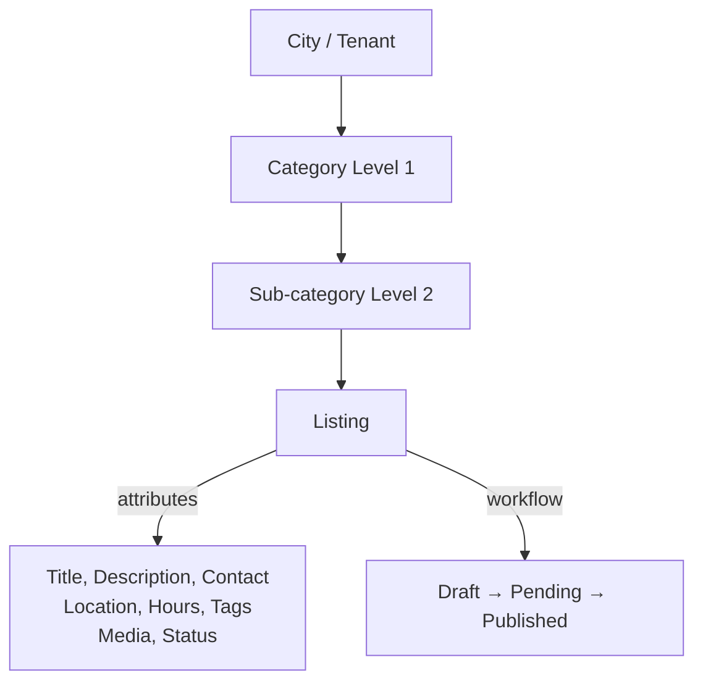
```mermaid
graph TD
    City[City / Tenant] --> Category[Category Level 1]
    Category --> SubCategory[Sub-category Level 2]
    SubCategory --> Listing[Listing]

    Listing --> |attributes| Attrs[Title, Description, Contact<br/>Location, Hours, Tags<br/>Media, Status]
    Listing --> |workflow| Workflow[Draft → Pending → Published]
```

**Listing Attributes:**
- Title, description, contact information
- Location (geospatial), opening hours
- Tags, media attachments
- Category assignment, approval status

**Workflows:**
- Admin/City Admin approvals and moderation
- Public listing visibility states
- Versioning (audit trail) on edits and approvals

## 10.3 Role Permissions Matrix (Extended)

| Permission | Super Admin | Super City Admin | City Admin | Editor | Anonymous |
|------------|:-----------:|:----------------:|:----------:|:------:|:---------:|
| **City Management** | All tenants | Own tenant | - | - | - |
| **Template Selection** | All | Own tenant | Read | - | - |
| **Feature Toggles** | All | Own tenant | Read | - | - |
| **User Management** | All | Own tenant | Own tenant | - | - |
| **Listings CRUD** | All | Own tenant | Own tenant | Create (pending) | Read |
| **Listings Approval** | All | Own tenant | Own tenant | - | - |
| **Content Publishing** | All | Own tenant | Own tenant | - | - |
| **Build Triggers** | All | Own tenant | Read | - | - |
| **Analytics** | All tenants | Own tenant | Own tenant | - | - |
| **Audit Logs** | All | Own tenant | Own tenant | - | - |
| **Chatbot Admin** | All | Own tenant | Own tenant | - | - |
| **Impersonation** | ✓ | - | - | - | - |

---

# 11. Mobile App Architecture

## 11.1 Technology Stack

| Component | Technology | Notes |
|-----------|------------|-------|
| **Framework** | Flutter | Single codebase for Android + iOS |
| **State Management** | Provider / Riverpod / Bloc | Team choice, document conventions |
| **Local Persistence** | Hive or SQLite | Cache, offline queue |
| **Networking** | Dio | Retry/backoff, centralized interceptors |
| **Maps** | Mapbox or Leaflet | License decision required |
| **Crash Reporting** | Sentry | Performance monitoring |
| **CI/CD** | Docker (Android), Bitrise/Codemagic (iOS) | Orchestrated by App Factory |
| **Signing** | Fastlane | iOS match, Android keystore from Vault |

## 11.2 App Generation & Modularity

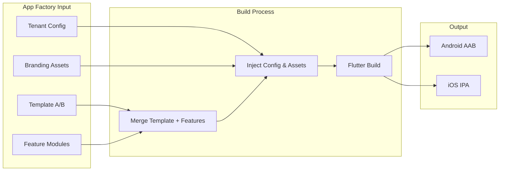
```mermaid
graph LR
    subgraph "App Factory Input"
        Template[Template A/B]
        Features[Feature Modules]
        Config[Tenant Config]
        Assets[Branding Assets]
    end

    subgraph "Build Process"
        Merge[Merge Template + Features]
        Inject[Inject Config & Assets]
        Build[Flutter Build]
    end

    subgraph "Output"
        AAB[Android AAB]
        IPA[iOS IPA]
    end

    Template --> Merge
    Features --> Merge
    Config --> Inject
    Assets --> Inject
    Merge --> Inject
    Inject --> Build
    Build --> AAB
    Build --> IPA
```

**Template-driven UI:**
- App visual structure determined by Template A or B
- Navigation, home layout, major UX patterns per template

**Feature Modules (Flutter packages):**
- Listings, Search, Events, Maps/POI
- Job Matching, Business Community
- Chatbot, Live Chat, Ads, Surveys
- Defect Reporter, Multilingualism

**Build-time Configuration:**
- App Factory merges selected feature packages
- Injects config (bundle ID, icons, theme)
- Some features toggleable at runtime via remote config

## 11.3 Mobile App Structure

```
heidi-mobile/
├── apps/
│   ├── template_a/           # Template A shell app
│   └── template_b/           # Template B shell app
├── packages/
│   ├── core/
│   │   ├── network/          # Dio client, interceptors
│   │   ├── auth/             # JWT handling, secure storage
│   │   ├── tenant/           # Tenant context management
│   │   └── storage/          # Local persistence
│   ├── features/
│   │   ├── listings/         # Listings feature module
│   │   ├── search/           # Search feature module
│   │   ├── events/           # Events & news module
│   │   ├── maps/             # Maps & POI module
│   │   ├── chatbot/          # Chatbot feature module
│   │   ├── jobs/             # Job matching module
│   │   ├── community/        # Business community module
│   │   ├── ads/              # Advertisement module
│   │   ├── surveys/          # Survey tool module
│   │   └── defect_reporter/  # Defect reporting module
│   └── ui/
│       ├── design_system/    # Shared UI components
│       └── theme/            # Theming utilities
├── scripts/                  # Build & deployment scripts
└── fastlane/                 # iOS/Android signing lanes
```

## 11.4 Core Screens & Flows

### Global Shell
- Splash screen (per-tenant branding)
- Onboarding (optional)
- Home / Dashboard (cards/grid per template)
- Global Search, Bottom navigation / drawer
- Profile & Settings

### Listings Flow
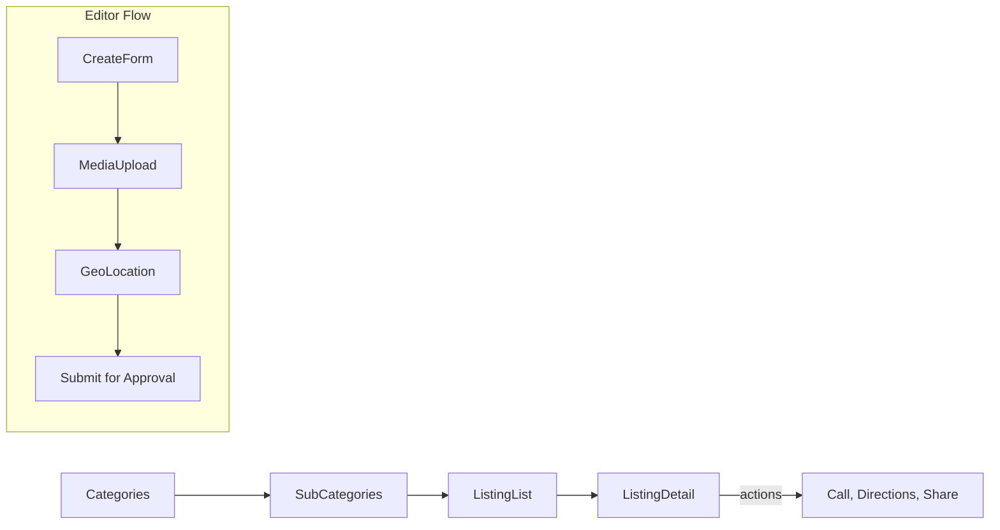
```mermaid
flowchart LR
    Categories --> SubCategories --> ListingList --> ListingDetail
    ListingDetail --> |actions| Actions[Call, Directions, Share]

    subgraph "Editor Flow"
        CreateForm --> MediaUpload --> GeoLocation --> Submit[Submit for Approval]
    end
```

### Feature Screens
- **Events & News**: List, calendar view, detail with RSVP
- **Maps & POI**: Map view, markers, clusters, filters
- **Job Matching**: Job list, detail, apply flow
- **Business Community**: Feed, post creation, comments
- **Chatbot**: Floating launcher, conversation UI, citations
- **Notifications**: In-app center, push handling, deep links

## 11.5 Offline & Sync Strategy

| Data Type | Strategy |
|-----------|----------|
| **Listings List** | Cache with TTL, pull-to-refresh |
| **Last Viewed Items** | Local cache |
| **Favorites** | Sync on connect |
| **Search Results** | Cache recent queries |
| **Draft Submissions** | Queue offline, retry on connect |
| **Sensitive Data** | Encrypted local DB |

**Sync Model:**
- Optimistic queue with conflict handling
- Background retry when online
- Surface sync status in UI

## 11.6 Mobile Performance Targets

| Metric | Target |
|--------|--------|
| **Cold Start** | ≤ 2.5s on mid-range devices |
| **List Scroll** | 60fps (efficient rendering, pagination) |
| **Network Response** | < 500ms for search & listing loads |
| **App Size** | Minimize dependencies, monitor AAB/IPA size |
| **Memory** | Steady-state under mid-range thresholds |

---

# 12. Web Platform Architecture

## 12.1 Web CMS (Admin Panel)

### Technology Stack
- **Framework**: React + TypeScript
- **Styling**: Tailwind + HEIDI Design System
- **Rendering**: SPA (no SEO requirements)
- **Hosting**: Behind API Gateway, Kubernetes deployment

### CMS Functional Areas

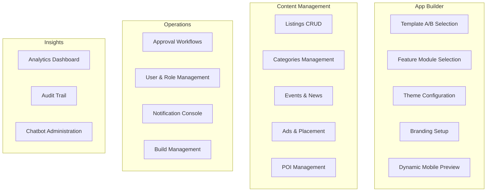
```mermaid
graph TB
    subgraph "App Builder"
        TemplateSelect[Template A/B Selection]
        FeatureSelect[Feature Module Selection]
        ThemeConfig[Theme Configuration]
        BrandingConfig[Branding Setup]
        Preview[Dynamic Mobile Preview]
    end

    subgraph "Content Management"
        Listings[Listings CRUD]
        Categories[Categories Management]
        Events[Events & News]
        Ads[Ads & Placement]
        POIs[POI Management]
    end

    subgraph "Operations"
        Approvals[Approval Workflows]
        Users[User & Role Management]
        Notifications[Notification Console]
        Builds[Build Management]
    end

    subgraph "Insights"
        Analytics[Analytics Dashboard]
        Audit[Audit Trail]
        ChatbotAdmin[Chatbot Administration]
    end
```

### Key CMS Features

| Feature | Description |
|---------|-------------|
| **App Builder** | Template selection, feature toggles, theme config, branding, metadata |
| **Dynamic Preview** | Real-time mobile app preview, instant updates, interactive navigation |
| **Content Management** | Rich text editing, media upload, versioning, multilingual support |
| **Approval Workflows** | Queue view, approve/reject/request changes, audit log |
| **Feature Modules** | Description, dependencies, version compatibility, enable/disable |
| **Notifications** | Push & email, templates, scheduling, delivery reports |
| **Build Management** | Trigger builds, real-time status, download artifacts, history |
| **User Management** | CRUD users, assign roles, impersonation (Super Admin) |
| **Analytics** | Usage metrics, content stats, feature usage, chatbot stats |
| **Audit Trail** | Configuration changes, build triggers, moderation actions |
| **Chatbot Admin** | Enable/disable, trigger ingestion, view progress, accuracy metrics |

## 12.2 Citizen Web App (Public Platform)

### Technology Stack
- **Framework**: Next.js
- **Rendering**: SSR for SEO pages, CSR for interactive features
- **Hosting**: Vercel-like SSR or self-hosted Node, CDN caching

### Rendering Strategy

| Page Type | Rendering | Reason |
|-----------|-----------|--------|
| Homepage | SSR | SEO, initial load |
| Category Pages | SSR | SEO, discoverability |
| Listing Pages | SSR | SEO, sharing |
| Search Results | SSR | SEO |
| Chatbot | CSR | Interactive |
| Profile | CSR | Authenticated |
| Favorites | CSR | Authenticated |

### Citizen Web App Features

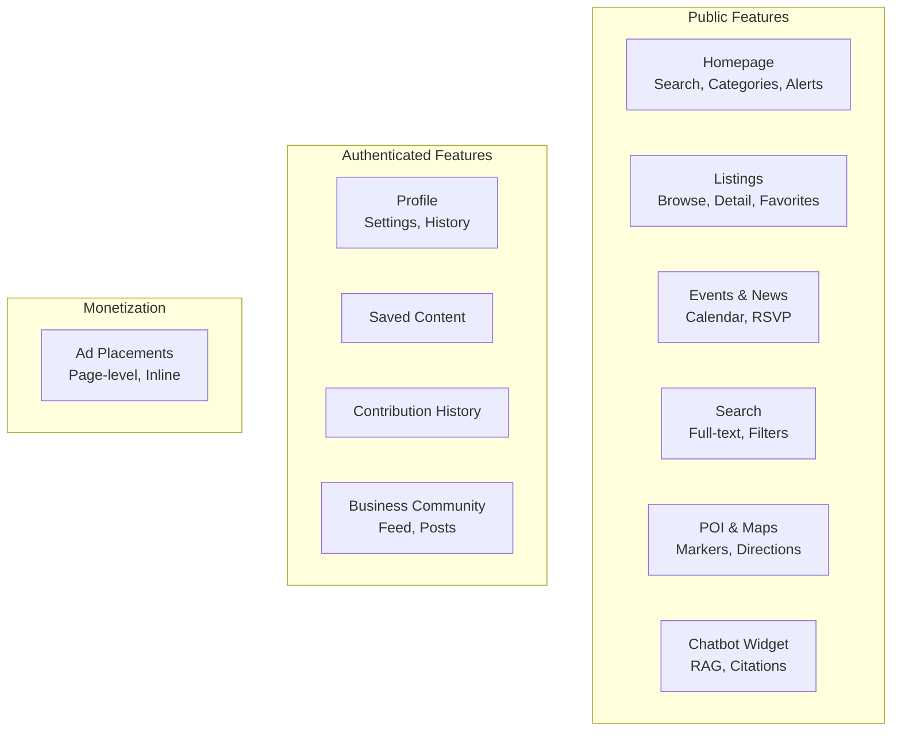
```mermaid
graph TB
    subgraph "Public Features"
        Home[Homepage<br/>Search, Categories, Alerts]
        Listings[Listings<br/>Browse, Detail, Favorites]
        Events[Events & News<br/>Calendar, RSVP]
        Search[Search<br/>Full-text, Filters]
        Maps[POI & Maps<br/>Markers, Directions]
        Chatbot[Chatbot Widget<br/>RAG, Citations]
    end

    subgraph "Authenticated Features"
        Profile[Profile<br/>Settings, History]
        Favorites[Saved Content]
        Contributions[Contribution History]
        Community[Business Community<br/>Feed, Posts]
    end

    subgraph "Monetization"
        Ads[Ad Placements<br/>Page-level, Inline]
    end
```

## 12.3 Web Security Requirements

| Requirement | Implementation |
|-------------|----------------|
| **Authentication** | JWT-based, HTTPS-only |
| **Input Sanitization** | All content fields |
| **File Uploads** | Presigned URLs, server validation |
| **Headers** | CSP, X-Frame-Options, X-Content-Type-Options |
| **Protection** | XSS, CSRF, Clickjacking prevention |
| **GDPR** | EU data storage, consent banner, deletion support |

## 12.4 Web Deployment Model

### Web CMS
- Kubernetes deployment
- Versioned releases
- Rollback via previous container image
- CI/CD: build → test → deploy

### Citizen Web App
- Vercel-like SSR or self-hosted Node
- CDN caching for public pages
- Rollback: previous version in registry

---

# 13. Feature Modules Catalog

## 13.1 Core Features (Always Available)

| Feature | Backend Service | Web CMS | Web App | Mobile |
|---------|-----------------|---------|---------|--------|
| **Listings** | Core Service | ✓ | ✓ | ✓ |
| **Categories** | Core Service | ✓ | ✓ | ✓ |
| **Search** | Core Service | ✓ | ✓ | ✓ |
| **User Management** | Users Service | ✓ | - | - |
| **Authentication** | Auth Service | ✓ | ✓ | ✓ |

## 13.2 Opt-in Feature Modules

| Feature Module | Description | Dependencies |
|----------------|-------------|--------------|
| **User Onboarding** | Guided onboarding flow for new users | Auth |
| **POI Map** | Map-based service view with markers | Core, Maps Provider |
| **Theme Design** | Custom theme configuration | AppConfig |
| **Admin Management** | Extended admin capabilities | Users, RBAC |
| **Multilingualism** | Multi-language content support | Core, DeepL Integration |
| **Multiple Location Selection** | Multi-location filtering | Core, Maps |
| **Channel Function** | Content channels/categories | Core |
| **Job Matching** | Job listings and applications | Core |
| **SpotAR Interface** | AR integration (Gera) | External API |
| **Pre-Planning Function** | Appointment/visit planning | Core, Scheduler |
| **Simplycard Integration** | Loyalty card integration | External API |
| **Waste Collection Calendar** | Waste pickup schedules | Core, Scheduler |
| **Live Chat** | Real-time chat support | WebSocket, External Service |
| **Advertisement Feature** | Ad placements and management | Core, Analytics |
| **Mobile Dashboard** | Admin dashboard in mobile | Analytics |
| **Defect Reporter** | Issue/defect submission | Core, Media Upload |
| **Survey Tool** | Survey creation and responses | Core |
| **Business Community** | Community feed and posts | Core, Users |
| **Chatbot (RAG)** | AI-powered Q&A | Chatbot Service, Vector DB |

## 13.3 Feature Module Architecture

```mermaid
graph TB
    subgraph "Feature Service"
        Registry[Feature Registry]
        Compatibility[Compatibility Matrix]
        Dependencies[Dependency Graph]
        Toggles[Tenant Toggles]
    end

    subgraph "Per Feature"
        Metadata[Feature Metadata]
        Version[Version Info]
        Config[Configuration Schema]
        Permissions[Required Permissions]
    end

    Registry --> Metadata
    Compatibility --> Version
    Dependencies --> Config
    Toggles --> Permissions
```

**Feature Registration:**
- Each feature registered in Feature Service
- Declares dependencies and compatible template versions
- Provides configuration schema
- Specifies required permissions

**Feature Lifecycle:**
- Enable/disable per tenant via CMS
- Build-time inclusion for mobile
- Runtime toggles where safe
- Version compatibility checks

---

# 14. Infrastructure & Hosting Plan

## 14.1 Cloud Infrastructure (Hetzner)

```mermaid
graph TB
    subgraph "Hetzner Cloud"
        subgraph "Kubernetes Cluster"
            subgraph "Namespaces"
                Dev[dev namespace]
                Stage[staging namespace]
                Prod[production namespace]
            end
        end

        subgraph "Managed Services"
            PG[(PostgreSQL<br/>Per-service DBs)]
            Redis[(Redis<br/>Cache, Sessions)]
            S3[(Object Storage<br/>Media, Artifacts)]
        end
    end

    subgraph "External Services"
        RabbitMQ[(RabbitMQ<br/>Message Queue)]
        Vault[HashiCorp Vault<br/>Secrets]
        Pinecone[(Pinecone<br/>Vector DB)]
    end

    subgraph "CI/CD"
        GitHub[GitHub Actions]
        Bitrise[Bitrise/Codemagic<br/>iOS Builds]
    end
```

## 14.2 Infrastructure Components

| Component | Technology | Purpose |
|-----------|------------|---------|
| **Container Orchestration** | Kubernetes (Hetzner) | Service deployment, scaling |
| **Databases** | PostgreSQL | Per-service databases, WAL archiving |
| **Object Storage** | S3-compatible (Hetzner) | Media files, build artifacts |
| **Message Queue** | RabbitMQ | Inter-service messaging, events |
| **Caching** | Redis | Sessions, rate limiting, cache |
| **Vector Database** | Pinecone | Chatbot embeddings (tenant namespaces) |
| **Secrets Management** | HashiCorp Vault | Keystores, API keys, credentials |
| **Monitoring** | Prometheus + Grafana | Metrics, dashboards |
| **Logging** | Loki | Log aggregation |
| **Error Tracking** | Sentry (self-hosted) | Crash reporting |

## 14.3 CI/CD Pipeline

### Backend Pipeline
```mermaid
flowchart LR
    Code[Code Push] --> Test[Run Tests]
    Test --> Build[Build Images]
    Build --> Push[Push to Registry]
    Push --> Deploy[Helm Deploy]
    Deploy --> Verify[Health Checks]
```

### Mobile Pipeline
```mermaid
flowchart LR
    Trigger[Build Trigger] --> Generate[Generate Project]
    Generate --> Android[Android Build<br/>Docker Linux]
    Generate --> iOS[iOS Build<br/>Bitrise/Codemagic]
    Android --> Sign[Sign Artifacts]
    iOS --> Sign
    Sign --> Store[Upload to S3]
    Store --> Notify[Notify CMS]
```

## 14.4 Third-Party Services

| Service | Provider | Purpose |
|---------|----------|---------|
| **Embeddings & LLM** | OpenAI / Local | Chatbot RAG |
| **Vector Storage** | Pinecone | Tenant-namespaced embeddings |
| **Translation** | DeepL API | Multilingual content |
| **Push Notifications** | FCM (Android), APNS (iOS) | Mobile push |
| **iOS Builds** | Bitrise / Codemagic | macOS CI runners |
| **Payment** | German/SEPA provider | Payment processing (planned) |

## 14.5 Environment Configuration

| Environment | Purpose | Replicas | Database |
|-------------|---------|----------|----------|
| **Development** | Local/feature testing | 1 per service | Shared dev DB |
| **Staging** | Integration testing | 2 per service | Staging DB |
| **Production** | Live traffic | 3+ per service | Production DB (HA) |

---

# 15. Acceptance Criteria & Deliverables

## 15.1 Backend Acceptance Criteria

| Criteria | Validation |
|----------|------------|
| Template & Feature APIs | Return expected metadata with versioning |
| Core Service | Cities → Categories → Listings with CRUD, approval, tenant isolation |
| Auth & RBAC | Enforced across all endpoints for defined roles |
| Project Generation | Accept build request, create reproducible workspace |
| Audit Trail | Record config changes, admin actions, build events with query endpoints |
| Chatbot | Ingestion, embedding upsert to per-tenant index, tenant-scoped query |
| Observability | Prometheus/Grafana dashboards for health, queue length, build durations |
| Secrets | Vault integration for tenant signing workflow |

## 15.2 Web CMS Acceptance Criteria

| Criteria | Validation |
|----------|------------|
| Template/Feature Workflows | All toggle workflows functional |
| Dynamic Preview | Updates instantly on field changes |
| Listings Moderation | End-to-end create → approve → publish |
| App Factory Integration | Trigger, monitor, download builds |
| Notifications | Schedule and deliver successfully |
| Audit Trail | Shows all admin actions |
| Role-based UI | Correct enforcement per role |
| Editor Submissions | Appear correctly in moderation queue |

## 15.3 Citizen Web App Acceptance Criteria

| Criteria | Validation |
|----------|------------|
| Responsive & Accessible | WCAG 2.1 AA compliance |
| Listings/Search/Events | Fully functional |
| Chatbot | Tenant-specific answers with citations |
| Ads | Display based on configured rules |
| Profile & Favorites | Functional for authenticated users |
| Performance | Pages load under latency thresholds |
| Tenant Isolation | No cross-tenant data exposure |

## 15.4 Mobile App Acceptance Criteria

| Criteria | Validation |
|----------|------------|
| Tenant Branding | Theme, branding, features applied per build |
| Listings Flow | Create → Moderation → Publish end-to-end |
| Search & Maps | Correct tenant-scoped results |
| Chatbot | Tenant-specific answers with citations |
| Push Notifications | Delivered, deep link to correct screen |
| Offline Sync | Drafts queue and sync reliably |
| Accessibility | Labels, focus order, scaling pass checks |
| CI Pipeline | Build Android/iOS with injected secrets |

## 15.5 Deliverables by Team

### Backend Team
- [ ] NestJS monorepo with all microservices
- [ ] OpenAPI specifications for all services
- [ ] Database migrations and seed data
- [ ] RabbitMQ event schemas
- [ ] Kubernetes manifests and Helm charts
- [ ] CI/CD pipeline configuration
- [ ] Operational runbooks

### Web Team
- [ ] React CMS application
- [ ] Next.js Citizen Web App
- [ ] HEIDI Design System components
- [ ] E2E test suite (Playwright)
- [ ] Accessibility audit report
- [ ] Deployment configurations

### Mobile Team
- [ ] Flutter monorepo scaffold
- [ ] Template A & B example projects
- [ ] Feature packages (Listings, Chatbot reference)
- [ ] Shared libs (network, auth, tenant, storage)
- [ ] Build & CI pipeline configs
- [ ] E2E test suite
- [ ] Accessibility report
- [ ] Release runbook

---

## NestJS Monorepo Benefits

### Development Benefits
- **Shared Code**: Common libraries reduce duplication across services
- **Type Safety**: Full TypeScript support with shared interfaces and DTOs
- **Consistent Patterns**: Unified development patterns across all microservices
- **Rapid Development**: NestJS CLI and decorators accelerate development
- **Testing**: Integrated testing framework with dependency injection support

### Operational Benefits
- **Single Repository**: Easier dependency management and version control
- **Unified Build**: Single CI/CD pipeline for all services
- **Shared Configuration**: Common configuration patterns and validation
- **Monitoring**: Consistent logging and metrics across all services
- **Documentation**: Auto-generated API documentation with Swagger

### Scalability Benefits
- **Independent Deployment**: Each service can be deployed independently
- **Horizontal Scaling**: Services can scale based on individual load patterns
- **Resource Optimization**: Fine-tuned resource allocation per service
- **Performance**: Optimized for Node.js event loop and async operations

---

## Conclusion

This Technical Architecture Document provides a comprehensive overview of the HEIDI platform's architecture, covering:

- **System Context**: High-level view of actors, systems, and external dependencies
- **NestJS Monorepo**: Microservices architecture built with NestJS and TypeScript
- **Component Design**: Internal structure of critical NestJS services and modules
- **Interaction Flows**: Sequence diagrams for key operations
- **Data Flows**: Content, notification, and analytics pipelines
- **Integration Patterns**: Communication patterns and NestJS-specific architectural decisions
- **Deployment**: Kubernetes-based deployment architecture for NestJS services
- **Security**: Comprehensive security measures and compliance
- **Cross-Cutting Concerns**: Logging, tracing, health checks, configuration, error handling
- **Platform Requirements**: Consolidated requirements from backend, web, and mobile
- **Mobile Architecture**: Flutter-based white-label app generation system
- **Web Architecture**: React CMS and Next.js Citizen Web App specifications
- **Feature Modules**: Catalog of core and opt-in feature modules
- **Infrastructure**: Hetzner-based Kubernetes deployment with supporting services
- **Acceptance Criteria**: Validation requirements and team deliverables

This document serves as the authoritative reference for development teams, operations, and stakeholders to understand the system architecture and make informed decisions.

**Related Documents:**
- [Backend Requirements](./backend.requirement.md) - Detailed backend specifications
- [Web Requirements](./web.requirement.md) - Web CMS and Citizen Web App specifications
- [Mobile Requirements](./mobile.requirement.md) - Flutter mobile app specifications

**Document Maintenance:**
- Review and update quarterly or when major architecture changes occur
- Version control all changes
- Keep diagrams synchronized with implementation
- Document architectural decisions (ADRs) separately
- Update shared library documentation as APIs evolve

---

**End of Document**