# HEIDI App Factory Process

This detailed master document provides a comprehensive blueprint for the HEIDI Automated App Factory, covering strategic vision, technical implementation, security model, and long-term governance for delivering unique, signed Flutter applications for multiple cities (tenants).

**Version:** 1.0
**Last Updated:** 2025-12-10
**Status:** 🔮 Planned

> **Related Documents:**
>
> - [Architecture Document](./architecture.md) - Overall system architecture
> - [Backend Requirements](./backend.requirement.md) - Backend service specifications
> - [Mobile Requirements](./mobile.requirement.md) - Mobile app specifications

---

## Document Status

| Symbol | Meaning                               |
| ------ | ------------------------------------- |
| ✅     | **Implemented** - Currently available |
| 🔮     | **Planned** - Future development      |
| ⚠️     | **Partial** - In progress             |

### Implementation Status

| Component               | Status     | Notes                                       |
| ----------------------- | ---------- | ------------------------------------------- |
| **Template Service**    | 🔮 Planned | Template metadata, versioning, A/B variants |
| **Feature Service**     | 🔮 Planned | Module registry, compatibility matrix       |
| **AppConfig Service**   | 🔮 Planned | Tenant configurations, themes               |
| **ProjectGen Service**  | 🔮 Planned | Build orchestration, queue management       |
| **Build Workers**       | 🔮 Planned | Docker (Android), macOS runners (iOS)       |
| **Vault Integration**   | 🔮 Planned | Secrets management for signing              |
| **Flutter Mobile Repo** | 🔮 Planned | Template + Feature packages                 |

### Relationship to Current HEIDI Services

The App Factory integrates with existing HEIDI microservices:


---

## Table of Contents

1. [Vision and Goal](#1-vision-and-goal)
2. [Industry Pattern: White-Label Multi-Tenancy](#2-industry-pattern-white-label-multi-tenancy)
3. [Architectural Foundation and Blueprint](#3-architectural-foundation-and-blueprint)
4. [Code Model and Customization Strategy](#4-code-model-and-customization-strategy)
5. [The Orchestrator (ProjectGen Service)](#5-the-orchestrator-projectgen-service)
6. [Build Workers and Anatomy of a Build](#6-build-workers-and-anatomy-of-a-build)
7. [End-to-End Release Workflow](#7-end-to-end-release-workflow)
8. [iOS Code Signing and The Provisioning Problem](#8-ios-code-signing-and-the-provisioning-problem)
9. [Security by Design](#9-security-by-design)
10. [Technology Stack Summary](#10-technology-stack-summary)
11. [Governance and Long-Term Maintenance](#11-governance-and-long-term-maintenance)

---

## 1. Vision and Goal

The primary vision is to transform the complex, multi-platform mobile application delivery process into a highly **automated, repeatable, and deterministic "app factory"**. The ultimate goal is to **automatically generate, build, sign, and distribute a city-specific Flutter app** by combining a selected template (A or B), versioned feature packages, and city configuration (assets, bundle ID, theme, Firebase) with minimal manual intervention. This ensures scalability, predictability, and reproducibility for every client artifact.

### 2. Industry Pattern: White-Label Multi-Tenancy

The HEIDI platform leverages the **White-Label SaaS architecture pattern**. This model allows the provider to develop a core application once and then customize and rebrand it for multiple clients (cities).

#### Architectural Justification

The foundation of this scalability is **Multi-Tenant Architecture**, where multiple distinct tenants (cities) share a single application instance and underlying infrastructure.

| Aspect              | Multi-Tenancy Benefit for HEIDI                                                                                |
| :------------------ | :------------------------------------------------------------------------------------------------------------- |
| **Cost Efficiency** | Reduces cumulative software costs by sharing infrastructure and resources.                                     |
| **Maintenance**     | Updates and patches are applied once to the central application/codebase, benefiting all tenants concurrently. |
| **Scalability**     | Allows for rapid, horizontal scaling of resources as the tenant population expands, enabling fast onboarding.  |

#### Mobile Challenge: Build-Time Separation

While the backend utilizes multi-tenancy for resource sharing, global mobile platforms (Apple App Store and Google Play) mandate a **unique binary, unique Bundle ID/Package Name, and unique signing credentials for every tenant**. This external constraint requires the HEIDI factory to implement **Build-Time Tenant Separation**. The system maintains a single codebase but dynamically injects tenant-specific configurations and assets just before compilation and signing.

## 3. Architectural Foundation and Blueprint

The system employs an **Orchestrator-Worker model** governed by a centralized control plane.

### 3.1 Component Overview

| Component            | Technology / Role                                              | Functionality Summary                                                                                                                              |
| :------------------- | :------------------------------------------------------------- | :------------------------------------------------------------------------------------------------------------------------------------------------- |
| **Orchestrator**     | NestJS ProjectGen Service                                      | Central backend; validates configuration, resolves dependencies (compatibility matrix), generates job bundle, and manages the job queue lifecycle. |
| **Job Queue**        | RabbitMQ (existing HEIDI infrastructure)                       | Coordinates and manages the asynchronous execution of build jobs.                                                                                  |
| **Build Workers**    | Docker/Linux containers (Android) & Hosted macOS runners (iOS) | Executes the atomic build steps: source assembly, dependency fetching, configuration injection, compilation, signing, and artifact upload.         |
| **Secrets Store**    | HashiCorp Vault (planned)                                      | Securely stores sensitive credentials (keystores, certificates, passwords) for ephemeral injection into workers.                                   |
| **Artifact Storage** | Hetzner S3-compatible storage (existing)                       | Stores final signed artifacts (APK/AAB/IPA), build logs, and source assets.                                                                        |
| **Metadata DB**      | PostgreSQL `heidi_projectgen` (planned)                        | Tracks build history, status updates, project configuration, and artifact URLs for traceability.                                                   |

### 3.2 System Architecture Diagram


## 4. Code Model and Customization Strategy

The factory architecture relies on **modular, version-controlled components** to ensure flexibility and controlled evolution.

### 4.1 Component Definition


| Component              | Description                                                                                                                                  | Versioning                           |
| ---------------------- | -------------------------------------------------------------------------------------------------------------------------------------------- | ------------------------------------ |
| **Templates (A/B)**    | Full Flutter projects defining base UI structure, layout, and common components. Act as the skeleton with integration hooks for features.    | SemVer - MAJOR = breaking UI changes |
| **Feature Packages**   | Isolated Flutter packages (`pub packages`) encapsulating specific logic (Listings, Jobs, Communities). Expose routes, widgets, initializers. | SemVer - MAJOR = incompatible API    |
| **City Configuration** | Non-code inputs from CMS: metadata (bundle ID, app name), themes, translations, asset URLs.                                                  | Version tracked per build            |

### 4.2 Integration Strategy (Source Assembly)

The Orchestrator defines a deterministic **"job bundle"** containing the exact version (commit SHAs) for the chosen template and features:

```yaml
# Job Bundle Example
job:
  id: 'build-12345'
  tenant_id: 'city-munich'
  platform: 'android'

template:
  name: 'template_a'
  version: '2.1.0'
  commit_sha: 'abc123def456'

features:
  - name: 'listings_feature'
    version: '3.2.1'
    commit_sha: 'def789ghi012'
  - name: 'search_feature'
    version: '2.0.0'
    commit_sha: 'ghi345jkl678'
  - name: 'maps_feature'
    version: '2.1.0'
    commit_sha: 'jkl901mno234'

config:
  bundle_id: 'de.munich.heidi'
  app_name: 'München HEIDI'
  theme:
    primary_color: '#1E88E5'
    secondary_color: '#43A047'
  firebase_project_id: 'heidi-munich-prod'

signing:
  android_keystore_ref: 'vault://heidi/keystores/munich'
  ios_profile_ref: 'vault://heidi/profiles/munich'
```

### 4.3 Compatibility Matrix

A central **Compatibility Matrix** is maintained and checked by the Orchestrator before a build is queued:


| Check                   | Rule                                                           | Example                                                   |
| ----------------------- | -------------------------------------------------------------- | --------------------------------------------------------- |
| **Template ↔ Feature** | Feature must declare compatibility with template major version | `listings_feature@3.2.1` requires `template_a@^2.0.0`     |
| **Feature ↔ Flutter**  | Feature must work with target Flutter SDK                      | `maps_feature@2.1.0` requires Flutter `^3.19.0`           |
| **Feature ↔ Feature**  | Some features have dependencies on others                      | `chatbot_feature` requires `listings_feature` for content |

**Governance Rules:**

- All changes must originate from versioned feature/template repositories or CMS config
- **Direct edits inside generated projects are strictly forbidden**
- Feature updates require compatibility validation before tenant rollout

## 5. The Orchestrator (ProjectGen Service)

The Orchestrator (NestJS ProjectGen Service) is the brain of the factory, managing the entire job lifecycle.

### 5.1 Service Architecture


### 5.2 Orchestrator Responsibilities

| Responsibility          | Detail                                                                                                             | API Endpoint                   |
| :---------------------- | :----------------------------------------------------------------------------------------------------------------- | :----------------------------- |
| **Request Handling**    | Accepts build requests from HEIDI CMS, receiving job payload (configuration, features, assets, signing references) | `POST /api/builds`             |
| **Validation**          | Validates configuration, checks Compatibility Matrix, verifies signing credentials exist in Vault                  | Internal                       |
| **Job Management**      | Creates build record (status `QUEUED`) in PostgreSQL, enqueues job bundle to RabbitMQ                              | Internal                       |
| **Status Tracking**     | Exposes APIs to retrieve status and metadata, receives updates from workers via webhooks                           | `GET /api/builds/:id`          |
| **Idempotency**         | Detects and prevents queuing of identical recent build payloads                                                    | Internal                       |
| **Artifact Management** | Generates pre-signed S3 URLs for artifact download                                                                 | `GET /api/builds/:id/artifact` |

### 5.3 Build Status State Machine


### 5.4 API Specification

```typescript
// Build Request DTO
interface CreateBuildDto {
  tenantId: string;
  platform: 'android' | 'ios' | 'both';
  templateId: string;
  templateVersion: string;
  features: {
    featureId: string;
    version: string;
  }[];
  config: {
    bundleId: string;
    appName: string;
    theme: ThemeConfig;
    assets: AssetConfig;
    firebase: FirebaseConfig;
  };
  distribution?: {
    target: 'internal' | 'testflight' | 'production';
    notes?: string;
  };
}

// Build Response DTO
interface BuildResponseDto {
  id: string;
  status: BuildStatus;
  platform: string;
  tenantId: string;
  createdAt: Date;
  updatedAt: Date;
  templateVersion: string;
  featureVersions: Record<string, string>;
  artifactUrl?: string;
  error?: BuildError;
  logs?: string[];
  duration?: number;
}
```

## 6. Build Workers and Anatomy of a Build

Build Workers execute the heavy lifting inside isolated, ephemeral environments.

### 6.1 Worker Architecture


### 6.2 Build Process Steps

| Step                           | Android                   | iOS                    | Details                                                                    |
| ------------------------------ | ------------------------- | ---------------------- | -------------------------------------------------------------------------- |
| **1. Checkout & Assembly**     | Docker container          | macOS runner           | Initialize ephemeral workspace, clone template + feature repos             |
| **2. Configuration Injection** | Shell scripts             | Shell scripts          | Mutate `pubspec.yaml`, `AndroidManifest.xml` / `Info.plist`, inject assets |
| **3. Dependency Resolution**   | `flutter pub get`         | `flutter pub get`      | Resolve all Dart dependencies                                              |
| **4. Code Quality**            | `flutter analyze`         | `flutter analyze`      | Static analysis and optional unit tests                                    |
| **5. Signing Key Injection**   | Vault → Keystore          | Vault → Fastlane Match | Ephemeral secret injection                                                 |
| **6. Compilation**             | `flutter build appbundle` | `flutter build ipa`    | Platform-specific compilation                                              |
| **7. Signing**                 | `jarsigner` / `apksigner` | Fastlane `gym`         | Cryptographic signing                                                      |
| **8. Upload & Report**         | S3 + Webhook              | S3 + Webhook           | Store artifact, report status                                              |

### 6.3 Configuration Injection Details

```bash
# Example: Configuration Injection Script

# 1. Update pubspec.yaml with path dependencies
cat >> pubspec.yaml << EOF
dependency_overrides:
  listings_feature:
    path: ./packages/listings_feature
  search_feature:
    path: ./packages/search_feature
  maps_feature:
    path: ./packages/maps_feature
EOF

# 2. Update Bundle ID (Android)
sed -i "s/com.heidi.template/de.munich.heidi/g" android/app/build.gradle
sed -i "s/com.heidi.template/de.munich.heidi/g" android/app/src/main/AndroidManifest.xml

# 3. Update Bundle ID (iOS)
/usr/libexec/PlistBuddy -c "Set :CFBundleIdentifier de.munich.heidi" ios/Runner/Info.plist
/usr/libexec/PlistBuddy -c "Set :CFBundleDisplayName 'München HEIDI'" ios/Runner/Info.plist

# 4. Inject theme configuration
cp config/theme.json lib/config/theme.json

# 5. Inject assets (icons, splash)
cp -r assets/icons/* assets/icons/
cp -r assets/splash/* assets/splash/
flutter pub run flutter_launcher_icons
flutter pub run flutter_native_splash:create
```

### 6.4 Worker Environment

| Platform    | Environment       | Base Image                          | Key Tools                                    |
| ----------- | ----------------- | ----------------------------------- | -------------------------------------------- |
| **Android** | Docker container  | `ghcr.io/cirruslabs/flutter:3.24.0` | Flutter SDK, Android SDK, Gradle, OpenJDK 17 |
| **iOS**     | Bitrise/Codemagic | macOS 14+                           | Flutter SDK, Xcode 15+, CocoaPods, Fastlane  |

### 6.5 Artifact Naming Convention

```
heidi-{tenant}-{platform}-{version}-{buildNumber}-{timestamp}.{ext}

Examples:
- heidi-munich-android-2.1.0-42-20251210.aab
- heidi-munich-ios-2.1.0-42-20251210.ipa
```

## 7. End-to-End Release Workflow

The workflow is intentionally **controlled** to prevent unintended changes from propagating.

### 7.1 Workflow Diagram


### 7.2 Workflow Steps

| Step                      | Actor           | Action                                                                    | Output               |
| ------------------------- | --------------- | ------------------------------------------------------------------------- | -------------------- |
| **1. Request Initiation** | City Admin      | Updates config in CMS (theme, features), submits build request            | Build request        |
| **2. Validation**         | Orchestrator    | Validates config, checks compatibility matrix, verifies Vault credentials | Validated job bundle |
| **3. Queueing**           | Orchestrator    | Creates DB record (QUEUED), publishes to RabbitMQ                         | Job in queue         |
| **4. Build Execution**    | Worker          | Assembly, injection, compilation, signing                                 | Signed artifact      |
| **5. Artifact Storage**   | Worker          | Uploads to S3, reports status via webhook                                 | Artifact URL         |
| **6. Distribution**       | Orchestrator    | Optional: Upload to TestFlight/Firebase/Play Console                      | Distribution links   |
| **7. QA Validation**      | QA Team         | Tests build on target devices                                             | Approval/rejection   |
| **8. Production Release** | Release Manager | Manual approval for production rollout                                    | Live app             |

### 7.3 Distribution Targets

| Target                        | Platform    | Use Case                         | Automation                        |
| ----------------------------- | ----------- | -------------------------------- | --------------------------------- |
| **Firebase App Distribution** | Android/iOS | Internal testing                 | Fully automated                   |
| **TestFlight**                | iOS         | Beta testing, stakeholder review | Fully automated                   |
| **Play Console (Internal)**   | Android     | Internal testing track           | Fully automated                   |
| **App Store Connect**         | iOS         | Production release               | Manual approval required          |
| **Play Console (Production)** | Android     | Production release               | Staged rollout (10% → 50% → 100%) |

## 8. iOS Code Signing and The Provisioning Problem

iOS complexity is managed by Fastlane, specifically addressing the N-Tenant code signing problem where **N unique bundle identifiers and N unique provisioning profiles** are required.

### 8.1 The N-Tenant Problem

```mermaid
graph TB
    subgraph "Apple Developer Account"
        Cert[Distribution Certificate<br/>1 per team]

        subgraph "Provisioning Profiles (N per tenant)"
            Profile1[Profile: de.munich.heidi]
            Profile2[Profile: de.berlin.heidi]
            Profile3[Profile: de.hamburg.heidi]
            ProfileN[Profile: de.{city}.heidi]
        end
    end

    subgraph "Build Workers"
        Worker1[Worker Building Munich]
        Worker2[Worker Building Berlin]
        Worker3[Worker Building Hamburg]
    end

    Cert --> Profile1
    Cert --> Profile2
    Cert --> Profile3
    Cert --> ProfileN

    Profile1 --> Worker1
    Profile2 --> Worker2
    Profile3 --> Worker3
```

### 8.2 Solution: Fastlane Match

The factory mandates **Fastlane `match`** to reliably and consistently manage code signing identities:

```ruby
# Fastlane Matchfile
git_url("git@github.com:heidi/ios-certificates.git")
storage_mode("git")
type("appstore")  # or "development", "adhoc"

# Dynamic app_identifier passed at runtime
app_identifier(ENV["BUNDLE_ID"])
```


### 8.3 Scaling Strategy

| Component                    | Strategy                 | Count             |
| ---------------------------- | ------------------------ | ----------------- |
| **Distribution Certificate** | Single, shared for team  | 1                 |
| **Provisioning Profiles**    | One per tenant Bundle ID | N (dynamic)       |
| **Private Key**              | Stored in Match vault    | 1                 |
| **Keychain**                 | Ephemeral per build      | Created/destroyed |

### 8.4 CI Integration

```ruby
# Fastlane lane for HEIDI builds
lane :build_ios do |options|
  tenant_id = options[:tenant_id]
  bundle_id = options[:bundle_id]

  # Setup ephemeral keychain
  setup_ci

  # Sync signing credentials (readonly in production)
  match(
    type: "appstore",
    app_identifier: bundle_id,
    readonly: true,
    keychain_name: "heidi_#{tenant_id}_keychain",
    keychain_password: ENV["KEYCHAIN_PASSWORD"]
  )

  # Build IPA
  gym(
    scheme: "Runner",
    export_method: "app-store",
    output_directory: "./build",
    output_name: "heidi-#{tenant_id}.ipa"
  )

  # Upload to S3
  aws_s3(
    bucket: "heidi-artifacts",
    region: "eu-central-1",
    ipa: "./build/heidi-#{tenant_id}.ipa"
  )
end
```

## 9. Security by Design

Security is implemented at the architectural level, focusing on secrets isolation and ephemeral access.

### 9.1 Security Architecture


### 9.2 Credential Isolation

| Secret Type             | Storage                                   | Injection Method     | Cleanup            |
| ----------------------- | ----------------------------------------- | -------------------- | ------------------ |
| **Android Keystore**    | Vault `secret/heidi/keystores/{tenant}`   | Temp file + env vars | File deleted       |
| **Apple API Key (.p8)** | Vault `secret/heidi/apple/api-key`        | Env var              | Process terminated |
| **Match Password**      | Vault `secret/heidi/apple/match-password` | Env var              | Process terminated |
| **Firebase SA**         | Vault `secret/heidi/firebase/{tenant}`    | Temp file            | File deleted       |

### 9.3 CI Security Practices

```mermaid
flowchart LR
    subgraph "DO ✅"
        A1[Use API Keys .p8]
        A2[match readonly: true]
        A3[Ephemeral keychains]
        A4[Vault injection]
    end

    subgraph "DON'T ❌"
        B1[Human accounts]
        B2[Hardcoded secrets]
        B3[Persistent keychains]
        B4[Secrets in logs]
    end
```



| Practice                 | Description                                                                         |
| ------------------------ | ----------------------------------------------------------------------------------- |
| **Non-Interactive Auth** | Use App Store Connect API Keys (.p8), avoid human accounts with 2FA                 |
| **Read-Only Match**      | Production pipelines use `match(readonly: true)` to prevent credential modification |
| **Ephemeral Keychains**  | `setup_ci` creates temporary keychains, destroyed on job termination                |
| **No Logging Secrets**   | Build scripts must never echo/log secret values                                     |

### 9.4 Platform-Specific Signing

| Platform    | Strategy                                                                    | Per-Tenant Cost           |
| ----------- | --------------------------------------------------------------------------- | ------------------------- |
| **iOS**     | Shared Distribution Certificate + Unique Provisioning Profile per Bundle ID | O(1) cert + O(N) profiles |
| **Android** | Unique Keystore per tenant (security isolation)                             | O(N) keystores            |

```bash
# Android keystore injection example
export KEYSTORE_PATH=$(mktemp)
vault kv get -field=keystore secret/heidi/keystores/munich | base64 -d > $KEYSTORE_PATH
export KEYSTORE_PASSWORD=$(vault kv get -field=password secret/heidi/keystores/munich)
export KEY_ALIAS=$(vault kv get -field=alias secret/heidi/keystores/munich)
export KEY_PASSWORD=$(vault kv get -field=key_password secret/heidi/keystores/munich)

# Build with signing
flutter build appbundle --release

# Cleanup
rm -f $KEYSTORE_PATH
unset KEYSTORE_PASSWORD KEY_ALIAS KEY_PASSWORD
```

## 10. Technology Stack Summary

### 10.1 Technology Matrix

| Category               | Technology                                        | Integration with HEIDI                    |
| :--------------------- | :------------------------------------------------ | :---------------------------------------- |
| **Orchestration**      | NestJS (ProjectGen Service)                       | Uses existing HEIDI monorepo, shared libs |
| **Job Queueing**       | RabbitMQ                                          | Uses existing HEIDI RabbitMQ instance     |
| **Android Builds**     | Docker (Linux containers)                         | Flutter 3.24+, Android SDK, Gradle        |
| **iOS Builds**         | Bitrise or Codemagic (macOS)                      | Flutter 3.24+, Xcode 15+, CocoaPods       |
| **Code Signing**       | Fastlane + `match`                                | iOS cert management                       |
| **Secrets Management** | HashiCorp Vault                                   | New infrastructure component              |
| **Artifact Storage**   | Hetzner S3                                        | Uses existing HEIDI S3                    |
| **Metadata DB**        | PostgreSQL (`heidi_projectgen`)                   | Uses existing HEIDI Postgres              |
| **Distribution**       | Play Console API, App Store Connect API, Firebase | New integrations                          |

### 10.2 Integration with Existing HEIDI Infrastructure


### 10.3 Flutter Mobile Repository Structure

```
heidi-mobile/                        # Separate Git repository
├── apps/
│   ├── template_a/                  # Template A shell app
│   │   ├── lib/
│   │   ├── android/
│   │   ├── ios/
│   │   └── pubspec.yaml
│   └── template_b/                  # Template B shell app
│       ├── lib/
│       ├── android/
│       ├── ios/
│       └── pubspec.yaml
├── packages/
│   ├── core/
│   │   ├── heidi_network/           # API client, interceptors
│   │   ├── heidi_auth/              # JWT, secure storage
│   │   ├── heidi_tenant/            # Tenant context
│   │   └── heidi_theme/             # Theming system
│   └── features/
│       ├── listings_feature/        # Listings module
│       ├── search_feature/          # Search module
│       ├── events_feature/          # Events & news
│       ├── maps_feature/            # Maps & POI
│       ├── chatbot_feature/         # AI chatbot
│       ├── jobs_feature/            # Job matching
│       ├── community_feature/       # Business community
│       ├── ads_feature/             # Advertisements
│       ├── surveys_feature/         # Survey tool
│       └── defect_reporter_feature/ # Defect reporting
├── scripts/
│   ├── inject_config.sh             # Configuration injection
│   ├── setup_signing.sh             # Signing setup
│   └── build.sh                     # Build orchestration
└── fastlane/
    ├── Fastfile                     # Build lanes
    ├── Matchfile                    # Match configuration
    └── Appfile                      # App identifiers
```

## 11. Governance and Long-Term Maintenance

Effective long-term operation requires strict rules and comprehensive monitoring.

### 11.1 Versioning and Traceability

Every generated artifact must record complete metadata for reproducibility:

```json
{
  "artifact": {
    "id": "heidi-munich-android-2.1.0-42-20251210.aab",
    "tenant_id": "munich",
    "platform": "android",
    "created_at": "2025-12-10T14:30:00Z"
  },
  "template": {
    "name": "template_a",
    "version": "2.1.0",
    "commit_sha": "abc123def456"
  },
  "features": [
    { "name": "listings_feature", "version": "3.2.1", "commit_sha": "def789" },
    { "name": "search_feature", "version": "2.0.0", "commit_sha": "ghi012" },
    { "name": "maps_feature", "version": "2.1.0", "commit_sha": "jkl345" }
  ],
  "flutter_version": "3.24.0",
  "build_number": 42,
  "signing": {
    "android_keystore_id": "vault://heidi/keystores/munich",
    "signed_at": "2025-12-10T14:29:45Z"
  },
  "worker": {
    "id": "android-worker-01",
    "duration_seconds": 485
  }
}
```

### 11.2 Updates and Rollback


| Scenario               | Action                                                      |
| ---------------------- | ----------------------------------------------------------- |
| **Feature Update**     | Tenant explicitly triggers rebuild with new feature version |
| **Template Update**    | Requires compatibility check, may need feature updates      |
| **Hotfix Rollback**    | Rebuild using recorded metadata of previous good build      |
| **Emergency Rollback** | Distribute previous artifact from S3 (no rebuild needed)    |

### 11.3 Monitoring and KPIs

| KPI                      | Target   | Alert Threshold |
| ------------------------ | -------- | --------------- |
| **Build Success Rate**   | > 95%    | < 90%           |
| **Android Build Time**   | < 10 min | > 15 min        |
| **iOS Build Time**       | < 15 min | > 25 min        |
| **Queue Wait Time**      | < 5 min  | > 10 min        |
| **Signing Success Rate** | 100%     | < 100%          |

### 11.4 Performance Optimization


---

## Conclusion

The HEIDI App Factory represents a sophisticated **white-label multi-tenant mobile application delivery system**. By combining:

- **Modular Architecture**: Templates + Feature packages with SemVer
- **Orchestrator-Worker Model**: NestJS ProjectGen + RabbitMQ + Build Workers
- **Security by Design**: Vault-based ephemeral secret injection
- **Full Traceability**: Complete build metadata for reproducibility

The system enables **automated, repeatable, and deterministic** generation of city-specific Flutter applications with minimal manual intervention.

### Integration with HEIDI Ecosystem

| Component                | Relationship                   |
| ------------------------ | ------------------------------ |
| **City Service**         | Provides tenant configuration  |
| **Core Service**         | Content for chatbot embeddings |
| **Notification Service** | Build status alerts            |
| **Storage Library**      | S3 artifact management         |
| **RabbitMQ**             | Job queue messaging            |
| **PostgreSQL**           | Build metadata storage         |

The complexity of orchestrating an automated app factory—where different platform requirements (Linux/Android vs. macOS/iOS) and security models (shared iOS certificates vs. unique Android keystores) must converge on a single, reproducible process—is akin to building a custom timepiece: **every tiny gear (feature package), spring (signing key), and pivot (CI runner) must be perfectly calibrated and synchronized by the central movement (the Orchestrator) to ensure the final output (the signed application) is flawless every single time.**

---

**Related Documents:**

- [Architecture Document](./architecture.md) - Overall system architecture
- [Backend Requirements](./backend.requirement.md) - Backend service specifications
- [Mobile Requirements](./mobile.requirement.md) - Mobile app specifications

**End of Document**
