# HEIDI — Backend Requirements & Implementation Plan

**Purpose**
This document defines the concrete backend requirements, responsibilities, service catalogue, tenancy model, feature surface, and high-level infrastructure plan for the Heidi App Factory. Use this as the authoritative reference for scoping, implementation, and client sign-off.

**Version:** 2.0
**Last Updated:** 2025-06-10
**Status:** Draft

> **Note:** This document is synchronized with [Architecture Document](./architecture.md) for technical specifications.

---

## Table of Contents

1. [System Context & Actors](#1-system-context--actors)
2. [Core Backend Responsibilities](#2-core-backend-responsibilities)
3. [Feature Model & Business Rules](#3-feature-model--business-rules)
4. [Tenant Isolation Strategy](#4-tenant-isolation-strategy)
5. [Microservices Catalog](#5-microservices-catalog)
6. [Component Architecture](#6-component-architecture)
7. [Technology Stack & Libraries](#7-technology-stack--libraries)
8. [Shared Libraries Architecture](#8-shared-libraries-architecture)
9. [API Interaction Flows](#9-api-interaction-flows)
10. [Data Flow Pipelines](#10-data-flow-pipelines)
11. [Integration Patterns](#11-integration-patterns)
12. [Security Architecture](#12-security-architecture)
13. [Docker & Container Architecture](#13-docker--container-architecture)
14. [Kubernetes Deployment Strategy](#14-kubernetes-deployment-strategy)
15. [Monitoring & Observability](#15-monitoring--observability)
16. [Cross-Cutting Concerns](#16-cross-cutting-concerns)
17. [CI/CD Pipeline](#17-cicd-pipeline)
18. [Feature Modules Catalog](#18-feature-modules-catalog)
19. [Third-Party Services](#19-third-party-services)
20. [Acceptance Criteria](#20-acceptance-criteria)
21. [Appendices](#appendices)

---

## 1. System Context & Actors

### 1.1 Actors

| Actor                    | Description                                                                               | Access Level     |
| ------------------------ | ----------------------------------------------------------------------------------------- | ---------------- |
| **Super Admin**          | Platform-level operator managing cities, global templates, and platform-wide settings     | All tenants      |
| **Super City Admin**     | City-level operator managing local CMS data, city admins, and city configurations         | Own tenant       |
| **City Admin**           | Operational manager handling listings approvals, content publishing, and local dashboards | Own tenant       |
| **Editor / Contributor** | Authenticated citizen submitting content for approval                                     | Create (pending) |
| **Anonymous Citizen**    | Public visitor browsing listings, using chatbot, viewing news/events                      | Read only        |

### 1.2 Systems Interaction

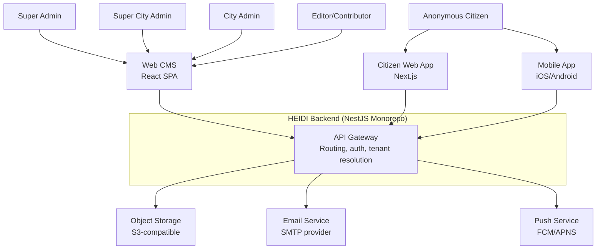

### 1.3 System Boundaries

**Backend Boundary:**

- All services communicate through API Gateway
- No direct external access to internal services
- All requests require tenant context
- RBAC enforced at gateway and service levels

---

## 2. Core Backend Responsibilities

The backend implements the following platform capabilities:

| #   | Capability                            | Description                                                                                                                                                                    |
| --- | ------------------------------------- | ------------------------------------------------------------------------------------------------------------------------------------------------------------------------------ |
| 1   | **Template & Feature Registry**       | Store template metadata/versions (A/B), feature module metadata, dependencies, compatibility matrix. Provide APIs for CMS to list, validate and select templates & features.   |
| 2   | **App Configuration & Orchestration** | Persist app configuration (app name, bundle id, assets, theme, selected features). Orchestrate project generation jobs, provide build status tracking and artifact management. |
| 3   | **Core Business Logic & Listings**    | Cities → Categories → Sub-categories → Listings hierarchy. CRUD + approval workflows, search and filtering APIs for mobile and web frontends.                                  |
| 4   | **Authentication & RBAC**             | JWT-based authentication, refresh tokens, tenant-aware sessions. Role-based access control for all defined roles. Tenant isolation in API and data layers.                     |
| 5   | **Tenant Management**                 | Tenant lifecycle (onboarding, activation/deactivation, configuration, metadata). Manage tenant-scoped resources (registered apps, credentials, quotas).                        |
| 6   | **Notification & Scheduler**          | Multi-channel notifications (push & email). Scheduler for jobs, recurring tasks, and background processing.                                                                    |
| 7   | **Integration & External Connectors** | Connect with DeepL, Payment providers, Destination.One, Mobilithek. Standardized connectors and retry/reconciliation logic.                                                    |
| 8   | **Analytics, Monitoring & Audit**     | Usage metrics, dashboards, admin insights. System-wide audit trail for configuration changes, generation events, role changes.                                                 |
| 9   | **App Factory Services**              | Artifact storage (signed APK/AAB/IPA), build metadata, signing coordination. Worker orchestration for generation jobs and background tasks.                                    |
| 10  | **Chatbot (RAG Feature)**             | Embedding pipeline, vector index management (per-tenant namespace), retrieval layer and query API. Ingestion endpoints for document scraping and chunking.                     |

---

## 3. Feature Model & Business Rules

### 3.1 Content Hierarchy

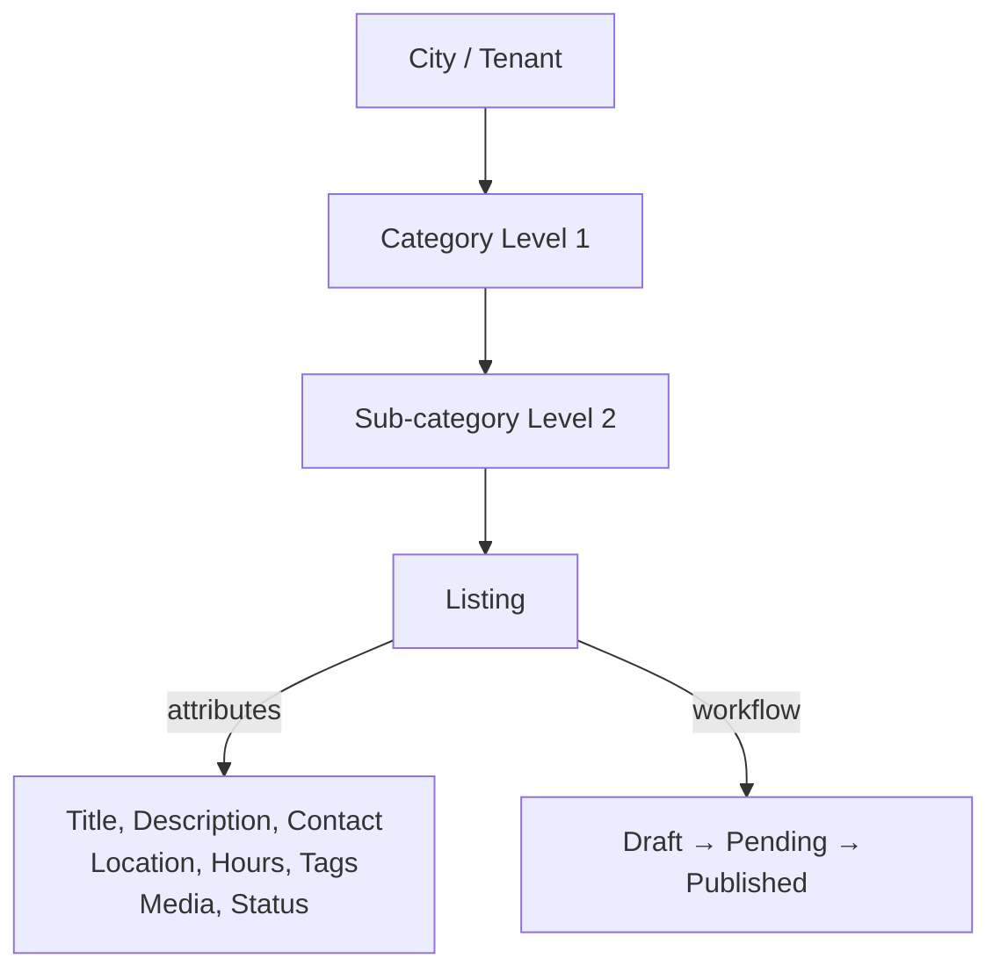

### 3.2 Entity Definitions

| Entity                     | Description                                                                                               |
| -------------------------- | --------------------------------------------------------------------------------------------------------- |
| **City (Tenant)**          | Top-level tenant container. Each city owns its data, templates selection, feature toggles and app builds. |
| **Category (Level 1)**     | City-managed categories for content grouping (e.g., Services, Businesses, Events).                        |
| **Sub-category (Level 2)** | Child categories to refine classification (e.g., Service → Waste Collection).                             |
| **Listings**               | Items under sub-categories representing services, businesses, or points-of-interest.                      |

### 3.3 Listing Attributes

- Title, description, contact information
- Location (geospatial data), opening hours
- Tags, media attachments
- Category assignment, approval status

### 3.4 Approval Workflows

| Workflow                | Description                                              |
| ----------------------- | -------------------------------------------------------- |
| **Create → Pending**    | Editor submits content, status set to `pending_approval` |
| **Pending → Published** | Admin approves, status updated to `published`            |
| **Pending → Rejected**  | Admin rejects with reason, contributor notified          |
| **Published → Draft**   | Admin can unpublish content                              |
| **Versioning**          | Audit trail on edits and approvals                       |

**Placement:** The Listings capability resides in the **Core Service** to ensure consistent functionality across the platform.

---

## 4. Tenant Isolation Strategy

### 4.1 Design Goals

- Data isolation, per-tenant scoping, and GDPR compliance
- Strong separation for tenant-scoped data
- Flexibility for both shared and isolated models

### 4.2 Implementation Approach

| Layer              | Strategy                   | Implementation                                                                                  |
| ------------------ | -------------------------- | ----------------------------------------------------------------------------------------------- |
| **Database**       | Per-Service Databases      | Each microservice uses its own PostgreSQL database. Tenant data scoped via `tenant_id` column.  |
| **Vector Storage** | Namespace Isolation        | Vector DB uses tenant-specific namespaces to avoid cross-tenant leakage.                        |
| **API Layer**      | RBAC & Gateway Enforcement | Tenant identification at API Gateway (header/token claim). All services enforce tenant context. |
| **Secrets**        | Per-Tenant Paths           | Keystores, provisioning profiles stored in Vault/KMS under tenant-specific paths.               |
| **Cache**          | Key Prefixing              | All cache keys include tenant ID (`tenant:city1:resource:id`).                                  |

### 4.3 Multi-Tenant Data Access Pattern

```sql
-- Automatic tenant filtering (via middleware/ORM)
SELECT * FROM listings
WHERE tenant_id = :tenantId AND status = 'published';
```

### 4.4 Request Flow with Tenant Isolation

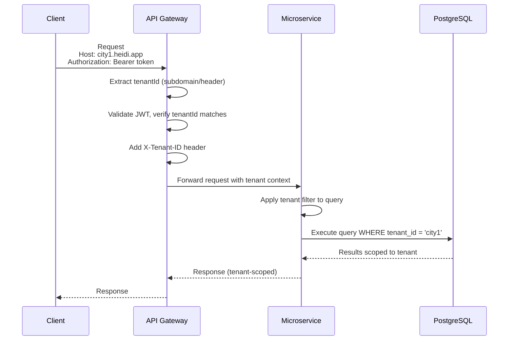

---

## 5. Microservices Catalog

### 5.1 NestJS Monorepo Structure

```
heidi-backend/
├── apps/
│   ├── auth/                 # Authentication microservice
│   ├── users/                # User management microservice
│   ├── city/                 # City management microservice
│   ├── core/                 # Core business logic microservice
│   ├── notification/         # Notification microservice
│   ├── scheduler/            # Task scheduling microservice
│   ├── integration/          # External API adapters
│   ├── admin/                # Admin dashboard microservice
│   └── terminal/             # Kiosk/terminal management (future)
├── libs/
│   ├── config/               # Configuration management
│   ├── contracts/            # Shared DTOs, interfaces
│   ├── errors/               # Error handling
│   ├── health/               # Health check indicators
│   ├── i18n/                 # Internationalization
│   ├── interceptors/         # Response transform, logging
│   ├── jwt/                  # JWT module, guards
│   ├── logger/               # Winston logger
│   ├── metrics/              # Prometheus metrics
│   ├── monitoring/           # Monitoring integration
│   ├── prisma/               # Per-service Prisma modules
│   ├── rabbitmq/             # Message queue
│   ├── rbac/                 # Role-based access control
│   ├── redis/                # Redis module
│   ├── saga/                 # Distributed transactions
│   ├── storage/              # S3 storage abstraction
│   ├── tenancy/              # Multi-tenant utilities
│   └── translations/         # DeepL integration
├── scripts/                  # Build and deployment scripts
└── infra/                    # Infrastructure configs
```

### 5.2 Current Microservices

| Service                  | Port | Database             | Description                                                                 |
| ------------------------ | ---- | -------------------- | --------------------------------------------------------------------------- |
| **Auth Service**         | 3001 | `heidi_auth`         | Authentication, JWT issuance, session management, password management       |
| **Users Service**        | 3002 | `heidi_users`        | User profiles, roles, permissions, user lifecycle, terms acceptance         |
| **City Service**         | 3003 | `heidi_city`         | City metadata, boundaries, tenant config, activation/deactivation           |
| **Core Service**         | 3004 | `heidi_core`         | Listings CRUD, Categories, Tags, Tiles, POIs, search, approval workflows    |
| **Notification Service** | 3005 | `heidi_notification` | Push (FCM/APNS), email delivery, templates, verification, delivery tracking |
| **Scheduler Service**    | 3006 | `heidi_scheduler`    | Cron jobs, queue scheduling, retries, translation tasks                     |
| **Integration Service**  | 3007 | `heidi_integration`  | External API adapters (DeepL, Destination.One, Mobilithek)                  |
| **Admin Service**        | 3008 | `heidi_admin`        | Business metrics, admin dashboards, KPIs                                    |
| **Terminal Service**     | 3009 | `heidi_terminal`     | Kiosk/device registration & management (future)                             |

### 5.3 Future Services (Planned)

| Service                        | Purpose                                                           |
| ------------------------------ | ----------------------------------------------------------------- |
| **Project Generation Service** | App Factory orchestration, build job metadata, artifacts registry |
| **Template Service**           | Template versions, metadata, compatibility checks                 |
| **Feature Service**            | Feature versions, dependencies, toggles, compatibility matrix     |
| **Theme Service**              | Theme configs, fonts, colors, asset references                    |
| **Audit Service**              | Centralized audit trail, search, retention policies               |
| **Chatbot Service**            | RAG orchestration, ingestion endpoints, embedding workers         |
| **Payment Service**            | Payment orchestration, SEPA/GDPR-compliant flows                  |
| **AppConfig Service**          | Per-tenant app configurations, branding                           |
| **Analytics Service**          | Usage metrics collection, dashboard aggregation, reporting        |

---

## 6. Component Architecture

### 6.1 Auth Service Components

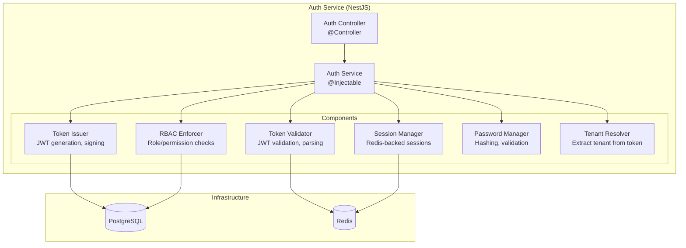

**Component Responsibilities:**

| Component            | Responsibility                                                            |
| -------------------- | ------------------------------------------------------------------------- |
| **Token Issuer**     | Generates JWT tokens with claims (user ID, tenant ID, roles, permissions) |
| **Token Validator**  | Validates incoming JWT tokens, checks expiration, verifies signature      |
| **Session Manager**  | Manages user sessions in Redis, handles session refresh, logout           |
| **RBAC Enforcer**    | Evaluates role-based access control rules for API endpoints               |
| **Password Manager** | Handles password hashing (bcrypt), validation, reset flows                |
| **Tenant Resolver**  | Extracts tenant context from JWT claims or request headers                |

### 6.2 Core Service Components

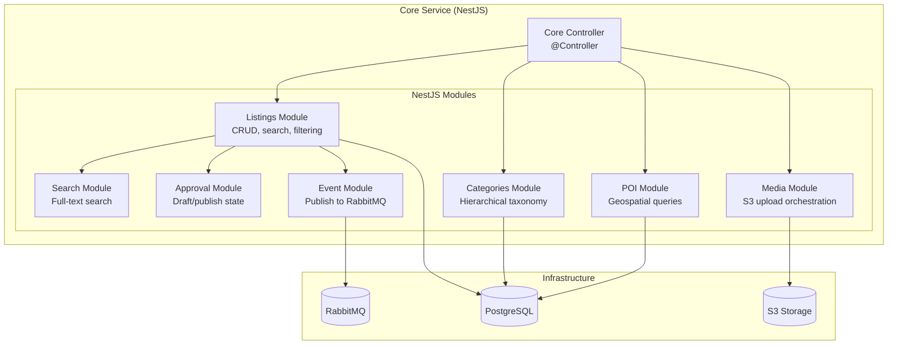

**Component Responsibilities:**

| Component             | Responsibility                                                                 |
| --------------------- | ------------------------------------------------------------------------------ |
| **Listings Module**   | Manages listing entities (CRUD), status workflow (draft → pending → published) |
| **Categories Module** | Handles hierarchical category structures, category assignments                 |
| **POI Module**        | Manages Points of Interest with geospatial data, location-based queries        |
| **Media Module**      | Orchestrates file uploads to S3, generates thumbnails, manages media metadata  |
| **Search Module**     | Provides full-text search across listings with filtering and sorting           |
| **Approval Module**   | Manages approval states, tracks approver, timestamps, rejection reasons        |
| **Event Publisher**   | Publishes events to RabbitMQ for downstream processing                         |

### 6.3 Chatbot Service Components (Planned)

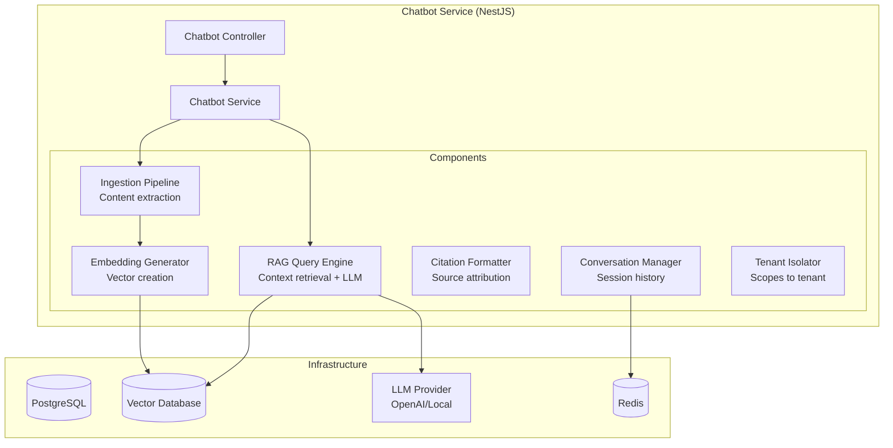

### 6.4 ProjectGen Service Components (Planned)

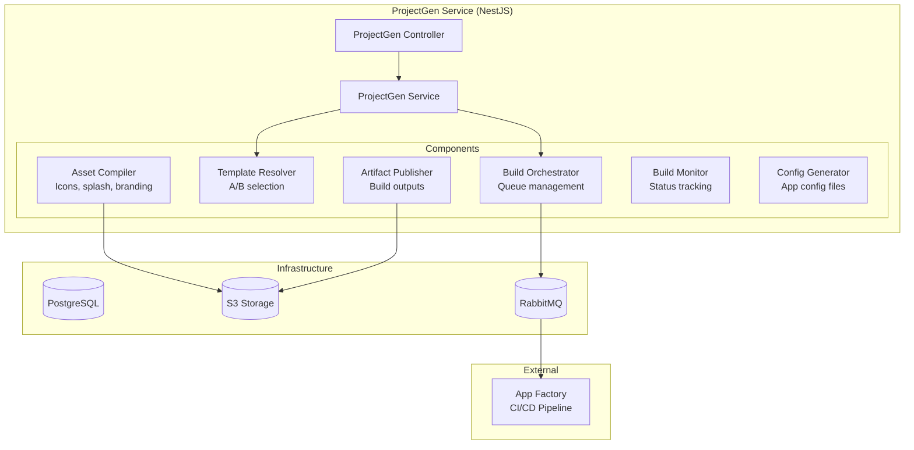

---

## 7. Technology Stack & Libraries

### 7.1 Runtime Environment

| Component      | Version  | Purpose              |
| -------------- | -------- | -------------------- |
| **Node.js**    | ≥24.11.0 | JavaScript runtime   |
| **npm**        | ≥10.0.0  | Package manager      |
| **TypeScript** | ^5.9.3   | Type-safe JavaScript |

### 7.2 Core Framework

| Library                      | Version | Purpose                  |
| ---------------------------- | ------- | ------------------------ |
| **@nestjs/core**             | ^11.1.8 | NestJS core framework    |
| **@nestjs/common**           | ^11.1.8 | Common NestJS utilities  |
| **@nestjs/platform-express** | ^11.1.8 | Express HTTP adapter     |
| **@nestjs/config**           | ^4.0.2  | Configuration management |
| **@nestjs/microservices**    | ^11.1.8 | Microservices support    |
| **@nestjs/swagger**          | 11.0.7  | OpenAPI documentation    |

### 7.3 Database & ORM

| Library            | Version | Purpose                       |
| ------------------ | ------- | ----------------------------- |
| **@prisma/client** | ^6.19.0 | Type-safe database client     |
| **prisma**         | ^6.19.0 | Database toolkit & migrations |

### 7.4 Authentication & Security

| Library               | Version | Purpose                   |
| --------------------- | ------- | ------------------------- |
| **@nestjs/jwt**       | ^11.0.1 | JWT token management      |
| **@nestjs/passport**  | ^11.0.5 | Authentication middleware |
| **passport**          | ^0.7.0  | Authentication framework  |
| **passport-jwt**      | ^4.0.1  | JWT strategy for Passport |
| **bcrypt**            | ^6.0.0  | Password hashing          |
| **helmet**            | ^8.1.0  | Security headers          |
| **@nestjs/throttler** | ^6.4.0  | Rate limiting             |

### 7.5 Messaging & Caching

| Library                     | Version | Purpose                        |
| --------------------------- | ------- | ------------------------------ |
| **amqp-connection-manager** | ^5.0.0  | RabbitMQ connection management |
| **amqplib**                 | ^0.10.9 | AMQP protocol client           |
| **ioredis**                 | ^5.8.2  | Redis client                   |

### 7.6 External Services & Storage

| Library                           | Version  | Purpose                         |
| --------------------------------- | -------- | ------------------------------- |
| **@aws-sdk/client-s3**            | ^3.925.0 | S3-compatible object storage    |
| **@aws-sdk/s3-request-presigner** | ^3.925.0 | Presigned URL generation        |
| **firebase-admin**                | ^12.0.0  | Firebase/FCM push notifications |
| **nodemailer**                    | ^7.0.10  | Email delivery                  |
| **axios**                         | ^1.13.2  | HTTP client                     |
| **@nestjs/axios**                 | ^4.0.1   | NestJS HTTP module              |

### 7.7 Monitoring & Logging

| Library                       | Version | Purpose                    |
| ----------------------------- | ------- | -------------------------- |
| **prom-client**               | ^15.1.3 | Prometheus metrics         |
| **winston**                   | ^3.18.3 | Logging framework          |
| **winston-daily-rotate-file** | ^5.0.0  | Log rotation               |
| **nest-winston**              | ^1.10.2 | NestJS Winston integration |
| **@nestjs/terminus**          | ^11.0.0 | Health checks              |

### 7.8 Utilities

| Library               | Version | Purpose                 |
| --------------------- | ------- | ----------------------- |
| **class-validator**   | ^0.14.2 | DTO validation          |
| **class-transformer** | ^0.5.1  | Object transformation   |
| **handlebars**        | ^4.7.8  | Email templating        |
| **sharp**             | ^0.33.5 | Image processing        |
| **multer**            | ^2.0.2  | File upload handling    |
| **cron-parser**       | ^5.4.0  | Cron expression parsing |
| **rxjs**              | ^7.8.2  | Reactive programming    |
| **@nestjs/schedule**  | ^6.0.1  | Task scheduling         |

### 7.9 Development Tools

| Library              | Version  | Purpose                   |
| -------------------- | -------- | ------------------------- |
| **@nestjs/cli**      | ^11.0.10 | NestJS CLI                |
| **@nestjs/testing**  | ^11.1.8  | Testing utilities         |
| **jest**             | ^29.7.0  | Testing framework         |
| **ts-jest**          | ^29.1.1  | TypeScript Jest preset    |
| **supertest**        | ^6.3.3   | HTTP testing              |
| **eslint**           | ^8.56.0  | Code linting              |
| **prettier**         | ^3.6.2   | Code formatting           |
| **commitizen**       | ^4.3.1   | Conventional commits      |
| **standard-version** | ^9.5.0   | Semantic versioning       |
| **concurrently**     | ^9.2.1   | Parallel script execution |
| **webpack**          | ^5.102.1 | Module bundler            |

---

## 8. Shared Libraries Architecture

### 8.1 Library Catalog

| Library          | Path Alias            | Purpose                                          |
| ---------------- | --------------------- | ------------------------------------------------ |
| **config**       | `@heidi/config`       | Configuration module, Swagger helpers            |
| **contracts**    | `@heidi/contracts`    | Shared DTOs, interfaces, event contracts         |
| **errors**       | `@heidi/errors`       | Custom error classes, error handling             |
| **health**       | `@heidi/health`       | Health check indicators                          |
| **i18n**         | `@heidi/i18n`         | Internationalization (10 languages)              |
| **interceptors** | `@heidi/interceptors` | Response transform, logging, timeout, validation |
| **jwt**          | `@heidi/jwt`          | JWT module, guards, strategies                   |
| **logger**       | `@heidi/logger`       | Winston logger configuration                     |
| **metrics**      | `@heidi/metrics`      | Prometheus metrics collection                    |
| **monitoring**   | `@heidi/monitoring`   | Monitoring integration                           |
| **prisma**       | `@heidi/prisma`       | Per-service Prisma modules & clients             |
| **rabbitmq**     | `@heidi/rabbitmq`     | RabbitMQ module, producers, consumers            |
| **rbac**         | `@heidi/rbac`         | Role-based access control guards & decorators    |
| **redis**        | `@heidi/redis`        | Redis module & service                           |
| **saga**         | `@heidi/saga`         | Distributed transaction patterns                 |
| **storage**      | `@heidi/storage`      | S3 storage abstraction                           |
| **tenancy**      | `@heidi/tenancy`      | Multi-tenant context, guards, interceptors       |
| **translations** | `@heidi/translations` | DeepL integration, translation providers         |

### 8.2 Supported Languages (i18n)

| Language      | Code | Status  |
| ------------- | ---- | ------- |
| German        | de   | Primary |
| English       | en   | Active  |
| Arabic        | ar   | Active  |
| Danish        | dk   | Active  |
| Farsi/Persian | fa   | Active  |
| Norwegian     | no   | Active  |
| Russian       | ru   | Active  |
| Swedish       | se   | Active  |
| Turkish       | tr   | Active  |
| Ukrainian     | uk   | Active  |

---

## 9. API Interaction Flows

### 9.1 Authentication Flow

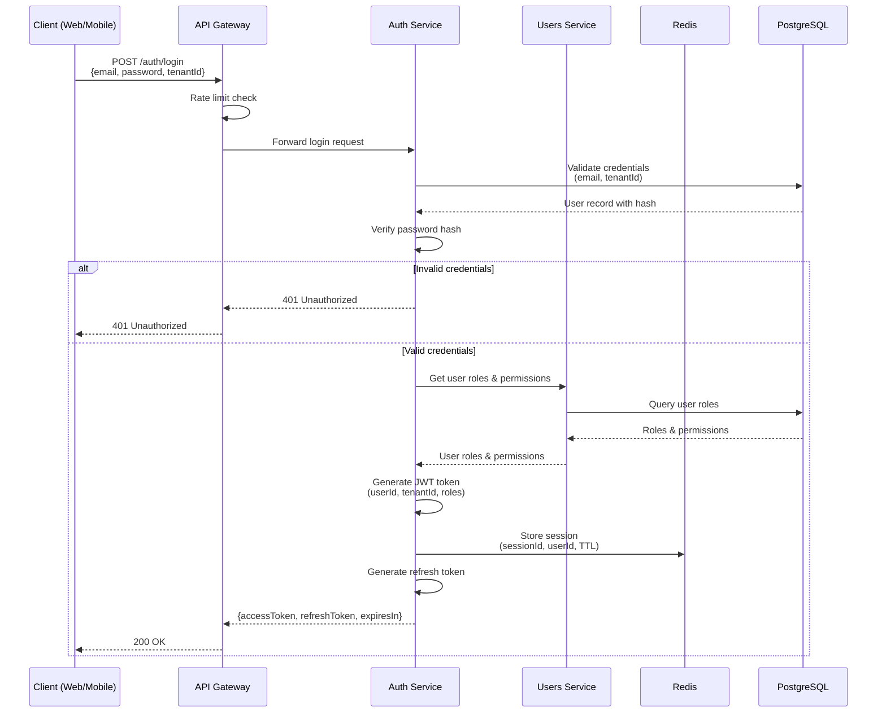

**Key Points:**

- API Gateway performs rate limiting before forwarding
- Password verification happens in Auth Service (never transmit plain passwords)
- JWT contains all necessary claims (userId, tenantId, roles, permissions)
- Session stored in Redis for revocation and session management
- Refresh token allows token renewal without re-authentication

### 9.2 Listing Creation with Approval Flow

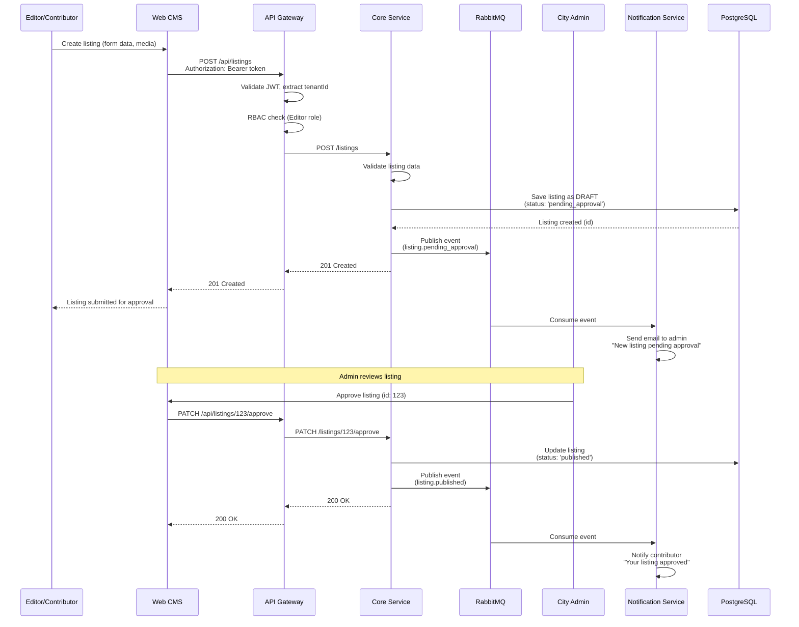

### 9.3 App Build Trigger Flow

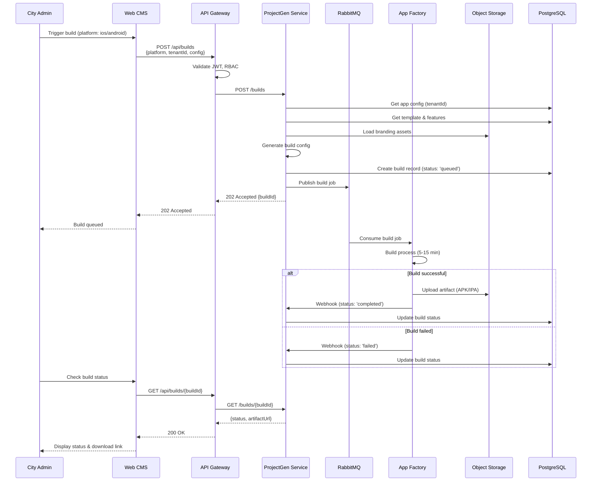

### 9.4 Chatbot Query Flow

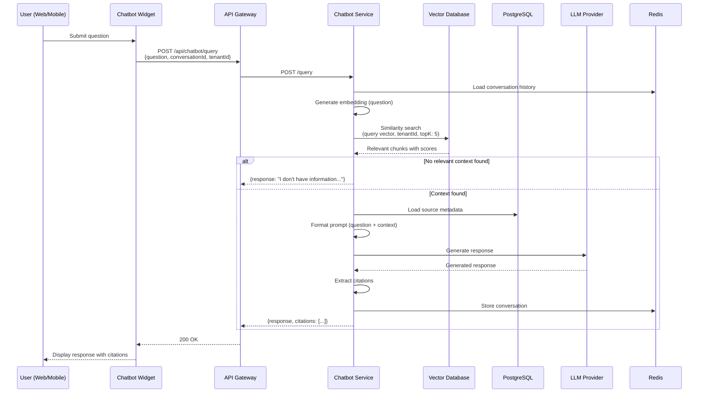

---

## 10. Data Flow Pipelines

### 10.1 Content Publishing Pipeline

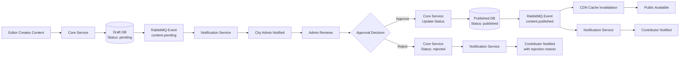

### 10.2 Notification Delivery Pipeline

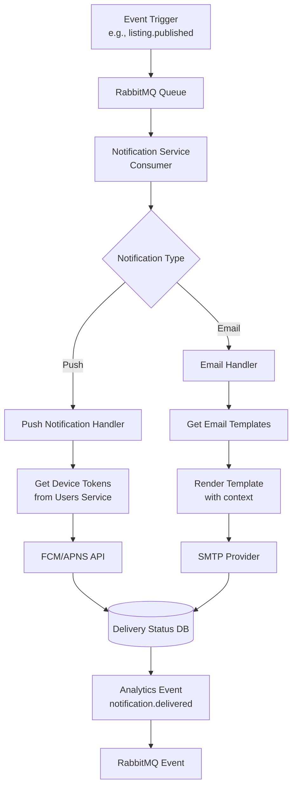

### 10.3 Analytics Collection Pipeline

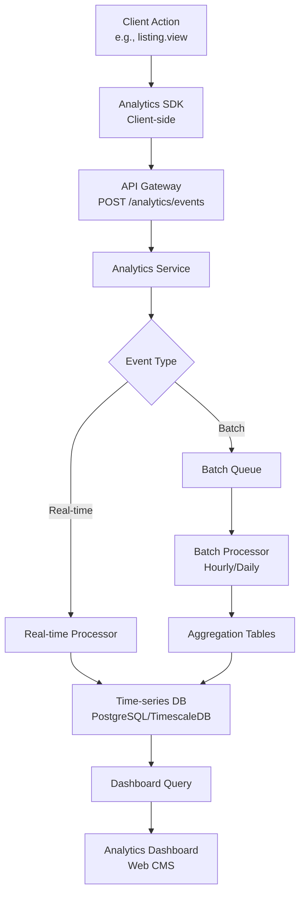

---

## 11. Integration Patterns

### 11.1 Synchronous Patterns

| Pattern              | Implementation                                                                        | Use Cases                                                  |
| -------------------- | ------------------------------------------------------------------------------------- | ---------------------------------------------------------- |
| **API Gateway**      | Single entry point, tenant resolution, JWT validation, rate limiting, request routing | All external requests                                      |
| **Request/Response** | REST APIs for inter-service communication, HTTP/HTTPS with JSON payloads              | User authentication, data retrieval, configuration queries |

### 11.2 Asynchronous Patterns

| Pattern            | Implementation                                                              | Use Cases                                                           |
| ------------------ | --------------------------------------------------------------------------- | ------------------------------------------------------------------- |
| **Pub/Sub**        | RabbitMQ topic-based routing, guaranteed delivery, dead letter queues       | Content approval notifications, build job queuing, analytics events |
| **Event Sourcing** | All admin actions published as events, append-only log, time-travel queries | Audit trail, compliance                                             |

### 11.3 Resilience Patterns

| Pattern             | Implementation                                                             | Use Cases                                         |
| ------------------- | -------------------------------------------------------------------------- | ------------------------------------------------- |
| **Circuit Breaker** | Monitor external calls, states (Closed/Open/Half-Open), fallback responses | LLM API calls, email/SMS providers, external APIs |
| **Saga**            | Choreography-based saga, local transactions, compensating actions          | App build orchestration, distributed transactions |

### 11.4 Data Patterns

| Pattern                  | Implementation                                                       | Use Cases                                             |
| ------------------------ | -------------------------------------------------------------------- | ----------------------------------------------------- |
| **Database per Service** | Each service has dedicated schema, no direct cross-service DB access | Service autonomy, independent scaling                 |
| **CQRS**                 | Separate read/write operations, optimized read models via events     | Analytics dashboards, search functionality, reporting |

### 11.5 NestJS-Specific Patterns

| Pattern                  | Implementation                                                                     |
| ------------------------ | ---------------------------------------------------------------------------------- |
| **Dependency Injection** | `@Injectable()` decorators, constructor-based injection, module organization       |
| **Guard Pattern**        | `@UseGuards()` for route protection, JWT auth guard, RBAC guard, tenant guard      |
| **Interceptor Pattern**  | Logging interceptor, transform interceptor, timeout interceptor, cache interceptor |
| **Pipe Pattern**         | `ValidationPipe` for DTO validation, `ParseIntPipe` for type conversion            |
| **Exception Filter**     | Global exception filter, HTTP exception filter, business logic error handling      |

### 11.6 Event Topics

| Topic                 | Description                  |
| --------------------- | ---------------------------- |
| `listing.created`     | New listing submitted        |
| `listing.approved`    | Listing approved by admin    |
| `listing.rejected`    | Listing rejected by admin    |
| `build.queued`        | Build job queued             |
| `build.completed`     | Build completed successfully |
| `build.failed`        | Build failed                 |
| `user.created`        | New user registered          |
| `user.updated`        | User profile updated         |
| `content.published`   | Content published            |
| `notification.sent`   | Notification delivered       |
| `notification.failed` | Notification delivery failed |

---

## 12. Security Architecture

### 12.1 JWT Token Structure

**Access Token Claims:**

```json
{
  "sub": "user123", // Subject (user ID)
  "tenantId": "city1", // Tenant identifier
  "roles": ["city_admin"], // User roles
  "permissions": ["listings:write"], // Granular permissions
  "iat": 1705315200, // Issued at
  "exp": 1705322400, // Expiration (2 hours)
  "jti": "token-id-123" // JWT ID (for revocation)
}
```

**Token Lifecycle:**

1. User logs in → Access token (2h) + Refresh token (30d) issued
2. Access token expires → Client uses refresh token to get new access token
3. Refresh token expires → User must re-authenticate
4. User logs out → Both tokens revoked (blacklisted in Redis)

### 12.2 RBAC Permission Matrix

| Permission             | Super Admin | Super City Admin | City Admin |      Editor      | Anonymous |
| ---------------------- | :---------: | :--------------: | :--------: | :--------------: | :-------: |
| **City Management**    | All tenants |    Own tenant    |     -      |        -         |     -     |
| **Template Selection** |     All     |    Own tenant    |    Read    |        -         |     -     |
| **Feature Toggles**    |     All     |    Own tenant    |    Read    |        -         |     -     |
| **User Management**    |     All     |    Own tenant    | Own tenant |        -         |     -     |
| **Listings CRUD**      |     All     |    Own tenant    | Own tenant | Create (pending) |   Read    |
| **Listings Approval**  |     All     |    Own tenant    | Own tenant |        -         |     -     |
| **Build Triggers**     |     All     |    Own tenant    |    Read    |        -         |     -     |
| **Analytics**          | All tenants |    Own tenant    | Own tenant |        -         |     -     |
| **Audit Logs**         |     All     |    Own tenant    | Own tenant |        -         |     -     |
| **Impersonation**      |      ✓      |        -         |     -      |        -         |     -     |

**Permission Granularity:**

- Resource-level: `listings:read`, `listings:write`, `listings:delete`
- Action-level: `users:create`, `users:update`, `users:delete`
- Scope-level: `own_tenant`, `all_tenants`

### 12.3 API Gateway Security

| Security Control       | Implementation                                                                     |
| ---------------------- | ---------------------------------------------------------------------------------- |
| **Rate Limiting**      | Per tenant: 1000 req/min, Per user: 100 req/min, Per IP: 50 req/min                |
| **Request Validation** | Input sanitization, SQL injection prevention, size limits (10MB uploads, 1MB JSON) |
| **CORS**               | Configured origins per environment, credentials required                           |
| **WAF**                | SQL injection, XSS, CSRF, DDoS protection                                          |

### 12.4 Data Encryption

| Type           | Implementation                                                          |
| -------------- | ----------------------------------------------------------------------- |
| **At Rest**    | PostgreSQL encryption (LUKS/TDE), S3 server-side encryption             |
| **In Transit** | TLS 1.3 for all external communications, mTLS optional between services |
| **Secrets**    | Kubernetes Secrets encrypted at rest, optional Vault integration        |

### 12.5 Input Validation & Sanitization

| Category         | Implementation                                 |
| ---------------- | ---------------------------------------------- |
| **Rich Text**    | Sanitize HTML (whitelist tags, remove scripts) |
| **File Uploads** | Validate file type, size, malware scanning     |
| **API Input**    | JSON Schema validation, type enforcement       |
| **SQL**          | Parameterized queries, ORM usage               |
| **XSS**          | Output encoding, CSP headers, HttpOnly cookies |

### 12.6 Secure File Uploads

| Step           | Implementation                                                                      |
| -------------- | ----------------------------------------------------------------------------------- |
| **Validation** | Whitelist MIME types, size limits (10MB images, 50MB documents), sanitize filenames |
| **Storage**    | Separate buckets per tenant, presigned URLs for access                              |
| **Processing** | Generate thumbnails, strip EXIF data, async processing                              |

### 12.7 GDPR Compliance

| Requirement                | Implementation                                                                              |
| -------------------------- | ------------------------------------------------------------------------------------------- |
| **Data Residency**         | All data in EU data centers (Hetzner Germany)                                               |
| **Right to Access**        | Data export endpoint (JSON/CSV)                                                             |
| **Right to Deletion**      | User deletion API with cascade                                                              |
| **Right to Rectification** | User profile update endpoints                                                               |
| **Consent Management**     | Cookie consent, data processing consent, marketing opt-in                                   |
| **Data Retention**         | User data: 30 days after deletion, Audit logs: 7 years, Analytics: anonymized after 2 years |

---

## 13. Docker & Container Architecture

### 13.1 Multi-Stage Dockerfile

```dockerfile
# Stage 1: Base - Node.js 24.11.0 Alpine with essential deps
FROM node:24.11.0-alpine AS base
# OpenSSL, libc6-compat for Prisma, dumb-init for signal handling

# Stage 2: Dependencies - Production deps only
FROM base AS deps
RUN npm ci --omit=dev --legacy-peer-deps

# Stage 3: Build - Full build with dev deps
FROM base AS build
RUN npm ci --legacy-peer-deps
# Generate all Prisma clients
# Build specific app: npm run build:${APP_NAME}

# Stage 4: Production - Minimal runtime
FROM base AS production
# Copy only production deps, built app, Prisma clients, i18n translations
USER nestjs  # Non-root user
ENTRYPOINT ["dumb-init", "--"]
CMD ["node", "dist/main.js"]
```

### 13.2 Container Security

| Feature                    | Implementation                           |
| -------------------------- | ---------------------------------------- |
| **Non-root user**          | `nestjs` user (UID 1001)                 |
| **Minimal attack surface** | Alpine-based images                      |
| **Signal handling**        | `dumb-init` for proper PID 1 behavior    |
| **Health checks**          | Built-in HTTP health check on `/healthz` |

### 13.3 Docker Compose Services

#### Infrastructure Services

| Service      | Image                            | Port               | Purpose                     |
| ------------ | -------------------------------- | ------------------ | --------------------------- |
| **postgres** | postgres:16-alpine               | 5432               | Primary database            |
| **redis**    | redis:7.4-alpine                 | 6379 (internal)    | Caching & sessions          |
| **rabbitmq** | rabbitmq:4.1.5-management-alpine | 5672, 15672, 15692 | Message queue               |
| **caddy**    | caddy:2.7-alpine                 | 80, 443            | Reverse proxy with auto-SSL |

#### Monitoring Stack (optional profile)

| Service               | Image                                 | Port | Purpose                    |
| --------------------- | ------------------------------------- | ---- | -------------------------- |
| **prometheus**        | prom/prometheus:latest                | 9090 | Metrics collection         |
| **grafana**           | grafana/grafana:latest                | 3000 | Dashboards & visualization |
| **alertmanager**      | prom/alertmanager:latest              | 9093 | Alert routing              |
| **postgres-exporter** | prometheuscommunity/postgres-exporter | 9187 | PostgreSQL metrics         |
| **redis-exporter**    | oliver006/redis_exporter              | 9121 | Redis metrics              |
| **node-exporter**     | prom/node-exporter                    | 9100 | Host system metrics        |

#### Admin Tools

| Service             | Image                          | Port | Purpose          |
| ------------------- | ------------------------------ | ---- | ---------------- |
| **pgadmin**         | dpage/pgadmin4:latest          | 5050 | PostgreSQL admin |
| **redis-commander** | rediscommander/redis-commander | 8081 | Redis admin      |

### 13.4 Network Architecture

```yaml
networks:
  backend:
    driver: bridge
    ipam:
      config:
        - subnet: 172.28.0.0/16
```

- All services on isolated `backend` network
- Only Caddy/Nginx exposed to public (ports 80/443)
- Admin tools bound to `127.0.0.1` only
- Internal services communicate via Docker DNS

### 13.5 Data Persistence

```
./data/
├── postgres/          # PostgreSQL data
├── redis/             # Redis AOF persistence
├── rabbitmq/          # RabbitMQ data
├── caddy/             # SSL certificates
├── caddy-config/      # Caddy configuration
├── prometheus/        # Metrics storage (30 day retention)
├── grafana/           # Dashboards & settings
└── alertmanager/      # Alert state
```

---

## 14. Kubernetes Deployment Strategy

### 14.1 Cluster Architecture (Hetzner Cloud)

```
┌─────────────────────────────────────────────────────────────────┐
│                    Hetzner Cloud Kubernetes                      │
├─────────────────────────────────────────────────────────────────┤
│  Namespace: heidi-dev    │  Namespace: heidi-stage   │ heidi-prod│
├─────────────────────────────────────────────────────────────────┤
│                                                                  │
│  ┌──────────────┐  ┌──────────────┐  ┌──────────────┐          │
│  │   Ingress    │  │   Ingress    │  │   Ingress    │          │
│  │   (Traefik)  │  │   (Traefik)  │  │   (Traefik)  │          │
│  └──────┬───────┘  └──────┬───────┘  └──────┬───────┘          │
│         │                  │                  │                  │
│  ┌──────┴───────────────────────────────────┴───────┐          │
│  │              Service Mesh / Load Balancer         │          │
│  └──────────────────────┬───────────────────────────┘          │
│                         │                                        │
│  ┌─────────┬─────────┬──┴──────┬─────────┬─────────┐          │
│  │  Auth   │  Users  │  City   │  Core   │ Notif.  │          │
│  │ (3001)  │ (3002)  │ (3003)  │ (3004)  │ (3005)  │          │
│  └────┬────┴────┬────┴────┬────┴────┬────┴────┬────┘          │
│       │         │         │         │         │                  │
│  ┌────┴─────────┴─────────┴─────────┴─────────┴────┐          │
│  │              Shared Infrastructure               │          │
│  │  ┌──────────┐ ┌──────────┐ ┌──────────┐        │          │
│  │  │PostgreSQL│ │  Redis   │ │ RabbitMQ │        │          │
│  │  │ (HA/PVC) │ │ (Cluster)│ │(Clustered│        │          │
│  │  └──────────┘ └──────────┘ └──────────┘        │          │
│  └─────────────────────────────────────────────────┘          │
└─────────────────────────────────────────────────────────────────┘
```

### 14.2 Namespace Strategy

| Namespace          | Purpose                           | Resource Quotas          |
| ------------------ | --------------------------------- | ------------------------ |
| `heidi-dev`        | Development environment           | Low limits               |
| `heidi-staging`    | Pre-production testing            | Medium limits            |
| `heidi-prod`       | Production workloads              | High limits, autoscaling |
| `heidi-monitoring` | Prometheus, Grafana, Alertmanager | Dedicated resources      |
| `heidi-infra`      | PostgreSQL, Redis, RabbitMQ       | Persistent storage       |

### 14.3 Resource Allocation

| Service Category   | Replicas             | Memory     | CPU       |
| ------------------ | -------------------- | ---------- | --------- |
| **Auth Service**   | 2-3                  | 256Mi      | 0.25      |
| **Core Service**   | 3-5                  | 512Mi      | 0.5       |
| **Other Services** | 2-3                  | 256-512Mi  | 0.25-0.5  |
| **PostgreSQL**     | Primary + 2 replicas | 4-8Gi      | 2-4       |
| **Redis**          | 3-node cluster       | 1Gi/node   | 0.5/node  |
| **RabbitMQ**       | 3-node cluster       | 512Mi/node | 0.25/node |

### 14.4 Kubernetes Resources Example

```yaml
# Deployment
apiVersion: apps/v1
kind: Deployment
metadata:
  name: heidi-auth
  namespace: heidi-prod
spec:
  replicas: 2
  strategy:
    type: RollingUpdate
    rollingUpdate:
      maxSurge: 1
      maxUnavailable: 0
  template:
    spec:
      containers:
        - name: auth
          image: registry.heidi.com/heidi-auth:v1.24.0
          resources:
            requests:
              memory: '256Mi'
              cpu: '100m'
            limits:
              memory: '512Mi'
              cpu: '500m'
          livenessProbe:
            httpGet:
              path: /healthz
              port: 3001
            initialDelaySeconds: 40
            periodSeconds: 30
          readinessProbe:
            httpGet:
              path: /healthz
              port: 3001
            initialDelaySeconds: 10
            periodSeconds: 10
```

### 14.5 Horizontal Pod Autoscaler

```yaml
apiVersion: autoscaling/v2
kind: HorizontalPodAutoscaler
metadata:
  name: heidi-core-hpa
spec:
  scaleTargetRef:
    apiVersion: apps/v1
    kind: Deployment
    name: heidi-core
  minReplicas: 2
  maxReplicas: 10
  metrics:
    - type: Resource
      resource:
        name: cpu
        target:
          type: Utilization
          averageUtilization: 70
    - type: Resource
      resource:
        name: memory
        target:
          type: Utilization
          averageUtilization: 80
```

### 14.6 Deployment Strategies

| Strategy           | Description                                                     | Use Case                  |
| ------------------ | --------------------------------------------------------------- | ------------------------- |
| **Blue-Green**     | Deploy to "green", switch traffic from "blue", keep as rollback | Zero-downtime deployments |
| **Canary**         | Deploy to subset (10%), monitor, gradually increase             | Feature releases          |
| **Rolling Update** | Gradually replace pods                                          | Default strategy          |

### 14.7 Environment Tiers

| Environment     | Purpose               | Configuration                           |
| --------------- | --------------------- | --------------------------------------- |
| **Development** | Local/feature testing | Single-node, 1 replica, debug logging   |
| **Staging**     | Integration testing   | Multi-node, 2 replicas, production-like |
| **Production**  | Live traffic          | Multi-AZ, 3+ replicas, HA, monitoring   |

---

## 15. Monitoring & Observability

### 15.1 Prometheus Scrape Targets

| Job            | Target                    | Metrics                        |
| -------------- | ------------------------- | ------------------------------ |
| `auth`         | auth:3001/metrics         | HTTP requests, latency, errors |
| `users`        | users:3002/metrics        | User operations, sessions      |
| `city`         | city:3003/metrics         | City queries, cache hits       |
| `core`         | core:3004/metrics         | Listings, categories, search   |
| `notification` | notification:3005/metrics | Push/email delivery            |
| `scheduler`    | scheduler:3006/metrics    | Job execution, queue depth     |
| `integration`  | integration:3007/metrics  | External API calls             |
| `admin`        | admin:3008/metrics        | Admin operations               |
| `postgres`     | postgres-exporter:9187    | DB connections, queries        |
| `redis`        | redis-exporter:9121       | Memory, commands, keys         |
| `rabbitmq`     | rabbitmq:15692            | Queue depth, messages          |
| `node`         | node-exporter:9100        | CPU, memory, disk, network     |

### 15.2 Alert Rules

```yaml
groups:
  - name: heidi_microservices
    rules:
      # Service availability
      - alert: ServiceDown
        expr: up{type="microservice"} == 0
        for: 1m
        labels:
          severity: critical

      # High error rate
      - alert: HighErrorRate
        expr: rate(heidi_http_request_errors_total[5m]) > 0.1
        for: 5m
        labels:
          severity: warning

      # High latency (95th percentile > 1s)
      - alert: HighRequestLatency
        expr: histogram_quantile(0.95, rate(heidi_http_request_duration_seconds_bucket[5m])) > 1
        for: 5m
        labels:
          severity: warning

      # Memory pressure
      - alert: HighMemoryUsage
        expr: (nodejs_heap_size_total_bytes / nodejs_heap_size_limit_bytes) > 0.9
        for: 5m
        labels:
          severity: warning

      # Database connectivity
      - alert: DatabaseConnectionFailure
        expr: up{type="database"} == 0
        for: 1m
        labels:
          severity: critical
```

### 15.3 Grafana Dashboards

| Dashboard          | Contents                                                            |
| ------------------ | ------------------------------------------------------------------- |
| **Infrastructure** | PostgreSQL connections, Redis memory, RabbitMQ queues, Host metrics |
| **Microservices**  | Request rates, response time histograms, error rates, Node.js heap  |

### 15.4 Alertmanager Routing

```yaml
route:
  receiver: 'default'
  group_by: ['alertname', 'cluster', 'service']
  routes:
    - match:
        severity: critical
      receiver: 'oncall'
    - match:
        severity: warning
      receiver: 'team'
    - match:
        type: database
      receiver: 'database-team'
```

---

## 16. Cross-Cutting Concerns

### 16.1 Logging Strategy

**Structured Logging Format:**

```json
{
  "timestamp": "2024-01-15T10:30:00.000Z",
  "level": "INFO",
  "service": "core-service",
  "tenantId": "city1",
  "userId": "user123",
  "correlationId": "req-abc-123",
  "message": "Listing created",
  "context": {
    "listingId": "listing456",
    "status": "pending_approval"
  }
}
```

**Log Levels:**

- **ERROR**: Application errors requiring attention
- **WARN**: Warning conditions (degraded functionality)
- **INFO**: Informational messages (request processing, state changes)
- **DEBUG**: Detailed debugging information (development only)

**Log Aggregation:**

- Centralized in Loki or ELK stack
- Retention: 30 days application logs, 7 years audit logs
- Correlation IDs for cross-service tracing

### 16.2 Distributed Tracing

| Component       | Implementation                               |
| --------------- | -------------------------------------------- |
| **Standard**    | OpenTelemetry for instrumentation            |
| **Protocol**    | OTLP (OpenTelemetry Protocol)                |
| **Backend**     | Jaeger or Tempo for trace storage            |
| **Propagation** | W3C Trace Context (traceparent header)       |
| **Sampling**    | 100% for errors, 10% for successful requests |

### 16.3 Health Checks

| Probe         | Endpoint              | Purpose                  | Configuration                           |
| ------------- | --------------------- | ------------------------ | --------------------------------------- |
| **Liveness**  | `GET /health/live`    | Container running        | Interval: 30s, Timeout: 5s, Failures: 3 |
| **Readiness** | `GET /health/ready`   | Accept traffic           | Interval: 10s, Timeout: 5s, Failures: 3 |
| **Startup**   | `GET /health/startup` | Slow-starting containers | Period: 10s, Timeout: 5s, Failures: 30  |

**Dependency Health Checks:**

- Database: `SELECT 1`
- Redis: `PING` command
- RabbitMQ: Connection check
- External APIs: Lightweight connectivity test

### 16.4 Configuration Management

**Configuration Sources (Priority Order):**

1. Environment Variables (override)
2. ConfigMaps (Kubernetes)
3. Secrets (sensitive data)
4. Service defaults (base configuration)

**NestJS Configuration:**

- `ConfigModule` with environment validation
- Joi validation schemas for all configuration
- `.env` files for development, ConfigMaps for production

### 16.5 Error Handling

**Error Response Format:**

```json
{
  "error": {
    "code": "LISTING_NOT_FOUND",
    "message": "Listing with ID '123' not found",
    "details": { "listingId": "123", "tenantId": "city1" },
    "timestamp": "2024-01-15T10:30:00Z",
    "correlationId": "req-abc-123",
    "path": "/api/listings/123"
  }
}
```

**HTTP Status Codes:**
| Code | Usage |
|------|-------|
| 200 | Successful request |
| 201 | Resource created |
| 202 | Accepted for async processing |
| 400 | Invalid request parameters |
| 401 | Authentication required |
| 403 | Insufficient permissions |
| 404 | Resource not found |
| 409 | Resource conflict |
| 422 | Validation errors |
| 429 | Rate limit exceeded |
| 500 | Unexpected server error |
| 502 | Upstream service error |
| 503 | Service temporarily unavailable |

**Retry Strategy:**

- Transient errors: Exponential backoff (1s, 2s, 4s)
- Permanent errors: Fail immediately
- Max retries: 3 attempts
- Ensure operations are idempotent

---

## 17. CI/CD Pipeline

### 17.1 Pipeline Stages

```
┌─────────┐    ┌─────────┐    ┌─────────┐    ┌─────────┐    ┌─────────┐
│  Lint   │───▶│  Test   │───▶│  Build  │───▶│  Push   │───▶│ Deploy  │
│  Check  │    │  Unit   │    │ Docker  │    │Registry │    │  K8s    │
└─────────┘    └─────────┘    └─────────┘    └─────────┘    └─────────┘
```

### 17.2 Build Scripts

| Script               | Command                   | Purpose                    |
| -------------------- | ------------------------- | -------------------------- |
| `build:auth`         | `nest build auth`         | Build Auth service         |
| `build:users`        | `nest build users`        | Build Users service        |
| `build:city`         | `nest build city`         | Build City service         |
| `build:core`         | `nest build core`         | Build Core service         |
| `build:notification` | `nest build notification` | Build Notification service |
| `build:scheduler`    | `nest build scheduler`    | Build Scheduler service    |
| `build:integration`  | `nest build integration`  | Build Integration service  |
| `build:admin`        | `nest build admin`        | Build Admin service        |

### 17.3 Docker Build Commands

```bash
# Build all services
npm run docker:build

# Build with monitoring profile
npm run docker:build:monitoring

# Sequential builds (for memory-constrained environments)
npm run docker:build:sequential

# Build without cache
npm run docker:build:no-cache
```

### 17.4 Database Operations

```bash
# Generate Prisma clients for all services
npm run prisma:generate

# Run all migrations (development)
npm run prisma:migrate

# Run migrations (production - deploy only)
npm run prisma:migrate:prod
```

### 17.5 Seeding Scripts

```bash
# Run all seeds
npm run seed:all

# Individual seeds
npm run seed:terms           # Terms & conditions
npm run seed:salutations     # Salutation options
npm run seed:categories      # Default categories
npm run seed:permissions     # RBAC permissions
npm run seed:tiles           # Dashboard tiles
npm run seed:initial-admin   # Super admin user
npm run seed:firebase-project # FCM configuration
npm run seed:schedules       # Scheduled tasks
```

### 17.6 Release Management

```bash
# Create release with conventional commits
npm run release

# Dry run release
npm run release:dry

# Conventional commit helper
npm run commit
```

---

## 18. Feature Modules Catalog

### 18.1 Core Features (Always Available)

| Feature             | Backend Service | Description                       |
| ------------------- | --------------- | --------------------------------- |
| **Listings**        | Core Service    | Listings CRUD, search, filtering  |
| **Categories**      | Core Service    | Hierarchical taxonomy             |
| **Search**          | Core Service    | Full-text search across listings  |
| **User Management** | Users Service   | User profiles, roles, permissions |
| **Authentication**  | Auth Service    | JWT-based authentication          |

### 18.2 Opt-in Feature Modules

| Feature Module                  | Description                         | Dependencies                |
| ------------------------------- | ----------------------------------- | --------------------------- |
| **User Onboarding**             | Guided onboarding flow              | Auth                        |
| **POI Map**                     | Map-based service view with markers | Core, Maps Provider         |
| **Theme Design**                | Custom theme configuration          | AppConfig                   |
| **Admin Management**            | Extended admin capabilities         | Users, RBAC                 |
| **Multilingualism**             | Multi-language content support      | Core, DeepL Integration     |
| **Multiple Location Selection** | Multi-location filtering            | Core, Maps                  |
| **Channel Function**            | Content channels/categories         | Core                        |
| **Job Matching**                | Job listings and applications       | Core                        |
| **SpotAR Interface**            | AR integration (Gera)               | External API                |
| **Pre-Planning Function**       | Appointment/visit planning          | Core, Scheduler             |
| **Simplycard Integration**      | Loyalty card integration            | External API                |
| **Waste Collection Calendar**   | Waste pickup schedules              | Core, Scheduler             |
| **Live Chat**                   | Real-time chat support              | WebSocket, External Service |
| **Advertisement Feature**       | Ad placements and management        | Core, Analytics             |
| **Mobile Dashboard**            | Admin dashboard in mobile           | Analytics                   |
| **Defect Reporter**             | Issue/defect submission             | Core, Media Upload          |
| **Survey Tool**                 | Survey creation and responses       | Core                        |
| **Business Community**          | Community feed and posts            | Core, Users                 |
| **Chatbot (RAG)**               | AI-powered Q&A                      | Chatbot Service, Vector DB  |

### 18.3 Feature Lifecycle

1. **Registration**: Feature registered in Feature Service with metadata
2. **Enable/Disable**: Per-tenant toggle via CMS
3. **Build-time Inclusion**: Mobile app builds include selected features
4. **Runtime Toggles**: Some features toggleable via remote config
5. **Version Compatibility**: Checks against template versions

---

## 19. Third-Party Services

### 19.1 Service Integrations

| Service              | Provider                 | Purpose                      | Integration Point         |
| -------------------- | ------------------------ | ---------------------------- | ------------------------- |
| **Embeddings & LLM** | OpenAI / Local           | Chatbot RAG                  | Chatbot Service           |
| **Vector Storage**   | Pinecone                 | Tenant-namespaced embeddings | Chatbot Service           |
| **Translation**      | DeepL API                | Multilingual content         | Integration Service       |
| **Push (Android)**   | Firebase Cloud Messaging | Mobile notifications         | Notification Service      |
| **Push (iOS)**       | Apple Push Notification  | Mobile notifications         | Notification Service      |
| **Email**            | SMTP (Sendgrid/Postmark) | Transactional emails         | Notification Service      |
| **Payment**          | German/SEPA provider     | Payment processing           | Payment Service (planned) |
| **Events**           | Destination.One          | Event data import            | Integration Service       |
| **Parking**          | Mobilithek               | Parking data                 | Integration Service       |
| **iOS Builds**       | Bitrise / Codemagic      | macOS CI runners             | App Factory               |

### 19.2 Infrastructure Services

| Component                   | Technology              | Purpose                                |
| --------------------------- | ----------------------- | -------------------------------------- |
| **Container Orchestration** | Kubernetes (Hetzner)    | Service deployment, scaling            |
| **Databases**               | PostgreSQL 16           | Per-service databases, WAL archiving   |
| **Object Storage**          | S3-compatible (Hetzner) | Media files, build artifacts           |
| **Message Queue**           | RabbitMQ 4.1.5          | Inter-service messaging, events        |
| **Caching**                 | Redis 7.4               | Sessions, rate limiting, cache         |
| **Vector Database**         | Pinecone                | Chatbot embeddings (tenant namespaces) |
| **Secrets Management**      | HashiCorp Vault         | Keystores, API keys, credentials       |
| **Monitoring**              | Prometheus + Grafana    | Metrics, dashboards                    |
| **Logging**                 | Loki                    | Log aggregation                        |
| **Error Tracking**          | Sentry (self-hosted)    | Crash reporting                        |

---

## 20. Acceptance Criteria

### 20.1 Backend Acceptance Criteria

| Criteria                | Validation                                                              |
| ----------------------- | ----------------------------------------------------------------------- |
| Template & Feature APIs | Return expected metadata with versioning                                |
| Core Service            | Cities → Categories → Listings with CRUD, approval, tenant isolation    |
| Auth & RBAC             | Enforced across all endpoints for defined roles                         |
| Project Generation      | Accept build request, create reproducible workspace                     |
| Audit Trail             | Record config changes, admin actions, build events with query endpoints |
| Chatbot                 | Ingestion, embedding upsert to per-tenant index, tenant-scoped query    |
| Observability           | Prometheus/Grafana dashboards for health, queue length, build durations |
| Secrets                 | Vault integration for tenant signing workflow                           |

### 20.2 Implementation Checklist

| #   | Task                                                                                | Status |
| --- | ----------------------------------------------------------------------------------- | ------ |
| 1   | Confirm and freeze backend scope & non-functional targets (SLA, QPS)                | ✅     |
| 2   | Finalize microservice owners and repo links in NestJS monorepo                      | ✅     |
| 3   | Implement Template & Feature Service contracts (OpenAPI)                            | ✅     |
| 4   | Implement Core Service Listings & approval flows                                    | ✅     |
| 5   | Implement Auth & RBAC; enable tenant-aware middleware in API Gateway                | ✅     |
| 6   | Implement Audit Service & integrate with all services                               | ⏳     |
| 7   | Implement Project Generation orchestration skeleton and worker contract             | ⏳     |
| 8   | Implement Chatbot ingestion pipeline and per-tenant index test (staging)            | ⏳     |
| 9   | Provision infra: Postgres instances, object storage buckets, RabbitMQ, Redis, Vault | ✅     |
| 10  | Implement CI/CD skeleton for backend (build/test/deploy)                            | ✅     |
| 11  | Create operational runbooks for backups, secret rotations, and emergency rebuilds   | ⏳     |

### 20.3 Deliverables

- [ ] NestJS monorepo with all microservices
- [ ] OpenAPI specifications for all services
- [ ] Database migrations and seed data
- [ ] RabbitMQ event schemas
- [ ] Kubernetes manifests and Helm charts
- [ ] CI/CD pipeline configuration
- [ ] Operational runbooks

---

## Appendices

### Appendix A — API Documentation

All services expose Swagger/OpenAPI documentation:

| Service      | Swagger URL                              |
| ------------ | ---------------------------------------- |
| Auth         | `https://{domain}/api/auth/docs`         |
| Users        | `https://{domain}/api/users/docs`        |
| City         | `https://{domain}/api/city/docs`         |
| Core         | `https://{domain}/api/core/docs`         |
| Notification | `https://{domain}/api/notification/docs` |
| Scheduler    | `https://{domain}/api/scheduler/docs`    |
| Integration  | `https://{domain}/api/integration/docs`  |
| Admin        | `https://{domain}/api/admin/docs`        |

### Appendix B — Environment Variables

```bash
# Database
POSTGRES_USER=heidi
POSTGRES_PASSWORD=<secure-password>
POSTGRES_DB=heidi_db

# JWT
JWT_SECRET=<256-bit-secret>
JWT_REFRESH_SECRET=<256-bit-secret>
JWT_EXPIRATION=15m
JWT_REFRESH_EXPIRATION=7d

# Redis
REDIS_PASSWORD=<secure-password>

# RabbitMQ
RABBITMQ_USER=heidi
RABBITMQ_PASSWORD=<secure-password>
RABBITMQ_VHOST=/

# S3 Storage
S3_ENDPOINT=https://s3.eu-central-1.amazonaws.com
S3_BUCKET=heidi-assets
S3_ACCESS_KEY=<access-key>
S3_SECRET_KEY=<secret-key>

# Firebase (Push Notifications)
FIREBASE_PROJECT_ID=<project-id>
FIREBASE_CLIENT_EMAIL=<service-account-email>
FIREBASE_PRIVATE_KEY=<private-key>

# Email
SMTP_HOST=smtp.sendgrid.net
SMTP_PORT=587
SMTP_USER=<username>
SMTP_PASSWORD=<password>
EMAIL_FROM=noreply@heidi-app.de

# External APIs
DEEPL_API_KEY=<api-key>
DESTINATION_ONE_API_KEY=<api-key>
```

### Appendix C — Quick Start Commands

```bash
# Install dependencies
npm run bootstrap

# Start infrastructure (dev)
npm run dev:docker

# Run all services (dev)
npm run dev:all

# Run specific service (dev)
npm run dev:auth
npm run dev:core

# Build for production
npm run docker:build

# Deploy to production
npm run docker:up

# View logs
npm run docker:logs

# Clean up
npm run docker:cleanup
```

### Appendix D — Artifacts

- Architecture screenshot (attached) — canonical logical diagram
- List of feature modules (proposal)
- Role matrix (Super Admin, Super City Admin, City Admin, Citizen)
- Example build/job payload (for Orchestrator API)

---

**Related Documents:**

- [Architecture Document](./architecture.md) - Technical architecture specifications
- [Web Requirements](./web.requirement.md) - Web CMS and Citizen Web App specifications
- [Mobile Requirements](./mobile.requirement.md) - Flutter mobile app specifications

**Document Maintenance:**

- Review and update quarterly or when major architecture changes occur
- Version control all changes
- Keep diagrams synchronized with implementation

---

**End of Document**
