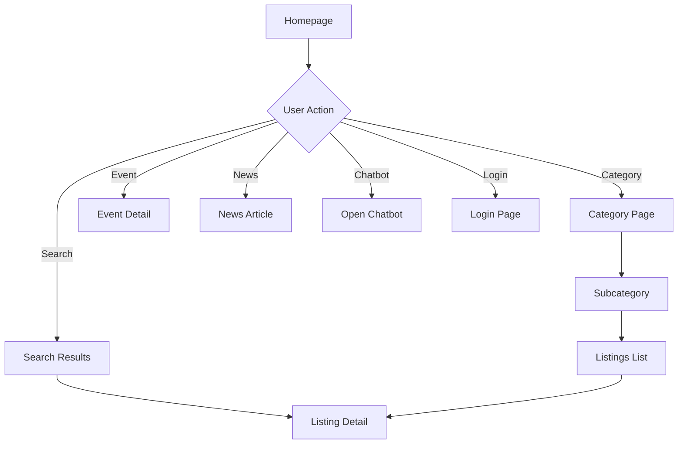
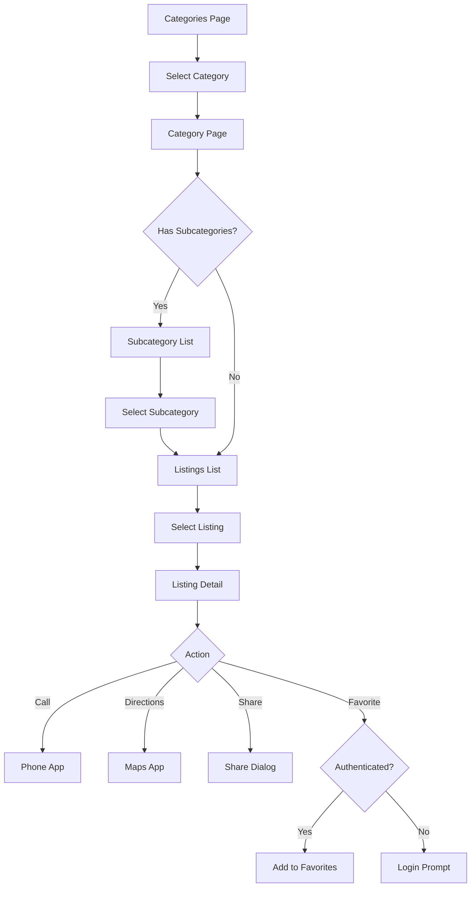
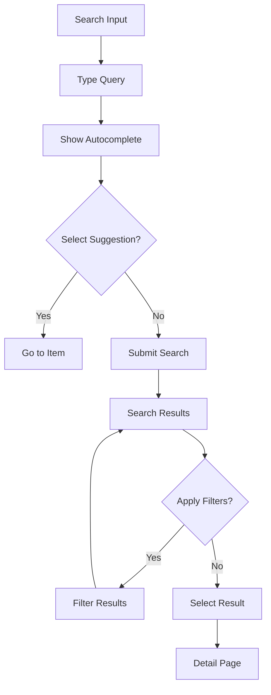
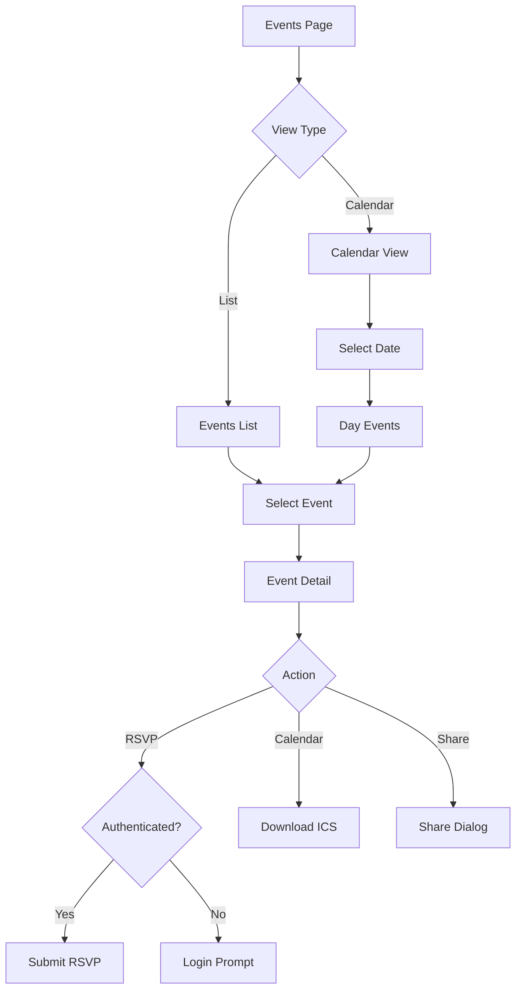
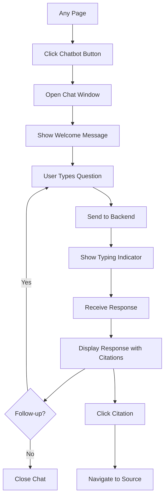
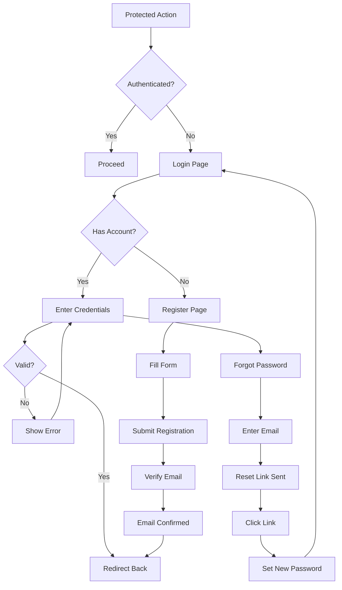
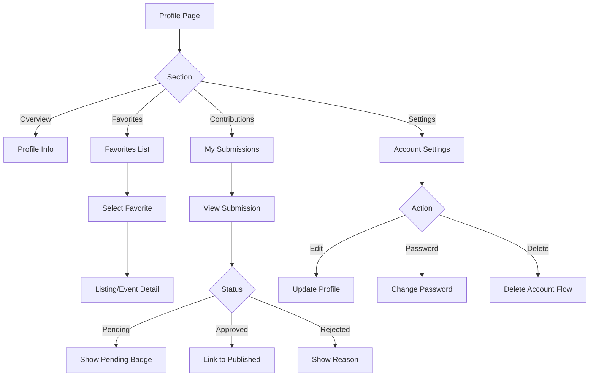
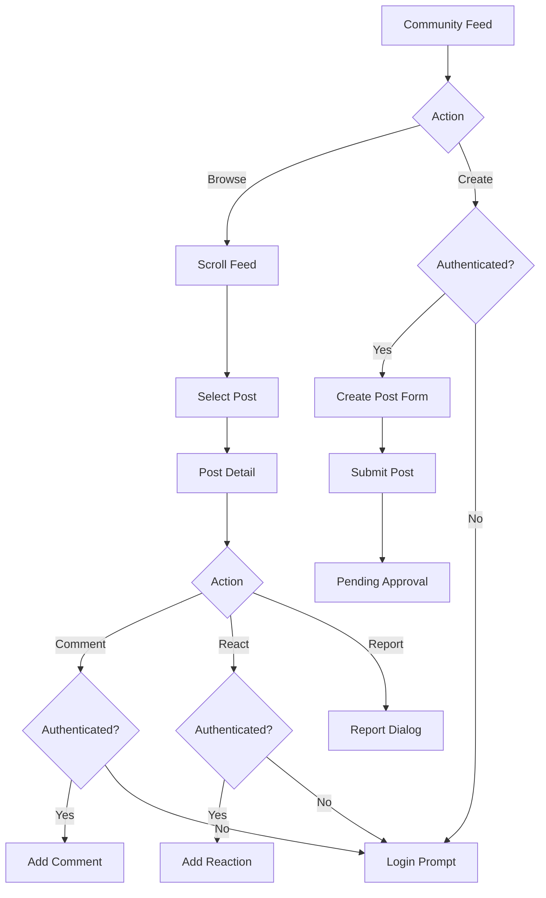

# HEIDI Citizen Web App - Detailed Requirements

This document provides comprehensive specifications for the HEIDI Citizen Web App (Public Platform), including detailed feature requirements, acceptance criteria, user flows, and screen specifications.

**Version:** 1.0
**Last Updated:** 2025-12-10
**Status:** Planning

---

## Related Documents

| Document                                                  | Description                          |
| --------------------------------------------------------- | ------------------------------------ |
| [Web Platform Overview](./web.requirement.md)             | High-level web platform requirements |
| [CMS Requirements](./cms.requirement.md)                  | Admin panel specifications           |
| [Architecture](../architecture.md)                        | Overall system architecture          |
| [Backend Requirements](../backend/backend.requirement.md) | Backend service specifications       |
| [Mobile Requirements](../app/mobile.requirement.md)       | Mobile app specifications            |

---

## Table of Contents

1. [Overview](#1-overview)
2. [Technology Stack](#2-technology-stack)
3. [Feature Modules](#3-feature-modules)
4. [User Flows](#4-user-flows)
5. [Screen Specifications](#5-screen-specifications)
6. [Rendering Strategy](#6-rendering-strategy)
7. [API Integration](#7-api-integration)
8. [Performance Requirements](#8-performance-requirements)
9. [Acceptance Criteria](#9-acceptance-criteria)

---

# 1. Overview

## 1.1 Purpose

The HEIDI Citizen Web App is a public-facing web platform that provides citizens with access to city services, listings, events, news, and interactive features like chatbot and community posts. It serves as the web counterpart to the mobile application.

## 1.2 Target Users

| User Type                 | Description                  | Capabilities                                               |
| ------------------------- | ---------------------------- | ---------------------------------------------------------- |
| **Anonymous Visitor**     | Public user without account  | Browse listings, search, view events, use chatbot          |
| **Authenticated Citizen** | Registered user with account | All anonymous features + favorites, contributions, profile |

## 1.3 Key Capabilities

- Browse and search city listings and services
- View events and news
- Interactive chatbot for city information
- Map-based POI discovery
- User registration and profile management
- Favorites and saved content
- Community features (if enabled)
- Contributor submissions (requires approval)

---

# 2. Technology Stack

| Component            | Technology                         | Purpose                          |
| -------------------- | ---------------------------------- | -------------------------------- |
| **Framework**        | Next.js 14+                        | SSR/SSG/CSR hybrid rendering     |
| **Language**         | TypeScript 5.x                     | Type safety                      |
| **Styling**          | Tailwind CSS + HEIDI Design System | Consistent styling               |
| **State Management** | React Query + Zustand              | Server & client state            |
| **Forms**            | React Hook Form + Zod              | Form handling                    |
| **Maps**             | Mapbox GL or Leaflet               | Interactive maps                 |
| **HTTP Client**      | Axios                              | API communication                |
| **Analytics**        | Custom + Sentry                    | Usage tracking, error monitoring |
| **Testing**          | Vitest + Playwright                | Unit & E2E testing               |

---

# 3. Feature Modules

## 3.1 Homepage

### Description

The main landing page providing quick access to key features and city highlights.

### Components

| Component         | Description                      | Required |
| ----------------- | -------------------------------- | -------- |
| Hero Section      | City branding, welcome message   | Yes      |
| Search Bar        | Global search input              | Yes      |
| Category Grid     | Quick access to main categories  | Yes      |
| Alerts Banner     | Active city alerts/notifications | Yes      |
| Quick Links       | Popular destinations             | Yes      |
| Featured Listings | Highlighted content              | Optional |
| Events Preview    | Upcoming events                  | Optional |
| News Preview      | Recent news articles             | Optional |

### Acceptance Criteria

| ID    | Criteria                                 | Priority |
| ----- | ---------------------------------------- | -------- |
| HP-01 | Page loads within 2 seconds on 4G        | High     |
| HP-02 | Search autocomplete appears within 300ms | High     |
| HP-03 | Category grid adapts to enabled modules  | High     |
| HP-04 | Alerts banner is dismissible             | Medium   |
| HP-05 | All content is tenant-specific           | Critical |
| HP-06 | SEO meta tags are properly set           | High     |
| HP-07 | Hero image is lazy-loaded                | Medium   |

---

## 3.2 Listings

### 3.2.1 Category Browse

| Feature          | Description                     |
| ---------------- | ------------------------------- |
| Category List    | Grid of main categories         |
| Subcategory List | Child categories under parent   |
| Category Header  | Name, description, icon         |
| Listing Count    | Number of listings per category |

### 3.2.2 Listing List

| Feature         | Description                        |
| --------------- | ---------------------------------- |
| List View       | Cards with image, title, summary   |
| Filters         | Category, location, tags, open now |
| Sort Options    | Relevance, distance, name, date    |
| Infinite Scroll | Load more on scroll                |
| Map Toggle      | Switch between list and map view   |

### 3.2.3 Listing Detail

| Feature          | Description                       |
| ---------------- | --------------------------------- |
| Header           | Title, category, status badge     |
| Media Gallery    | Images with lightbox              |
| Description      | Full content with rich text       |
| Contact Info     | Phone, email, website             |
| Location         | Address with map preview          |
| Opening Hours    | Weekly schedule                   |
| Related Listings | Similar content suggestions       |
| Actions          | Call, directions, share, favorite |

### Acceptance Criteria

| ID    | Criteria                                        | Priority |
| ----- | ----------------------------------------------- | -------- |
| LS-01 | Listing list loads within 1.5 seconds           | High     |
| LS-02 | Infinite scroll loads next page seamlessly      | Medium   |
| LS-03 | Filters update results without full reload      | High     |
| LS-04 | Detail page is shareable with correct meta tags | High     |
| LS-05 | Images use responsive srcset                    | Medium   |
| LS-06 | Favorite toggle requires authentication         | High     |
| LS-07 | Call/directions work on mobile                  | High     |
| LS-08 | Related listings algorithm is tenant-specific   | Medium   |

---

## 3.3 Events & News

### 3.3.1 Events

| Feature         | Description                        |
| --------------- | ---------------------------------- |
| Events List     | Chronological list of events       |
| Calendar View   | Monthly calendar with event dots   |
| Event Detail    | Full event information             |
| RSVP            | Register for event (authenticated) |
| Calendar Export | Add to personal calendar (ICS)     |
| Filters         | Date range, category, location     |

### 3.3.2 News

| Feature     | Description                       |
| ----------- | --------------------------------- |
| News List   | Article cards with featured image |
| News Detail | Full article content              |
| Categories  | Filter by news category           |
| Tags        | Related content via tags          |
| Share       | Social sharing options            |

### Acceptance Criteria

| ID    | Criteria                                    | Priority |
| ----- | ------------------------------------------- | -------- |
| EV-01 | Calendar view loads current month events    | High     |
| EV-02 | RSVP sends confirmation email               | High     |
| EV-03 | ICS export works on all platforms           | Medium   |
| EV-04 | Past events are clearly marked              | Medium   |
| NW-01 | News articles have proper heading structure | High     |
| NW-02 | Images have alt text for accessibility      | High     |
| NW-03 | Reading time is displayed                   | Low      |

---

## 3.4 Search

### Description

Global search across all content types with filters and autocomplete.

### Components

| Component    | Description                      |
| ------------ | -------------------------------- |
| Search Input | Text input with clear button     |
| Autocomplete | Suggestions as user types        |
| Results Page | Grouped by content type          |
| Filters      | Type, category, date, location   |
| No Results   | Helpful message with suggestions |

### Acceptance Criteria

| ID    | Criteria                                         | Priority |
| ----- | ------------------------------------------------ | -------- |
| SR-01 | Autocomplete responds within 300ms               | High     |
| SR-02 | Results grouped by type (Listings, Events, News) | High     |
| SR-03 | Search query preserved in URL                    | Medium   |
| SR-04 | No results shows helpful suggestions             | Medium   |
| SR-05 | Recent searches stored locally                   | Low      |
| SR-06 | Search works with special characters             | High     |

---

## 3.5 Chatbot Widget

### Description

AI-powered chatbot providing city information using RAG (Retrieval-Augmented Generation).

### Components

| Component        | Description                     |
| ---------------- | ------------------------------- |
| Floating Button  | Launcher in bottom-right corner |
| Chat Window      | Expandable conversation panel   |
| Message Input    | Text input with send button     |
| Messages         | User and bot message bubbles    |
| Citations        | Source links in bot responses   |
| Quick Actions    | Suggested questions             |
| Typing Indicator | Bot is processing               |

### Acceptance Criteria

| ID    | Criteria                                         | Priority |
| ----- | ------------------------------------------------ | -------- |
| CB-01 | Widget loads asynchronously (no blocking)        | High     |
| CB-02 | Response time under 3 seconds                    | High     |
| CB-03 | Citations link to source content                 | High     |
| CB-04 | Conversation persists during session             | Medium   |
| CB-05 | Works for both anonymous and authenticated users | High     |
| CB-06 | Clear conversation option available              | Medium   |
| CB-07 | Graceful fallback when service unavailable       | High     |
| CB-08 | Mobile-friendly full-screen mode                 | High     |

---

## 3.6 Business Community

### Description

Community features for local business interaction (if enabled for tenant).

### Components

| Component      | Description                        |
| -------------- | ---------------------------------- |
| Community Feed | List of community posts            |
| Post Detail    | Full post content with comments    |
| Create Post    | Post creation form (authenticated) |
| Comments       | Threaded comment section           |
| Reactions      | Like/reactions on posts            |
| Moderation     | Report inappropriate content       |

### Acceptance Criteria

| ID    | Criteria                                    | Priority |
| ----- | ------------------------------------------- | -------- |
| BC-01 | Feed updates without full page refresh      | High     |
| BC-02 | Posts require authentication                | High     |
| BC-03 | Posts require admin approval before visible | High     |
| BC-04 | Comments support @mentions                  | Low      |
| BC-05 | Report sends notification to admin          | High     |
| BC-06 | Character limit enforced for posts          | Medium   |

---

## 3.7 Ads & Monetization

### Description

Display of city-configured advertisements.

### Components

| Component    | Description                  |
| ------------ | ---------------------------- |
| Banner Ads   | Top/bottom of page banners   |
| Inline Ads   | Ads within content lists     |
| Sidebar Ads  | Ads in sidebar area          |
| Interstitial | Full-screen ad (limited use) |

### Acceptance Criteria

| ID    | Criteria                  | Priority |
| ----- | ------------------------- | -------- |
| AD-01 | Ads load asynchronously   | High     |
| AD-02 | Ads respect user viewport | Medium   |
| AD-03 | Click tracking functional | High     |
| AD-04 | Ads marked as "Sponsored" | High     |
| AD-05 | No ads on error pages     | Medium   |

---

## 3.8 POI & Maps

### Description

Map-based discovery of points of interest.

### Components

| Component       | Description                      |
| --------------- | -------------------------------- |
| Map View        | Interactive map with POI markers |
| Marker Clusters | Grouped markers for density      |
| Filter Panel    | Category, open now, distance     |
| POI Popup       | Quick info on marker click       |
| My Location     | User location button             |
| Directions      | Link to external maps app        |

### Acceptance Criteria

| ID    | Criteria                                   | Priority |
| ----- | ------------------------------------------ | -------- |
| MP-01 | Map loads within 2 seconds                 | High     |
| MP-02 | Markers cluster at zoom levels             | High     |
| MP-03 | Filter updates markers in real-time        | High     |
| MP-04 | Location permission requested respectfully | Medium   |
| MP-05 | Fallback for devices without GPS           | Medium   |
| MP-06 | Map is keyboard accessible                 | Medium   |

---

## 3.9 Authentication & Profile

### 3.9.1 Authentication

| Feature            | Description              |
| ------------------ | ------------------------ |
| Login              | Email/password login     |
| Registration       | New account creation     |
| Forgot Password    | Password reset flow      |
| Social Login       | Optional OAuth providers |
| Email Verification | Confirm email address    |

### 3.9.2 Profile

| Feature               | Description                     |
| --------------------- | ------------------------------- |
| Profile View          | User information display        |
| Edit Profile          | Update name, email, preferences |
| Favorites             | Saved listings and events       |
| Contributions         | User's submitted content        |
| Notification Settings | Email preferences               |
| Delete Account        | GDPR compliant deletion         |

### Acceptance Criteria

| ID    | Criteria                                           | Priority |
| ----- | -------------------------------------------------- | -------- |
| AU-01 | Login redirects to previous page                   | High     |
| AU-02 | Registration validates email format                | High     |
| AU-03 | Password reset link expires in 24 hours            | High     |
| AU-04 | Session persists across browser tabs               | Medium   |
| AU-05 | Logout clears all local data                       | High     |
| PF-01 | Favorites sync across devices                      | Medium   |
| PF-02 | Contribution history shows status                  | Medium   |
| PF-03 | Account deletion is irreversible with confirmation | High     |

---

# 4. User Flows

## 4.1 Homepage Flow



### Screens

| Screen   | Route | Rendering | SEO |
| -------- | ----- | --------- | --- |
| Homepage | `/`   | SSR       | Yes |

---

## 4.2 Listings Browse Flow



### Screens

| Screen         | Route                        | Rendering | SEO |
| -------------- | ---------------------------- | --------- | --- |
| Categories     | `/categories`                | SSR       | Yes |
| Category       | `/categories/:slug`          | SSR       | Yes |
| Subcategory    | `/categories/:slug/:subslug` | SSR       | Yes |
| Listings List  | `/listings`                  | SSR       | Yes |
| Listing Detail | `/listings/:id`              | SSR       | Yes |

---

## 4.3 Search Flow



### Screens

| Screen         | Route              | Rendering | SEO             |
| -------------- | ------------------ | --------- | --------------- |
| Search Results | `/search?q=:query` | SSR       | Yes (paginated) |

---

## 4.4 Events Flow



### Screens

| Screen       | Route         | Rendering | SEO |
| ------------ | ------------- | --------- | --- |
| Events List  | `/events`     | SSR       | Yes |
| Event Detail | `/events/:id` | SSR       | Yes |

---

## 4.5 Chatbot Flow



### Components

| Component            | State       | Behavior                     |
| -------------------- | ----------- | ---------------------------- |
| Chatbot Button       | Collapsed   | Fixed position, bottom-right |
| Chat Window          | Expanded    | 400px width, 500px height    |
| Chat Window (Mobile) | Full Screen | Full viewport                |

---

## 4.6 Authentication Flow



### Screens

| Screen          | Route                    | Rendering | SEO |
| --------------- | ------------------------ | --------- | --- |
| Login           | `/login`                 | CSR       | No  |
| Register        | `/register`              | CSR       | No  |
| Forgot Password | `/forgot-password`       | CSR       | No  |
| Reset Password  | `/reset-password/:token` | CSR       | No  |
| Verify Email    | `/verify-email/:token`   | CSR       | No  |

---

## 4.7 Profile & Favorites Flow



### Screens

| Screen        | Route                    | Rendering | SEO |
| ------------- | ------------------------ | --------- | --- |
| Profile       | `/profile`               | CSR       | No  |
| Favorites     | `/profile/favorites`     | CSR       | No  |
| Contributions | `/profile/contributions` | CSR       | No  |
| Settings      | `/profile/settings`      | CSR       | No  |

---

## 4.8 Community Flow



### Screens

| Screen         | Route            | Rendering | SEO |
| -------------- | ---------------- | --------- | --- |
| Community Feed | `/community`     | SSR       | Yes |
| Post Detail    | `/community/:id` | SSR       | Yes |
| Create Post    | `/community/new` | CSR       | No  |

---

# 5. Screen Specifications

## 5.1 Global Layout

### Desktop (1024px+)

```
+------------------------------------------+
|  Header (Logo, Nav, Search, User)        |
+------------------------------------------+
|                                          |
|            Main Content Area             |
|                                          |
|                                          |
+------------------------------------------+
|  Footer (Links, Legal, Social)           |
+------------------------------------------+
|                    [Chatbot Button]      |
```

### Mobile (< 1024px)

```
+------------------------+
|  Header (Logo, Menu)   |
+------------------------+
|                        |
|    Main Content        |
|                        |
+------------------------+
|  Bottom Nav            |
+------------------------+
|        [Chat]          |
```

## 5.2 Header Components

| Component  | Desktop         | Mobile            |
| ---------- | --------------- | ----------------- |
| Logo       | Left aligned    | Centered          |
| Navigation | Horizontal menu | Hamburger menu    |
| Search     | Inline input    | Icon + expand     |
| User Menu  | Dropdown        | In hamburger menu |
| Language   | Dropdown        | In hamburger menu |

## 5.3 Footer Components

| Section     | Contents                 |
| ----------- | ------------------------ |
| About       | City info, contact       |
| Quick Links | Categories, events, news |
| Legal       | Privacy, terms, imprint  |
| Social      | Social media links       |
| App Links   | Mobile app store badges  |

## 5.4 Common Components

| Component      | Description                      | Usage                 |
| -------------- | -------------------------------- | --------------------- |
| ListingCard    | Image, title, category, distance | Lists, search results |
| EventCard      | Date badge, title, location      | Event lists           |
| NewsCard       | Featured image, title, excerpt   | News lists            |
| CategoryCard   | Icon, name, count                | Category grids        |
| SearchInput    | Input with autocomplete          | Header, homepage      |
| MapView        | Interactive map with markers     | POI pages             |
| MediaGallery   | Image grid with lightbox         | Detail pages          |
| ShareDialog    | Social share options             | Detail pages          |
| LoadingSpinner | Animated loader                  | Async operations      |
| EmptyState     | Illustration with message        | No results            |
| ErrorBoundary  | Error message with retry         | Error handling        |

---

# 6. Rendering Strategy

## 6.1 Page Rendering Modes

| Page           | Mode | Reason               | Cache |
| -------------- | ---- | -------------------- | ----- |
| Homepage       | SSR  | SEO, dynamic content | 60s   |
| Categories     | SSR  | SEO, navigation      | 300s  |
| Category       | SSR  | SEO, listing preview | 60s   |
| Listings List  | SSR  | SEO, pagination      | 60s   |
| Listing Detail | SSR  | SEO, sharing         | 60s   |
| Events         | SSR  | SEO, calendar        | 60s   |
| Event Detail   | SSR  | SEO, sharing         | 60s   |
| News           | SSR  | SEO                  | 300s  |
| News Article   | SSR  | SEO                  | 300s  |
| Search Results | SSR  | SEO (paginated)      | 30s   |
| Community Feed | SSR  | SEO                  | 30s   |
| Post Detail    | SSR  | SEO                  | 30s   |
| Login/Register | CSR  | Auth state           | None  |
| Profile        | CSR  | Private data         | None  |
| Favorites      | CSR  | Private data         | None  |
| Chatbot        | CSR  | Interactive          | None  |

## 6.2 Data Fetching Strategy

| Data Type       | Strategy      | Revalidation |
| --------------- | ------------- | ------------ |
| Static Content  | SSG at build  | On deploy    |
| Dynamic Lists   | SSR           | 60 seconds   |
| User-specific   | CSR           | On demand    |
| Real-time       | CSR + Polling | 10 seconds   |
| Infinite Scroll | CSR           | On scroll    |

## 6.3 Caching Strategy

```typescript
// Next.js fetch configuration
export const revalidate = 60; // Page-level revalidation

// API route caching
export async function GET() {
  return Response.json(data, {
    headers: {
      'Cache-Control': 'public, s-maxage=60, stale-while-revalidate=300',
    },
  });
}
```

---

# 7. API Integration

## 7.1 Base Configuration

```typescript
// API Client for Citizen Web App
const apiClient = axios.create({
  baseURL: process.env.NEXT_PUBLIC_API_URL,
  headers: {
    'Content-Type': 'application/json',
    'X-Tenant-ID': tenantId,
  },
});

// Add auth token if available
apiClient.interceptors.request.use((config) => {
  const token = getAccessToken();
  if (token) {
    config.headers.Authorization = `Bearer ${token}`;
  }
  return config;
});
```

## 7.2 Endpoint Mapping

| Feature         | Method | Endpoint                        | Auth Required |
| --------------- | ------ | ------------------------------- | ------------- |
| Categories      | GET    | `/core/categories`              | No            |
| Listings        | GET    | `/core/listings`                | No            |
| Listing Detail  | GET    | `/core/listings/:id`            | No            |
| Events          | GET    | `/core/events`                  | No            |
| Event Detail    | GET    | `/core/events/:id`              | No            |
| News            | GET    | `/core/news`                    | No            |
| Search          | GET    | `/core/search`                  | No            |
| Chatbot Query   | POST   | `/chatbot/query`                | No            |
| Login           | POST   | `/auth/login`                   | No            |
| Register        | POST   | `/auth/register`                | No            |
| Profile         | GET    | `/users/me`                     | Yes           |
| Favorites       | GET    | `/users/me/favorites`           | Yes           |
| Add Favorite    | POST   | `/users/me/favorites`           | Yes           |
| Remove Favorite | DELETE | `/users/me/favorites/:id`       | Yes           |
| RSVP            | POST   | `/core/events/:id/rsvp`         | Yes           |
| Create Post     | POST   | `/community/posts`              | Yes           |
| Add Comment     | POST   | `/community/posts/:id/comments` | Yes           |

## 7.3 Error Handling

| Status | Handling                           |
| ------ | ---------------------------------- |
| 400    | Show validation errors inline      |
| 401    | Redirect to login                  |
| 403    | Show permission denied message     |
| 404    | Show 404 page                      |
| 429    | Show rate limit message with retry |
| 500    | Show error page with support link  |

---

# 8. Performance Requirements

## 8.1 Core Web Vitals Targets

| Metric                             | Target  | Threshold |
| ---------------------------------- | ------- | --------- |
| **LCP** (Largest Contentful Paint) | < 2.5s  | < 4.0s    |
| **FID** (First Input Delay)        | < 100ms | < 300ms   |
| **CLS** (Cumulative Layout Shift)  | < 0.1   | < 0.25    |
| **TTFB** (Time to First Byte)      | < 600ms | < 1800ms  |

## 8.2 Page-Specific Targets

| Page           | Load Time | Time to Interactive |
| -------------- | --------- | ------------------- |
| Homepage       | < 2.0s    | < 3.0s              |
| Listing List   | < 1.5s    | < 2.5s              |
| Listing Detail | < 1.5s    | < 2.5s              |
| Search Results | < 1.5s    | < 2.5s              |
| Map View       | < 2.5s    | < 3.5s              |

## 8.3 Bundle Size Limits

| Bundle         | Max Size (gzip) |
| -------------- | --------------- |
| Initial JS     | < 100kb         |
| Per-page JS    | < 50kb          |
| Total CSS      | < 30kb          |
| Map library    | < 100kb (lazy)  |
| Chatbot widget | < 50kb (lazy)   |

## 8.4 Image Optimization

| Requirement  | Implementation             |
| ------------ | -------------------------- |
| Format       | WebP with JPEG fallback    |
| Responsive   | srcset with multiple sizes |
| Lazy Loading | Native loading="lazy"      |
| Placeholder  | BlurHash or LQIP           |
| CDN          | Serve via CDN with caching |

---

# 9. Acceptance Criteria

## 9.1 Overall Application Criteria

| ID     | Criteria                                                   | Priority |
| ------ | ---------------------------------------------------------- | -------- |
| APP-01 | Works on Chrome, Firefox, Safari, Edge (latest 2 versions) | High     |
| APP-02 | Responsive design from 320px to 2560px                     | High     |
| APP-03 | WCAG 2.1 AA compliance                                     | High     |
| APP-04 | All content is tenant-scoped                               | Critical |
| APP-05 | No cross-tenant data leakage                               | Critical |
| APP-06 | Works offline with graceful degradation                    | Medium   |
| APP-07 | Progressive enhancement for JS-disabled                    | Low      |
| APP-08 | SEO meta tags on all public pages                          | High     |
| APP-09 | Open Graph tags for social sharing                         | High     |
| APP-10 | Structured data (JSON-LD) for listings/events              | Medium   |

## 9.2 Accessibility Criteria

| ID      | Criteria                                         | Priority |
| ------- | ------------------------------------------------ | -------- |
| A11Y-01 | All images have alt text                         | High     |
| A11Y-02 | Color contrast ratio >= 4.5:1                    | High     |
| A11Y-03 | Keyboard navigation for all interactive elements | High     |
| A11Y-04 | ARIA labels on non-semantic elements             | High     |
| A11Y-05 | Focus indicators visible                         | High     |
| A11Y-06 | Skip navigation link                             | Medium   |
| A11Y-07 | Form labels associated with inputs               | High     |
| A11Y-08 | Error messages announced to screen readers       | High     |

## 9.3 Security Criteria

| ID     | Criteria                                    | Priority |
| ------ | ------------------------------------------- | -------- |
| SEC-01 | HTTPS enforced on all pages                 | Critical |
| SEC-02 | CSP headers configured                      | High     |
| SEC-03 | XSS prevention on all inputs                | Critical |
| SEC-04 | CSRF protection on forms                    | High     |
| SEC-05 | Secure cookies (HttpOnly, Secure, SameSite) | High     |
| SEC-06 | Rate limiting on API calls                  | High     |
| SEC-07 | Input validation on client and server       | High     |

## 9.4 GDPR Compliance

| ID      | Criteria                             | Priority |
| ------- | ------------------------------------ | -------- |
| GDPR-01 | Cookie consent banner on first visit | High     |
| GDPR-02 | Clear privacy policy link            | High     |
| GDPR-03 | Account deletion available           | High     |
| GDPR-04 | Data export on request               | Medium   |
| GDPR-05 | No tracking before consent           | High     |

---

## Appendix A: SEO Requirements

### Meta Tags Per Page Type

| Page     | Title Pattern                   | Description          |
| -------- | ------------------------------- | -------------------- |
| Homepage | `{City Name} - City Services`   | City tagline         |
| Category | `{Category} - {City}`           | Category description |
| Listing  | `{Title} - {Category} - {City}` | Listing excerpt      |
| Event    | `{Title} - {Date} - {City}`     | Event description    |
| News     | `{Headline} - {City} News`      | Article excerpt      |
| Search   | `Search: {Query} - {City}`      | Results count        |

### Structured Data

```json
// Listing (LocalBusiness)
{
  "@context": "https://schema.org",
  "@type": "LocalBusiness",
  "name": "Listing Title",
  "address": { ... },
  "telephone": "...",
  "openingHours": "..."
}

// Event
{
  "@context": "https://schema.org",
  "@type": "Event",
  "name": "Event Title",
  "startDate": "2025-01-15T19:00",
  "location": { ... }
}
```

---

## Appendix B: Error States

| Error Type    | Display        | User Action       |
| ------------- | -------------- | ----------------- |
| Network Error | Toast + Retry  | Retry button      |
| Not Found     | 404 Page       | Back to home link |
| Server Error  | Error Page     | Contact support   |
| Auth Required | Login redirect | Login form        |
| Rate Limited  | Toast          | Wait message      |
| Validation    | Inline errors  | Fix fields        |

---

## Appendix C: Loading States

| Context         | Loading Indicator      |
| --------------- | ---------------------- |
| Page Load       | Full-page skeleton     |
| List Items      | Card skeletons         |
| Images          | Blur placeholder       |
| Search          | Inline spinner         |
| Form Submit     | Button spinner         |
| Chatbot         | Typing dots            |
| Map             | Map skeleton + spinner |
| Infinite Scroll | Bottom loader          |

---

**End of Document**
