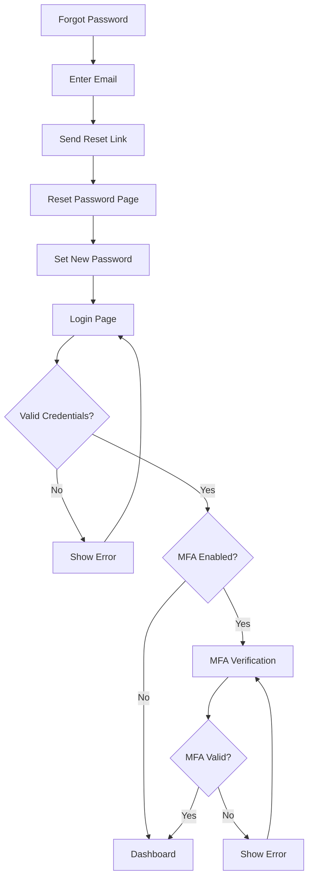
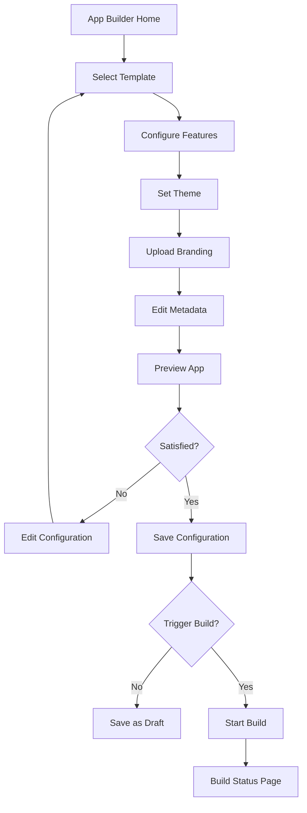
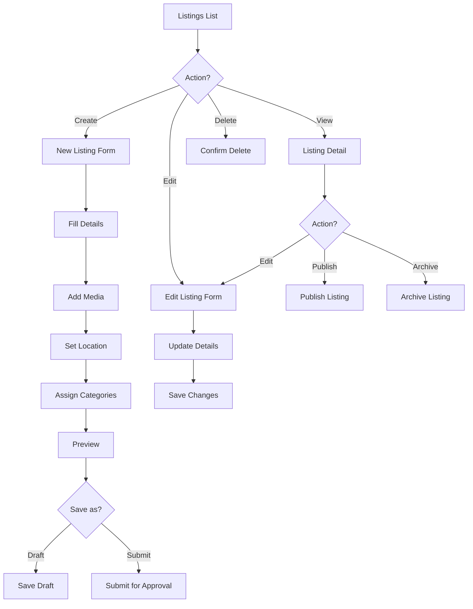
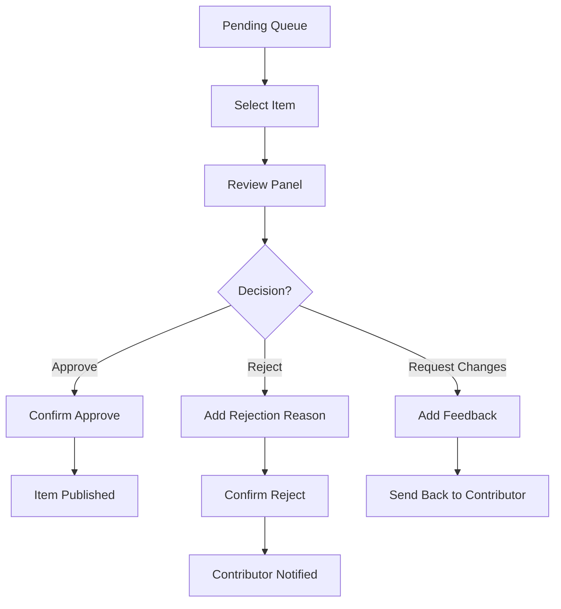
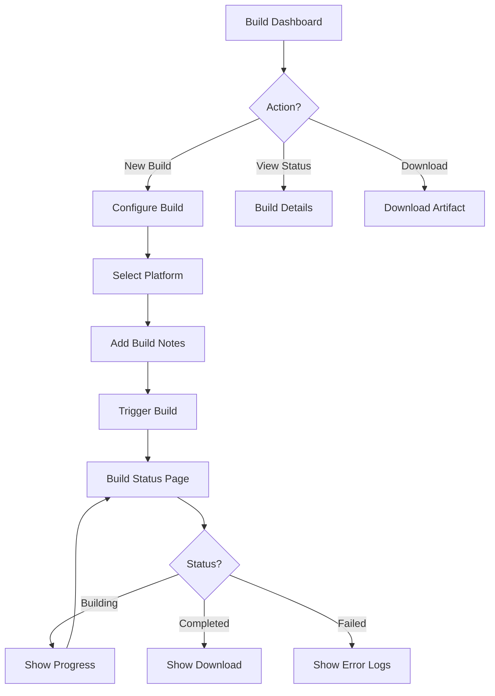
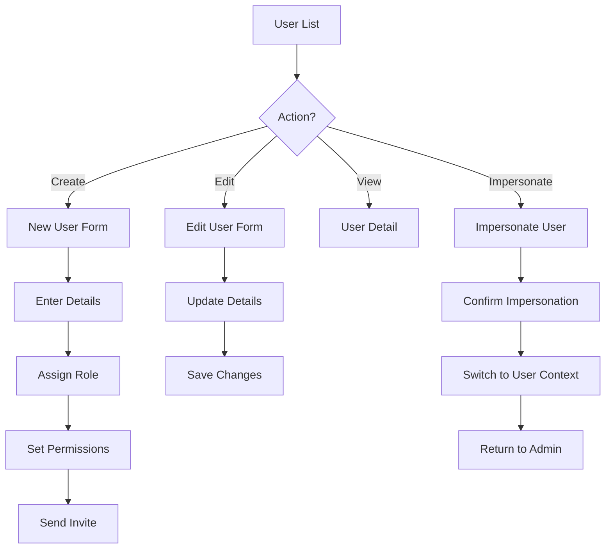
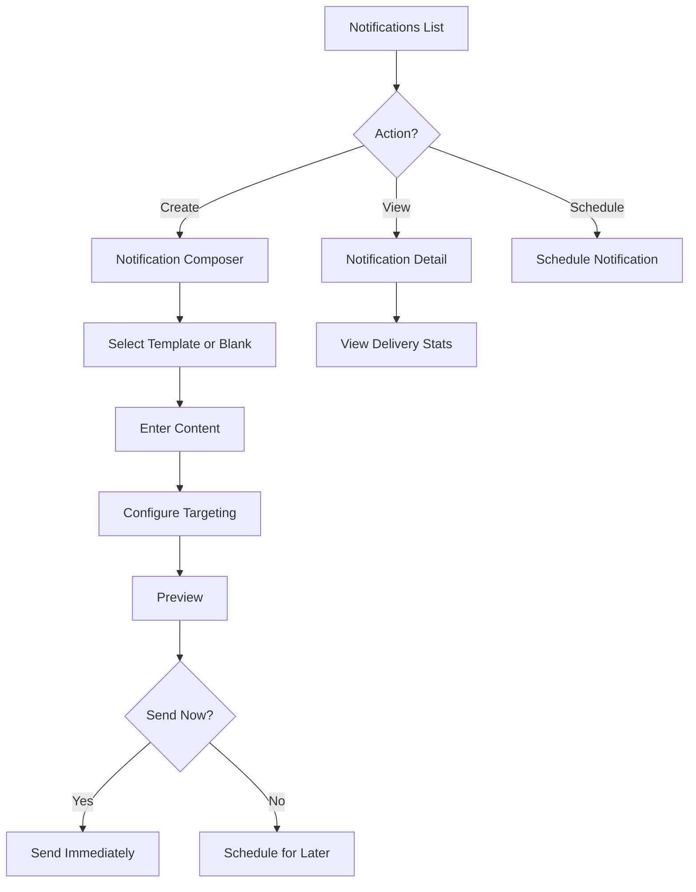
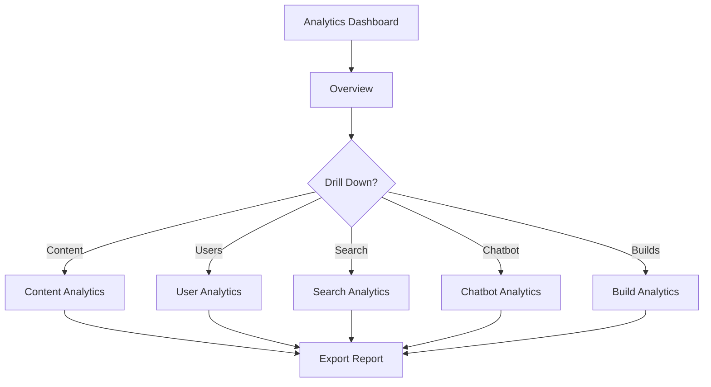

# HEIDI Web CMS - Detailed Requirements

This document provides comprehensive specifications for the HEIDI Web CMS (Admin Panel), including detailed feature requirements, acceptance criteria, user flows, and screen specifications.

**Version:** 1.0
**Last Updated:** 2025-12-10
**Status:** Planning

---

## Related Documents

| Document                                                  | Description                          |
| --------------------------------------------------------- | ------------------------------------ |
| [Web Platform Overview](./web.requirement.md)             | High-level web platform requirements |
| [Citizen Web App](./citizen-web.requirement.md)           | Citizen-facing web application       |
| [Architecture](../architecture.md)                        | Overall system architecture          |
| [Backend Requirements](../backend/backend.requirement.md) | Backend service specifications       |
| [App Factory Process](../app.factory.process.md)          | Build orchestration system           |

---

## Table of Contents

1. [Overview](#1-overview)
2. [Technology Stack](#2-technology-stack)
3. [Feature Modules](#3-feature-modules)
4. [User Flows](#4-user-flows)
5. [Screen Specifications](#5-screen-specifications)
6. [Role-Based Access Matrix](#6-role-based-access-matrix)
7. [API Integration](#7-api-integration)
8. [Acceptance Criteria](#8-acceptance-criteria)

---

# 1. Overview

## 1.1 Purpose

The HEIDI Web CMS is an administrative platform for managing city applications, content, users, and the App Factory build process. It serves as the central control panel for all HEIDI platform operations.

## 1.2 Target Users

| Role                   | Primary Responsibilities                                    |
| ---------------------- | ----------------------------------------------------------- |
| **Super Admin**        | Platform-wide management, city activation, global templates |
| **Super City Admin**   | City-level management, local admins, city configurations    |
| **City Admin**         | Content management, approvals, local dashboards             |
| **Editor/Contributor** | Content submission (requires approval)                      |

## 1.3 Key Capabilities

- App Builder with dynamic mobile preview
- Content management (Listings, Categories, Events, News, Ads, POIs)
- Approval workflows for contributor submissions
- Feature module management per tenant
- Build management via App Factory integration
- User and role management
- Analytics and audit trail

---

# 2. Technology Stack

| Component            | Technology                         | Purpose                     |
| -------------------- | ---------------------------------- | --------------------------- |
| **Framework**        | React 18+                          | UI framework                |
| **Language**         | TypeScript 5.x                     | Type safety                 |
| **Styling**          | Tailwind CSS + HEIDI Design System | Consistent styling          |
| **State Management** | Zustand or React Query             | Client state & server state |
| **Routing**          | React Router v6                    | SPA routing                 |
| **Forms**            | React Hook Form + Zod              | Form handling & validation  |
| **HTTP Client**      | Axios                              | API communication           |
| **Build Tool**       | Vite                               | Fast development builds     |
| **Testing**          | Vitest + Playwright                | Unit & E2E testing          |

---

# 3. Feature Modules

## 3.1 App Builder

### Description

Visual configuration tool for creating and customizing city mobile applications.

### Components

| Component             | Description                       | Required |
| --------------------- | --------------------------------- | -------- |
| Template Selector     | Choose Template A or B            | Yes      |
| Feature Module Picker | Enable/disable feature modules    | Yes      |
| Theme Configurator    | Colors, fonts, spacing            | Yes      |
| Branding Setup        | Logos, icons, splash screens      | Yes      |
| Metadata Editor       | App name, bundle ID, descriptions | Yes      |
| Dynamic Preview       | Real-time mobile app preview      | Yes      |

### Acceptance Criteria

| ID    | Criteria                                                       | Priority |
| ----- | -------------------------------------------------------------- | -------- |
| AB-01 | Template selection persists and reflects in preview            | High     |
| AB-02 | Feature module toggles update compatibility check in real-time | High     |
| AB-03 | Theme changes reflect in preview within 500ms                  | High     |
| AB-04 | Asset uploads support PNG, JPG, SVG up to 5MB                  | Medium   |
| AB-05 | Preview shows accurate representation across device sizes      | Medium   |
| AB-06 | Validation prevents incompatible feature combinations          | High     |
| AB-07 | Changes can be saved as draft before build                     | Medium   |

---

## 3.2 Content Management

### 3.2.1 Listings Management

| Feature           | Description                                                 |
| ----------------- | ----------------------------------------------------------- |
| List View         | Paginated table with search, filters, bulk actions          |
| Create/Edit       | Form with all listing fields, media upload, location picker |
| Categories        | Assign primary and secondary categories                     |
| Media Gallery     | Upload, reorder, delete images and documents                |
| Localization      | Multi-language content (if enabled)                         |
| Status Management | Draft, Pending, Published, Archived                         |
| Versioning        | View change history, restore previous versions              |

### Acceptance Criteria

| ID    | Criteria                                                 | Priority |
| ----- | -------------------------------------------------------- | -------- |
| LM-01 | List view loads within 2 seconds for up to 1000 listings | High     |
| LM-02 | Search returns results with debounce (300ms)             | Medium   |
| LM-03 | Bulk status change works for up to 50 items              | Medium   |
| LM-04 | Media upload shows progress and supports drag-drop       | Medium   |
| LM-05 | Auto-save draft every 60 seconds                         | Low      |
| LM-06 | Location picker integrates with map provider             | High     |
| LM-07 | Category assignment validates hierarchy                  | High     |

### 3.2.2 Categories Management

| Feature         | Description                     |
| --------------- | ------------------------------- |
| Tree View       | Hierarchical category display   |
| CRUD Operations | Create, edit, delete categories |
| Ordering        | Drag-drop reordering            |
| Icons           | Icon assignment per category    |
| Visibility      | Show/hide categories            |

### 3.2.3 Events & News

| Feature         | Description                                         |
| --------------- | --------------------------------------------------- |
| Calendar View   | Monthly/weekly calendar display                     |
| Event Editor    | Title, description, date/time, location, recurrence |
| News Editor     | Rich text, featured image, tags                     |
| Scheduling      | Publish at specific date/time                       |
| RSVP Management | View registrations (events)                         |

### 3.2.4 Ads Management

| Feature      | Description                         |
| ------------ | ----------------------------------- |
| Ad Campaigns | Create and manage ad campaigns      |
| Placements   | Configure ad placement locations    |
| Scheduling   | Start/end dates, time-based display |
| Analytics    | Click-through rates, impressions    |
| Assets       | Upload ad creatives                 |

### 3.2.5 POI Management

| Feature     | Description                       |
| ----------- | --------------------------------- |
| Map Editor  | Place POIs on interactive map     |
| Bulk Import | CSV/JSON import of POI data       |
| Categories  | Assign POI categories             |
| Details     | Name, description, contact, hours |

---

## 3.3 Approval Workflows

### Description

Manage submissions from contributors that require admin approval.

### Components

| Component      | Description                                     |
| -------------- | ----------------------------------------------- |
| Pending Queue  | List of items awaiting review                   |
| Review Panel   | Side-by-side comparison (submitted vs. current) |
| Action Buttons | Approve, Reject, Request Changes                |
| Comments       | Add feedback for contributor                    |
| History        | View all actions taken on item                  |

### Acceptance Criteria

| ID    | Criteria                                 | Priority |
| ----- | ---------------------------------------- | -------- |
| AW-01 | Queue shows count badge in navigation    | Medium   |
| AW-02 | Bulk approve/reject up to 20 items       | Medium   |
| AW-03 | Email notification sent on status change | High     |
| AW-04 | Rejection requires comment               | High     |
| AW-05 | Contributor can view rejection reason    | High     |
| AW-06 | Audit log records all approval actions   | High     |

---

## 3.4 Feature Modules Management

### Description

Configure which feature modules are enabled for the tenant.

### Components

| Component      | Description                                |
| -------------- | ------------------------------------------ |
| Module Catalog | List of all available modules              |
| Module Card    | Description, dependencies, version, status |
| Toggle         | Enable/disable module                      |
| Configuration  | Module-specific settings                   |
| Compatibility  | Version compatibility warnings             |

### Available Modules

| Module             | Description                   | Dependencies    |
| ------------------ | ----------------------------- | --------------- |
| Job Matching       | Job listings and applications | Core            |
| Business Community | Community feed and posts      | Core, Users     |
| Advertisement      | Ad placements and management  | Core            |
| Survey Tool        | Survey creation and responses | Core            |
| Waste Calendar     | Waste collection schedules    | Core, Scheduler |
| Live Chat          | Real-time chat support        | WebSocket       |
| Multilingualism    | Multi-language support        | Core, DeepL     |
| Chatbot            | RAG-based Q&A                 | Chatbot Service |
| Defect Reporter    | Issue submission              | Core, Media     |

---

## 3.5 Notifications Console

### Description

Create, schedule, and manage push and email notifications.

### Components

| Component         | Description                     |
| ----------------- | ------------------------------- |
| Notification List | History of sent notifications   |
| Composer          | Create new notification         |
| Template Library  | Reusable notification templates |
| Scheduler         | Schedule future notifications   |
| Targeting         | Audience segmentation           |
| Analytics         | Delivery rates, open rates      |

### Acceptance Criteria

| ID    | Criteria                                 | Priority |
| ----- | ---------------------------------------- | -------- |
| NC-01 | Preview notification on device mockup    | Medium   |
| NC-02 | Schedule up to 30 days in advance        | Medium   |
| NC-03 | Target by user segment, location, or all | High     |
| NC-04 | Track delivery status in real-time       | High     |
| NC-05 | A/B testing support for messages         | Low      |

---

## 3.6 Build Management

### Description

Trigger and monitor mobile app builds via App Factory integration.

### Components

| Component         | Description                      |
| ----------------- | -------------------------------- |
| Build Dashboard   | Overview of recent builds        |
| Build Trigger     | Start new Android/iOS build      |
| Build Status      | Real-time status updates         |
| Build History     | List of all builds with metadata |
| Artifact Download | Download APK/IPA files           |
| Build Logs        | View detailed build logs         |

### Acceptance Criteria

| ID    | Criteria                                    | Priority |
| ----- | ------------------------------------------- | -------- |
| BM-01 | Build status updates within 10 seconds      | High     |
| BM-02 | Show estimated completion time              | Medium   |
| BM-03 | Email notification on build complete/failed | High     |
| BM-04 | Download link valid for 7 days              | Medium   |
| BM-05 | View build configuration snapshot           | Medium   |
| BM-06 | Prevent duplicate builds within 5 minutes   | High     |

---

## 3.7 User & Role Management

### Description

Manage users, assign roles, and configure permissions.

### Components

| Component       | Description                       |
| --------------- | --------------------------------- |
| User List       | Searchable, filterable user table |
| User Editor     | Create/edit user details          |
| Role Assignment | Assign roles to users             |
| Permissions     | Fine-grained permission control   |
| Impersonation   | Super Admin can impersonate users |
| Activity Log    | User login/action history         |

### Acceptance Criteria

| ID    | Criteria                                   | Priority |
| ----- | ------------------------------------------ | -------- |
| UM-01 | Password must meet complexity requirements | High     |
| UM-02 | Email verification required for new users  | High     |
| UM-03 | Role changes take effect immediately       | High     |
| UM-04 | Impersonation logs all actions             | High     |
| UM-05 | Bulk user import via CSV                   | Low      |
| UM-06 | User can be deactivated without deletion   | Medium   |

---

## 3.8 Analytics Dashboard

### Description

View usage metrics, content statistics, and platform health.

### Components

| Component      | Description                           |
| -------------- | ------------------------------------- |
| Overview Cards | Key metrics at a glance               |
| Charts         | Time-series charts for trends         |
| Tables         | Detailed data tables                  |
| Filters        | Date range, category, feature filters |
| Export         | Download reports as CSV/PDF           |

### Metrics

| Metric           | Description                              |
| ---------------- | ---------------------------------------- |
| Active Users     | Daily/weekly/monthly active users        |
| Content Stats    | Listings, events, news by status         |
| Search Analytics | Popular search terms, no-results queries |
| Chatbot Usage    | Queries, response accuracy               |
| Build Stats      | Success rate, average duration           |
| Feature Usage    | Module engagement rates                  |

---

## 3.9 Audit Trail

### Description

Comprehensive logging of all administrative actions.

### Components

| Component   | Description                      |
| ----------- | -------------------------------- |
| Event Log   | Searchable list of all events    |
| Filters     | By user, action type, date range |
| Detail View | Full event context and payload   |
| Export      | Download logs for compliance     |

### Tracked Events

| Event Type      | Description                       |
| --------------- | --------------------------------- |
| User Actions    | Login, logout, password change    |
| Content Changes | Create, update, delete, publish   |
| Approvals       | Approve, reject, request changes  |
| Configuration   | Settings changes, feature toggles |
| Builds          | Trigger, complete, fail           |
| User Management | Create, update, role changes      |

---

## 3.10 Chatbot Administration

### Description

Configure and monitor the RAG-based chatbot.

### Components

| Component         | Description                      |
| ----------------- | -------------------------------- |
| Enable/Disable    | Toggle chatbot for tenant        |
| Ingestion Control | Trigger content re-indexing      |
| Progress Monitor  | View embedding generation status |
| Accuracy Metrics  | Response quality indicators      |
| Fallback Config   | Configure no-answer responses    |

---

# 4. User Flows

## 4.1 Authentication Flow



### Screens

| Screen           | Route                    | Components                                                                    |
| ---------------- | ------------------------ | ----------------------------------------------------------------------------- |
| Login            | `/login`                 | Email input, Password input, Remember me, Submit button, Forgot password link |
| MFA Verification | `/login/mfa`             | Code input (6 digits), Resend code link, Submit button                        |
| Forgot Password  | `/forgot-password`       | Email input, Submit button, Back to login link                                |
| Reset Password   | `/reset-password/:token` | New password input, Confirm password input, Submit button                     |

---

## 4.2 App Builder Flow



### Screens

| Screen                | Route                   | Components                                                     |
| --------------------- | ----------------------- | -------------------------------------------------------------- |
| App Builder Home      | `/app-builder`          | Template cards, Recent configurations, Quick actions           |
| Template Selection    | `/app-builder/template` | Template A/B cards with previews, Selection indicator          |
| Feature Configuration | `/app-builder/features` | Feature module grid, Enable/disable toggles, Dependencies info |
| Theme Configuration   | `/app-builder/theme`    | Color pickers, Font selectors, Spacing controls, Preview pane  |
| Branding Setup        | `/app-builder/branding` | Logo upload, Icon upload, Splash screen upload, Asset preview  |
| Metadata Editor       | `/app-builder/metadata` | App name, Bundle ID, Version, Store descriptions               |
| Preview               | `/app-builder/preview`  | Device mockup, Interactive navigation, Device size toggle      |
| Build Trigger         | `/app-builder/build`    | Platform selection, Build notes, Trigger button                |

---

## 4.3 Listings Management Flow



### Screens

| Screen         | Route                | Components                                                |
| -------------- | -------------------- | --------------------------------------------------------- |
| Listings List  | `/listings`          | Search bar, Filters, Data table, Pagination, Bulk actions |
| New Listing    | `/listings/new`      | Multi-step form, Progress indicator, Media uploader       |
| Edit Listing   | `/listings/:id/edit` | Pre-filled form, Change history link, Status indicator    |
| Listing Detail | `/listings/:id`      | Read-only view, Action buttons, Related content           |

---

## 4.4 Approval Workflow Flow



### Screens

| Screen        | Route            | Components                                                              |
| ------------- | ---------------- | ----------------------------------------------------------------------- |
| Pending Queue | `/approvals`     | Filter tabs (All/Listings/Events/etc), Item cards, Quick actions        |
| Review Panel  | `/approvals/:id` | Side-by-side comparison, Diff highlighting, Action buttons, Comment box |

---

## 4.5 Build Management Flow



### Screens

| Screen          | Route         | Components                                                              |
| --------------- | ------------- | ----------------------------------------------------------------------- |
| Build Dashboard | `/builds`     | Build history table, Status badges, Quick trigger button                |
| Build Details   | `/builds/:id` | Status timeline, Configuration snapshot, Logs viewer, Artifact download |
| New Build       | `/builds/new` | Platform selector, Notes input, Trigger button                          |

---

## 4.6 User Management Flow



### Screens

| Screen      | Route             | Components                                            |
| ----------- | ----------------- | ----------------------------------------------------- |
| User List   | `/users`          | Search, Filters, User table, Role badges              |
| New User    | `/users/new`      | User form, Role selector, Permission checkboxes       |
| Edit User   | `/users/:id/edit` | Pre-filled form, Activity log link                    |
| User Detail | `/users/:id`      | Profile info, Role info, Activity log, Action buttons |

---

## 4.7 Notifications Flow



### Screens

| Screen                | Route                | Components                                                           |
| --------------------- | -------------------- | -------------------------------------------------------------------- |
| Notifications List    | `/notifications`     | History table, Status badges, Scheduled tab                          |
| Notification Composer | `/notifications/new` | Template selector, Rich text editor, Targeting options, Preview pane |
| Notification Detail   | `/notifications/:id` | Content preview, Delivery stats, Recipient list                      |

---

## 4.8 Analytics Flow



### Screens

| Screen             | Route                | Components                                                 |
| ------------------ | -------------------- | ---------------------------------------------------------- |
| Analytics Overview | `/analytics`         | KPI cards, Trend charts, Quick filters                     |
| Content Analytics  | `/analytics/content` | Content counts by type/status, Publishing trends           |
| User Analytics     | `/analytics/users`   | Active users chart, Registration trends, Role distribution |
| Search Analytics   | `/analytics/search`  | Top queries, Zero-result queries, Search trends            |
| Chatbot Analytics  | `/analytics/chatbot` | Query volume, Response accuracy, Fallback rate             |

---

# 5. Screen Specifications

## 5.1 Global Layout

```
+------------------------------------------+
|  Header (Logo, Search, User Menu)        |
+--------+---------------------------------+
|        |                                 |
| Side   |      Main Content Area          |
| Nav    |                                 |
|        |                                 |
|        |                                 |
+--------+---------------------------------+
```

### Header Components

| Component          | Description                         |
| ------------------ | ----------------------------------- |
| Logo               | HEIDI logo, links to dashboard      |
| Global Search      | Search across all content           |
| Notifications Bell | Pending approvals, build status     |
| User Menu          | Profile, settings, logout           |
| Tenant Selector    | Switch between cities (Super Admin) |

### Side Navigation

| Section       | Items                                         |
| ------------- | --------------------------------------------- |
| Dashboard     | Overview, Quick Actions                       |
| App Builder   | Template, Features, Theme, Branding, Preview  |
| Content       | Listings, Categories, Events, News, Ads, POIs |
| Approvals     | Pending Queue                                 |
| Modules       | Feature Modules                               |
| Notifications | Console, Templates                            |
| Builds        | Dashboard, History                            |
| Users         | User List, Roles                              |
| Analytics     | Dashboard, Reports                            |
| Settings      | Tenant Settings, Chatbot, Audit Trail         |

---

## 5.2 Common Components

| Component      | Description                   | Usage                      |
| -------------- | ----------------------------- | -------------------------- |
| DataTable      | Sortable, filterable table    | Lists                      |
| Modal          | Overlay dialog                | Confirmations, quick forms |
| Drawer         | Slide-in panel                | Detail views, filters      |
| Toast          | Notification popup            | Success/error messages     |
| Breadcrumb     | Navigation path               | All pages                  |
| StatusBadge    | Colored status indicator      | Listings, builds           |
| FileUploader   | Drag-drop file upload         | Media, assets              |
| RichTextEditor | WYSIWYG editor                | Content fields             |
| MapPicker      | Interactive location selector | Listings, POIs             |
| DateTimePicker | Date/time input               | Events, scheduling         |

---

# 6. Role-Based Access Matrix

| Screen/Feature     | Super Admin | Super City Admin | City Admin |      Editor      |
| ------------------ | :---------: | :--------------: | :--------: | :--------------: |
| Dashboard          |    Full     |       Full       |    Full    |     Limited      |
| App Builder        |    Full     |       Full       |    View    |        -         |
| Listings - View    | All Tenants |    Own Tenant    | Own Tenant |       Own        |
| Listings - Create  |      ✓      |        ✓         |     ✓      |   ✓ (Pending)    |
| Listings - Edit    |      ✓      |        ✓         |     ✓      |     Own Only     |
| Listings - Delete  |      ✓      |        ✓         |     ✓      |        -         |
| Listings - Approve |      ✓      |        ✓         |     ✓      |        -         |
| Categories         |    Full     |       Full       |    Full    |       View       |
| Events/News        |    Full     |       Full       |    Full    | Create (Pending) |
| Ads                |    Full     |       Full       |    Full    |        -         |
| Approvals          | All Tenants |    Own Tenant    | Own Tenant |        -         |
| Feature Modules    |    Full     |    Configure     |    View    |        -         |
| Notifications      |    Full     |       Full       |    Full    |        -         |
| Builds             |    Full     |       Full       |    View    |        -         |
| Users              | All Tenants |    Own Tenant    |    View    |        -         |
| Analytics          | All Tenants |    Own Tenant    | Own Tenant |        -         |
| Audit Trail        |    Full     |    Own Tenant    |     -      |        -         |
| Chatbot Admin      |    Full     |       Full       |    View    |        -         |
| Impersonation      |      ✓      |        -         |     -      |        -         |

---

# 7. API Integration

## 7.1 Base Configuration

```typescript
// API Client Configuration
const apiClient = axios.create({
  baseURL: '/api',
  headers: {
    'Content-Type': 'application/json',
    'X-Tenant-ID': tenantId,
  },
});

// Request Interceptor - Add JWT
apiClient.interceptors.request.use((config) => {
  const token = getAccessToken();
  if (token) {
    config.headers.Authorization = `Bearer ${token}`;
  }
  return config;
});
```

## 7.2 Endpoint Mapping

| Feature        | Method | Endpoint                  | Service      |
| -------------- | ------ | ------------------------- | ------------ |
| Login          | POST   | `/auth/login`             | Auth         |
| Listings List  | GET    | `/core/listings`          | Core         |
| Create Listing | POST   | `/core/listings`          | Core         |
| Update Listing | PATCH  | `/core/listings/:id`      | Core         |
| Categories     | GET    | `/core/categories`        | Core         |
| Events         | GET    | `/core/events`            | Core         |
| Approve Item   | PATCH  | `/core/:type/:id/approve` | Core         |
| Users List     | GET    | `/users`                  | Users        |
| Create User    | POST   | `/users`                  | Users        |
| Trigger Build  | POST   | `/builds`                 | ProjectGen   |
| Build Status   | GET    | `/builds/:id`             | ProjectGen   |
| Templates      | GET    | `/templates`              | Template     |
| Features       | GET    | `/features`               | Feature      |
| Notifications  | POST   | `/notifications`          | Notification |
| Analytics      | GET    | `/admin/analytics`        | Admin        |
| Audit Logs     | GET    | `/admin/audit`            | Admin        |

---

# 8. Acceptance Criteria

## 8.1 Overall CMS Criteria

| ID     | Criteria                                                  | Priority |
| ------ | --------------------------------------------------------- | -------- |
| CMS-01 | All pages load within 3 seconds on 4G connection          | High     |
| CMS-02 | Application works on latest Chrome, Firefox, Safari, Edge | High     |
| CMS-03 | Responsive design for screens 1024px and above            | Medium   |
| CMS-04 | Session timeout after 30 minutes of inactivity            | High     |
| CMS-05 | All actions provide feedback within 2 seconds             | Medium   |
| CMS-06 | Error messages are user-friendly and actionable           | High     |
| CMS-07 | Keyboard navigation works for all major actions           | Medium   |
| CMS-08 | Screen reader compatible (ARIA labels)                    | Medium   |
| CMS-09 | No data exposure across tenants                           | Critical |
| CMS-10 | All API errors handled gracefully with retry options      | High     |

## 8.2 Feature-Specific Criteria

See individual feature sections above for detailed acceptance criteria.

---

## Appendix A: Error States

| Error Type        | Display             | Recovery Action          |
| ----------------- | ------------------- | ------------------------ |
| Network Error     | Toast + Inline      | Retry button             |
| Validation Error  | Field-level message | Fix and resubmit         |
| Permission Denied | Full-page message   | Contact admin link       |
| Not Found         | Full-page 404       | Back to list link        |
| Server Error      | Toast + Inline      | Retry or contact support |
| Session Expired   | Modal               | Re-login button          |

---

## Appendix B: Loading States

| Context      | Loading Indicator    |
| ------------ | -------------------- |
| Page Load    | Full-page skeleton   |
| Table Data   | Table skeleton rows  |
| Form Submit  | Button spinner       |
| File Upload  | Progress bar         |
| Build Status | Animated status icon |
| Search       | Inline spinner       |

---

**End of Document**
